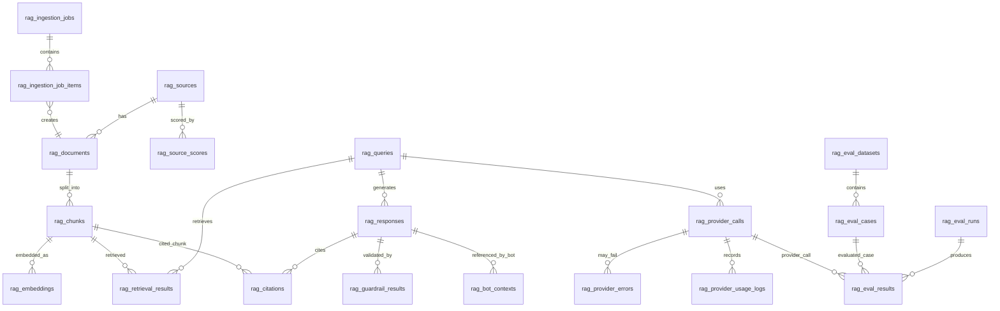
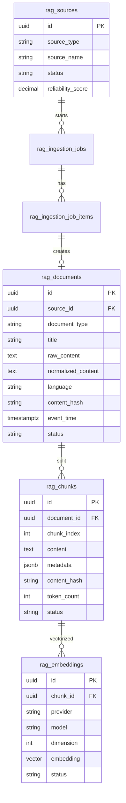
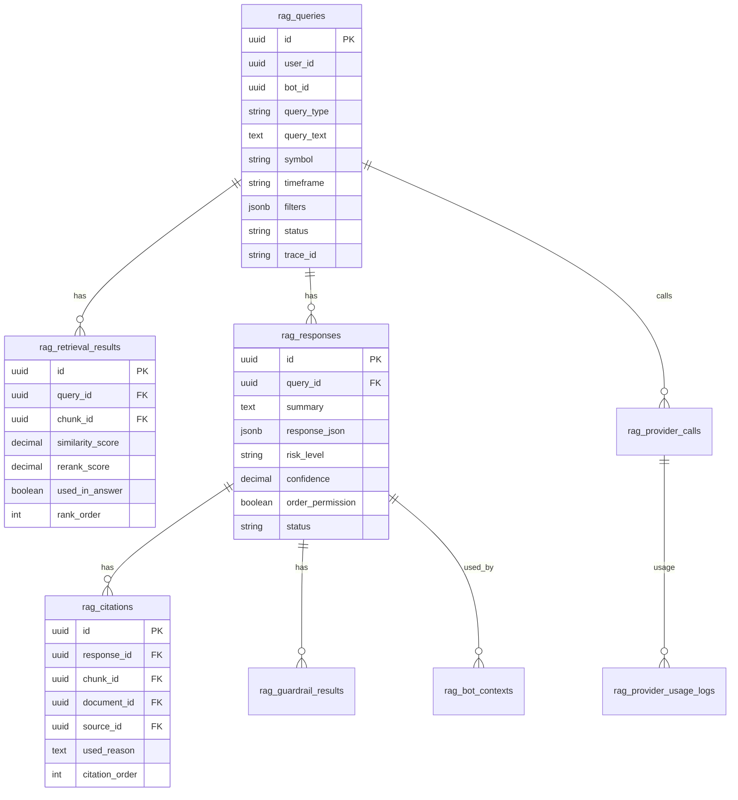

# Personal Multi Trading Platform

# Training Bot RAG Hub DB・ER設計書 v1.0

---

# 1. 文書情報

| 項目 | 内容 |
|---|---|
| 文書名 | Training Bot RAG Hub DB・ER設計書 |
| 対象システム | Personal Multi Trading Platform（PMTP） |
| 対象機能 | Training Bot参照用RAG基盤 |
| 文書種別 | DB・ER設計書 |
| 版数 | v1.0 |
| 作成日 | 2026-06-09 |
| 対象フェーズ | Phase 1 MVP / Phase 2 Provider比較 / Phase 3 外部情報RAG |
| DB | PostgreSQL |
| Vector Store | pgvector |
| ORM | Prisma |
| Cache / Queue | Redis |

---

# 2. 設計方針

## 2.1 基本方針

Training Bot RAG HubのDBは、以下を目的として設計する。

1. RAG検索対象データを安全に保存する
2. 文書・ログ・市場データをチャンク化して検索可能にする
3. Embeddingをpgvectorで保存する
4. RAG問い合わせ、検索結果、回答、引用、ガードレール結果を監査可能にする
5. Training Botが参照したRAG文脈を追跡可能にする
6. LLM Provider利用量、コスト、Latency、Fallbackを保存する
7. 将来のニュース、SNS、予測市場データ追加に耐える

## 2.2 最重要制約

```text
RAGは注文しない。
RAGはBotに判断材料を渡すだけ。
注文可否はTrading Engine / Risk Filter / Human Confirm側で判断する。
```

そのため、本DB設計では注文実行系テーブルを持たない。既存PMTP側の注文履歴・約定履歴・ポジション履歴は、RAG側では参照またはスナップショット化された文書として扱う。

## 2.3 採用DB

| 項目 | 採用 |
|---|---|
| RDBMS | PostgreSQL |
| Vector拡張 | pgvector |
| ORM | Prisma |
| 主キー | UUID |
| JSON保持 | JSONB |
| 日時 | timestamptz |
| 論理削除 | `deleted_at` または `status = DISABLED` |
| 監査追跡 | `trace_id` / `created_at` / `created_by` |

---

# 3. ER図

## 3.1 MVP全体ER図



## 3.2 データ取込・Indexing ER図



## 3.3 Query・回答・監査 ER図



---

# 4. テーブル一覧

## 4.1 コアテーブル

| テーブル名 | 用途 | MVP |
|---|---|---|
| rag_sources | データソース管理 | 必須 |
| rag_source_scores | ソース信頼度スコア履歴 | 必須 |
| rag_documents | 原文・正規化済み文書 | 必須 |
| rag_chunks | 検索単位チャンク | 必須 |
| rag_embeddings | Embedding保存 | 必須 |
| rag_ingestion_jobs | 取込ジョブ | 必須 |
| rag_ingestion_job_items | 取込ジョブ明細 | 必須 |

## 4.2 RAG実行・監査テーブル

| テーブル名 | 用途 | MVP |
|---|---|---|
| rag_queries | RAG問い合わせ履歴 | 必須 |
| rag_retrieval_results | 検索結果履歴 | 必須 |
| rag_responses | RAG回答履歴 | 必須 |
| rag_citations | 回答に使った引用 | 必須 |
| rag_guardrail_results | ガードレール検証結果 | 必須 |
| rag_bot_contexts | Bot参照文脈 | 必須 |

## 4.3 Provider管理テーブル

| テーブル名 | 用途 | MVP |
|---|---|---|
| rag_provider_policies | Provider選択Policy | 必須 |
| rag_provider_calls | Provider呼び出し履歴 | 必須 |
| rag_provider_usage_logs | token / cost / latency記録 | 必須 |
| rag_provider_errors | Providerエラー / Fallback履歴 | 必須 |

## 4.4 評価系テーブル

| テーブル名 | 用途 | MVP |
|---|---|---|
| rag_eval_datasets | 評価Dataset | Phase 2 |
| rag_eval_cases | 評価ケース | Phase 2 |
| rag_eval_runs | 評価実行単位 | Phase 2 |
| rag_eval_results | Provider評価結果 | Phase 2 |

---

# 5. テーブル定義

## 5.1 rag_sources

### 目的

RAGに投入するデータソースを管理する。内部データ、ニュース、SNS、予測市場、戦略ドキュメントなどを区別する。

### カラム定義

| カラム | 型 | 必須 | 説明 |
|---|---|---:|---|
| id | uuid | Y | ソースID |
| source_type | varchar(50) | Y | `market_data` / `bot_log` / `order_history` / `news` / `sns` / `prediction_market` / `strategy_doc` |
| source_name | varchar(100) | Y | `internal` / `binance` / `polymarket` / `news_api` 等 |
| display_name | varchar(200) | Y | 表示名 |
| description | text | N | 説明 |
| base_url | text | N | 外部ソースURL |
| reliability_score | numeric(5,4) | Y | 0〜1の信頼度 |
| default_language | varchar(10) | N | `ja` / `en` / `zh` |
| fetch_policy | jsonb | N | 取得設定 |
| status | varchar(30) | Y | `ACTIVE` / `DISABLED` / `BLOCKED` |
| created_at | timestamptz | Y | 作成日時 |
| updated_at | timestamptz | Y | 更新日時 |
| deleted_at | timestamptz | N | 論理削除日時 |

### 制約

```sql
unique(source_type, source_name)
check (reliability_score >= 0 and reliability_score <= 1)
```

---

## 5.2 rag_source_scores

### 目的

ソース信頼度、鮮度、ノイズ率などの評価履歴を保存する。

| カラム | 型 | 必須 | 説明 |
|---|---|---:|---|
| id | uuid | Y | スコアID |
| source_id | uuid | Y | rag_sources.id |
| reliability_score | numeric(5,4) | Y | 信頼度 |
| recency_score | numeric(5,4) | Y | 鮮度 |
| noise_score | numeric(5,4) | N | ノイズ度 |
| bias_score | numeric(5,4) | N | 偏り度 |
| evaluation_reason | text | N | 評価理由 |
| evaluated_at | timestamptz | Y | 評価日時 |
| created_at | timestamptz | Y | 作成日時 |

---

## 5.3 rag_documents

### 目的

原文、正規化本文、メタデータを文書単位で保存する。

| カラム | 型 | 必須 | 説明 |
|---|---|---:|---|
| id | uuid | Y | 文書ID |
| source_id | uuid | Y | rag_sources.id |
| external_id | varchar(255) | N | 外部側ID |
| document_type | varchar(50) | Y | `article` / `log` / `market_snapshot` / `strategy_rule` / `prediction_event` |
| title | text | N | タイトル |
| raw_content | text | Y | 原文 |
| normalized_content | text | Y | 正規化済み本文 |
| summary | text | N | 事前要約 |
| language | varchar(10) | Y | `ja` / `en` / `zh` |
| source_url | text | N | 参照URL |
| content_hash | varchar(64) | Y | 重複排除用SHA-256 |
| metadata | jsonb | Y | symbol, market, timeframe等 |
| event_time | timestamptz | N | 情報発生日時 |
| ingested_at | timestamptz | Y | 取込日時 |
| status | varchar(30) | Y | `PENDING` / `NORMALIZED` / `INDEXED` / `FAILED` / `BLOCKED` / `DISABLED` |
| created_at | timestamptz | Y | 作成日時 |
| updated_at | timestamptz | Y | 更新日時 |
| deleted_at | timestamptz | N | 論理削除日時 |

### 制約

```sql
unique(source_id, content_hash)
```

---

## 5.4 rag_chunks

### 目的

文書を検索しやすい単位に分割したチャンクを保存する。

| カラム | 型 | 必須 | 説明 |
|---|---|---:|---|
| id | uuid | Y | チャンクID |
| document_id | uuid | Y | rag_documents.id |
| chunk_index | int | Y | 文書内順序 |
| content | text | Y | チャンク本文 |
| content_hash | varchar(64) | Y | チャンク重複排除用 |
| token_count | int | N | token数 |
| metadata | jsonb | Y | 検索フィルタ用メタデータ |
| source_type | varchar(50) | Y | 検索高速化用冗長カラム |
| symbol | varchar(30) | N | BTCUSDT等 |
| market | varchar(30) | N | crypto / stock / fx |
| timeframe | varchar(20) | N | 1m / 5m / 1h / 1d |
| event_time | timestamptz | N | イベント時刻 |
| language | varchar(10) | Y | ja / en / zh |
| risk_tags | text[] | N | volatility等 |
| status | varchar(30) | Y | `ACTIVE` / `BLOCKED` / `DISABLED` |
| created_at | timestamptz | Y | 作成日時 |
| updated_at | timestamptz | Y | 更新日時 |

### 制約

```sql
unique(document_id, chunk_index)
unique(document_id, content_hash)
```

---

## 5.5 rag_embeddings

### 目的

チャンク本文のEmbeddingをpgvectorで保存する。

| カラム | 型 | 必須 | 説明 |
|---|---|---:|---|
| id | uuid | Y | Embedding ID |
| chunk_id | uuid | Y | rag_chunks.id |
| provider | varchar(50) | Y | openai / gemini / mistral / local |
| model | varchar(100) | Y | text-embedding-3-small等 |
| dimension | int | Y | 1536等 |
| embedding | vector | Y | pgvector |
| content_hash | varchar(64) | Y | Embedding生成元hash |
| status | varchar(30) | Y | `ACTIVE` / `STALE` / `FAILED` |
| embedded_at | timestamptz | Y | 生成日時 |
| created_at | timestamptz | Y | 作成日時 |

### 制約

```sql
unique(chunk_id, provider, model)
```

### 注意

Prismaはpgvector型を直接扱いにくい場合がある。その場合は以下のどちらかで対応する。

1. Prisma上では `Unsupported("vector")` として定義する
2. Vector検索SQLは `$queryRaw` で実行する

---

## 5.6 rag_ingestion_jobs

### 目的

外部・内部データ取込処理の実行単位を保存する。

| カラム | 型 | 必須 | 説明 |
|---|---|---:|---|
| id | uuid | Y | Job ID |
| source_id | uuid | Y | rag_sources.id |
| job_type | varchar(50) | Y | `manual_upload` / `scheduled_fetch` / `internal_sync` / `reindex` |
| status | varchar(30) | Y | `PENDING` / `FETCHING` / `NORMALIZED` / `INDEXING` / `INDEXED` / `FAILED` / `BLOCKED` |
| started_at | timestamptz | N | 開始日時 |
| finished_at | timestamptz | N | 終了日時 |
| total_count | int | Y | 対象件数 |
| success_count | int | Y | 成功件数 |
| failed_count | int | Y | 失敗件数 |
| error_message | text | N | エラー概要 |
| trace_id | varchar(100) | Y | 追跡ID |
| created_at | timestamptz | Y | 作成日時 |
| updated_at | timestamptz | Y | 更新日時 |

---

## 5.7 rag_ingestion_job_items

### 目的

取込ジョブ内の個別データ処理結果を保存する。

| カラム | 型 | 必須 | 説明 |
|---|---|---:|---|
| id | uuid | Y | 明細ID |
| job_id | uuid | Y | rag_ingestion_jobs.id |
| document_id | uuid | N | 作成されたrag_documents.id |
| external_id | varchar(255) | N | 外部データID |
| status | varchar(30) | Y | `PENDING` / `SUCCESS` / `FAILED` / `SKIPPED` / `BLOCKED` |
| error_message | text | N | エラー内容 |
| raw_payload | jsonb | N | 取得元payload |
| created_at | timestamptz | Y | 作成日時 |
| updated_at | timestamptz | Y | 更新日時 |

---

## 5.8 rag_queries

### 目的

RAG問い合わせ入力を保存する。

| カラム | 型 | 必須 | 説明 |
|---|---|---:|---|
| id | uuid | Y | Query ID |
| user_id | uuid | N | ユーザーID |
| bot_id | uuid | N | Bot ID |
| strategy_id | uuid | N | Strategy ID |
| query_type | varchar(50) | Y | `market_context` / `bot_signal_explanation` / `similar_case` / `risk_review` / `backtest_report` / `provider_eval` |
| query_text | text | Y | ユーザーまたはBotの問い合わせ |
| symbol | varchar(30) | N | BTCUSDT等 |
| market | varchar(30) | N | crypto / stock / fx |
| timeframe | varchar(20) | N | 1h等 |
| source_types | text[] | N | 検索対象ソース種別 |
| filters | jsonb | Y | from/to, risk_tags等 |
| features | jsonb | N | RSI, MACD等 |
| provider_policy | varchar(100) | Y | default / risk_aware等 |
| status | varchar(30) | Y | `RECEIVED` / `VALIDATED` / `RETRIEVED` / `GENERATED` / `VALIDATED_OUTPUT` / `SAVED` / `RETURNED` / `FAILED` / `BLOCKED` |
| trace_id | varchar(100) | Y | PMTP横断追跡ID |
| created_at | timestamptz | Y | 作成日時 |
| updated_at | timestamptz | Y | 更新日時 |

---

## 5.9 rag_retrieval_results

### 目的

RAG Queryで検索されたチャンクとスコアを保存する。

| カラム | 型 | 必須 | 説明 |
|---|---|---:|---|
| id | uuid | Y | Retrieval Result ID |
| query_id | uuid | Y | rag_queries.id |
| chunk_id | uuid | Y | rag_chunks.id |
| document_id | uuid | Y | rag_documents.id |
| source_id | uuid | Y | rag_sources.id |
| rank_order | int | Y | 検索順位 |
| similarity_score | numeric(8,6) | N | vector similarity |
| keyword_score | numeric(8,6) | N | keyword score |
| rerank_score | numeric(8,6) | N | reranking後score |
| used_in_answer | boolean | Y | 回答生成に使ったか |
| retrieval_reason | text | N | 採用理由 |
| created_at | timestamptz | Y | 作成日時 |

---

## 5.10 rag_responses

### 目的

LLMまたは検索結果のみで生成されたRAG回答を保存する。

| カラム | 型 | 必須 | 説明 |
|---|---|---:|---|
| id | uuid | Y | Response ID |
| query_id | uuid | Y | rag_queries.id |
| summary | text | Y | 要約 |
| response_json | jsonb | Y | 構造化回答全文 |
| supporting_factors | jsonb | N | 支持材料 |
| opposing_factors | jsonb | N | 反対材料 |
| similar_cases | jsonb | N | 類似ケース |
| risk_level | varchar(20) | Y | `LOW` / `MEDIUM` / `HIGH` / `CRITICAL` |
| confidence | numeric(5,4) | Y | 0〜1 |
| order_permission | boolean | Y | 常にfalse |
| warning_message | text | N | 注意文 |
| status | varchar(30) | Y | `GENERATED` / `VALIDATED` / `BLOCKED` / `RETURNED` |
| created_at | timestamptz | Y | 作成日時 |
| updated_at | timestamptz | Y | 更新日時 |

### 制約

```sql
check (confidence >= 0 and confidence <= 1)
check (order_permission = false)
```

---

## 5.11 rag_citations

### 目的

回答に使った根拠ソースを保存する。

| カラム | 型 | 必須 | 説明 |
|---|---|---:|---|
| id | uuid | Y | Citation ID |
| response_id | uuid | Y | rag_responses.id |
| retrieval_result_id | uuid | N | rag_retrieval_results.id |
| source_id | uuid | Y | rag_sources.id |
| document_id | uuid | Y | rag_documents.id |
| chunk_id | uuid | Y | rag_chunks.id |
| citation_order | int | Y | 表示順 |
| title | text | N | 引用表示タイトル |
| source_url | text | N | URL |
| used_reason | text | Y | 根拠として使った理由 |
| created_at | timestamptz | Y | 作成日時 |

---

## 5.12 rag_guardrail_results

### 目的

Prompt Injection検知、禁止表現、Schema Validation、Secret Maskingなどの結果を保存する。

| カラム | 型 | 必須 | 説明 |
|---|---|---:|---|
| id | uuid | Y | Guardrail Result ID |
| query_id | uuid | Y | rag_queries.id |
| response_id | uuid | N | rag_responses.id |
| guardrail_type | varchar(50) | Y | `prompt_injection` / `schema_validation` / `prohibited_expression` / `secret_masking` / `order_permission` |
| status | varchar(30) | Y | `PASS` / `WARNING` / `BLOCKED` |
| severity | varchar(20) | Y | `LOW` / `MEDIUM` / `HIGH` / `CRITICAL` |
| detected_items | jsonb | N | 検出項目 |
| reason | text | N | 判定理由 |
| blocked | boolean | Y | ブロックしたか |
| created_at | timestamptz | Y | 作成日時 |

---

## 5.13 rag_bot_contexts

### 目的

Training Botが参照したRAG回答をBot・Strategy・Signalと紐づける。

| カラム | 型 | 必須 | 説明 |
|---|---|---:|---|
| id | uuid | Y | Context ID |
| bot_id | uuid | Y | Bot ID |
| strategy_id | uuid | N | Strategy ID |
| query_id | uuid | Y | rag_queries.id |
| response_id | uuid | Y | rag_responses.id |
| symbol | varchar(30) | N | BTCUSDT等 |
| timeframe | varchar(20) | N | 1h等 |
| bot_signal | varchar(20) | N | BUY / SELL / HOLD |
| features | jsonb | N | RSI等 |
| context_json | jsonb | Y | Botへ返却した文脈 |
| order_permission | boolean | Y | 常にfalse |
| created_at | timestamptz | Y | 作成日時 |

### 制約

```sql
check (order_permission = false)
```

---

## 5.14 rag_provider_policies

### 目的

Query種別ごとのPrimary / Fallback Provider方針を保存する。

| カラム | 型 | 必須 | 説明 |
|---|---|---:|---|
| id | uuid | Y | Policy ID |
| policy_name | varchar(100) | Y | default / risk_aware等 |
| task_type | varchar(50) | Y | normal_summary / risk_review等 |
| primary_provider | varchar(50) | Y | openai等 |
| primary_model | varchar(100) | Y | model名 |
| fallback_provider | varchar(50) | N | fallback provider |
| fallback_model | varchar(100) | N | fallback model |
| max_input_tokens | int | N | 上限 |
| max_output_tokens | int | N | 上限 |
| max_estimated_cost | numeric(12,6) | N | 1回あたり上限 |
| enabled | boolean | Y | 有効フラグ |
| created_at | timestamptz | Y | 作成日時 |
| updated_at | timestamptz | Y | 更新日時 |

---

## 5.15 rag_provider_calls

### 目的

LLM / Embedding Provider呼び出しの実行履歴を保存する。

| カラム | 型 | 必須 | 説明 |
|---|---|---:|---|
| id | uuid | Y | Provider Call ID |
| query_id | uuid | N | rag_queries.id |
| response_id | uuid | N | rag_responses.id |
| provider_policy_id | uuid | N | rag_provider_policies.id |
| provider | varchar(50) | Y | openai / claude / gemini / mistral / local |
| model | varchar(100) | Y | model名 |
| call_type | varchar(50) | Y | `chat` / `embedding` / `rerank` / `eval` |
| status | varchar(30) | Y | `PENDING` / `CALLING` / `SUCCESS` / `FAILED` / `FALLBACK_USED` / `BLOCKED` |
| fallback_used | boolean | Y | fallback有無 |
| fallback_from_call_id | uuid | N | 元Call ID |
| request_hash | varchar(64) | N | リクエストhash |
| response_hash | varchar(64) | N | レスポンスhash |
| started_at | timestamptz | N | 開始日時 |
| finished_at | timestamptz | N | 終了日時 |
| trace_id | varchar(100) | Y | 追跡ID |
| created_at | timestamptz | Y | 作成日時 |

---

## 5.16 rag_provider_usage_logs

### 目的

Provider利用量、token、コスト、Latencyを保存する。

| カラム | 型 | 必須 | 説明 |
|---|---|---:|---|
| id | uuid | Y | Usage Log ID |
| provider_call_id | uuid | Y | rag_provider_calls.id |
| provider | varchar(50) | Y | provider名 |
| model | varchar(100) | Y | model名 |
| input_tokens | int | Y | 入力token |
| output_tokens | int | Y | 出力token |
| total_tokens | int | Y | 合計token |
| estimated_cost_usd | numeric(12,6) | Y | 推定費用 |
| latency_ms | int | Y | 応答時間 |
| query_type | varchar(50) | N | query種別 |
| bot_id | uuid | N | Bot ID |
| trace_id | varchar(100) | Y | 追跡ID |
| created_at | timestamptz | Y | 作成日時 |

---

## 5.17 rag_provider_errors

### 目的

Provider APIエラー、Schema不一致、Rate Limit、Fallback発生理由を保存する。

| カラム | 型 | 必須 | 説明 |
|---|---|---:|---|
| id | uuid | Y | Error ID |
| provider_call_id | uuid | Y | rag_provider_calls.id |
| provider | varchar(50) | Y | provider名 |
| model | varchar(100) | N | model名 |
| error_type | varchar(50) | Y | `api_error` / `timeout` / `rate_limit` / `schema_invalid` / `safety_block` |
| error_code | varchar(100) | N | Provider側コード |
| error_message | text | Y | エラー内容 |
| retryable | boolean | Y | リトライ可否 |
| fallback_triggered | boolean | Y | fallback実行有無 |
| created_at | timestamptz | Y | 作成日時 |

---

## 5.18 rag_eval_datasets

### 目的

Provider比較用の評価Datasetを管理する。

| カラム | 型 | 必須 | 説明 |
|---|---|---:|---|
| id | uuid | Y | Dataset ID |
| dataset_code | varchar(100) | Y | RAG-EVAL-001等 |
| name | varchar(200) | Y | 評価Dataset名 |
| description | text | N | 説明 |
| task_type | varchar(50) | Y | 市場要約等 |
| language | varchar(10) | N | ja / en / zh |
| status | varchar(30) | Y | ACTIVE / DISABLED |
| created_at | timestamptz | Y | 作成日時 |
| updated_at | timestamptz | Y | 更新日時 |

---

## 5.19 rag_eval_cases

### 目的

評価Dataset内の個別ケースを保存する。

| カラム | 型 | 必須 | 説明 |
|---|---|---:|---|
| id | uuid | Y | Case ID |
| dataset_id | uuid | Y | rag_eval_datasets.id |
| case_no | int | Y | ケース番号 |
| input_json | jsonb | Y | 入力 |
| expected_json | jsonb | N | 期待出力 |
| evaluation_criteria | jsonb | Y | 評価基準 |
| risk_tags | text[] | N | リスクタグ |
| status | varchar(30) | Y | ACTIVE / DISABLED |
| created_at | timestamptz | Y | 作成日時 |
| updated_at | timestamptz | Y | 更新日時 |

---

## 5.20 rag_eval_runs

### 目的

Provider評価の実行単位を保存する。

| カラム | 型 | 必須 | 説明 |
|---|---|---:|---|
| id | uuid | Y | Run ID |
| dataset_id | uuid | Y | rag_eval_datasets.id |
| run_name | varchar(200) | Y | 実行名 |
| providers | jsonb | Y | 評価対象Provider一覧 |
| status | varchar(30) | Y | PENDING / RUNNING / COMPLETED / FAILED |
| started_at | timestamptz | N | 開始日時 |
| finished_at | timestamptz | N | 終了日時 |
| created_at | timestamptz | Y | 作成日時 |

---

## 5.21 rag_eval_results

### 目的

Provider別・評価ケース別の評価結果を保存する。

| カラム | 型 | 必須 | 説明 |
|---|---|---:|---|
| id | uuid | Y | Result ID |
| eval_run_id | uuid | Y | rag_eval_runs.id |
| eval_case_id | uuid | Y | rag_eval_cases.id |
| provider_call_id | uuid | N | rag_provider_calls.id |
| provider | varchar(50) | Y | provider名 |
| model | varchar(100) | Y | model名 |
| schema_valid | boolean | Y | Schema一致 |
| citation_accuracy | numeric(5,4) | N | 引用正確性 |
| hallucination_score | numeric(5,4) | N | ハルシネーション度 |
| risk_coverage_score | numeric(5,4) | N | リスク抽出力 |
| safety_violation | boolean | Y | 安全違反有無 |
| latency_ms | int | N | 応答時間 |
| estimated_cost_usd | numeric(12,6) | N | 推定費用 |
| total_score | numeric(6,4) | N | 総合スコア |
| evaluation_detail | jsonb | N | 詳細評価 |
| created_at | timestamptz | Y | 作成日時 |

---

# 6. 主要Enum定義

## 6.1 source_type

```text
market_data
bot_log
order_history
execution_history
position_history
audit_log
strategy_doc
news
sns
prediction_market
macro_event
manual_note
```

## 6.2 query_type

```text
market_context
bot_signal_explanation
similar_case
external_sentiment
risk_review
backtest_report
history_review
provider_eval
```

## 6.3 risk_level

```text
LOW
MEDIUM
HIGH
CRITICAL
```

## 6.4 guardrail_status

```text
PASS
WARNING
BLOCKED
```

## 6.5 ingestion_status

```text
PENDING
FETCHING
NORMALIZED
INDEXING
INDEXED
FAILED
BLOCKED
```

## 6.6 provider_call_status

```text
PENDING
CALLING
SUCCESS
FAILED
FALLBACK_USED
BLOCKED
```

---

# 7. インデックス設計

## 7.1 通常Index

```sql
create index idx_rag_sources_type_status
  on rag_sources(source_type, status);

create index idx_rag_documents_source_status
  on rag_documents(source_id, status);

create index idx_rag_documents_event_time
  on rag_documents(event_time);

create index idx_rag_documents_content_hash
  on rag_documents(content_hash);

create index idx_rag_chunks_document
  on rag_chunks(document_id, chunk_index);

create index idx_rag_chunks_symbol_timeframe
  on rag_chunks(symbol, timeframe);

create index idx_rag_chunks_event_time
  on rag_chunks(event_time);

create index idx_rag_chunks_source_type
  on rag_chunks(source_type);

create index idx_rag_queries_trace_id
  on rag_queries(trace_id);

create index idx_rag_queries_bot_created
  on rag_queries(bot_id, created_at desc);

create index idx_rag_responses_query
  on rag_responses(query_id);

create index idx_rag_provider_usage_created
  on rag_provider_usage_logs(created_at desc);

create index idx_rag_provider_usage_provider_model
  on rag_provider_usage_logs(provider, model, created_at desc);
```

## 7.2 JSONB Index

```sql
create index idx_rag_documents_metadata_gin
  on rag_documents using gin(metadata);

create index idx_rag_chunks_metadata_gin
  on rag_chunks using gin(metadata);

create index idx_rag_queries_filters_gin
  on rag_queries using gin(filters);

create index idx_rag_responses_response_json_gin
  on rag_responses using gin(response_json);
```

## 7.3 pgvector Index

MVPではcosine similarityを基本とする。

```sql
create extension if not exists vector;

create index idx_rag_embeddings_embedding_hnsw
  on rag_embeddings
  using hnsw (embedding vector_cosine_ops);
```

データ量が小さい初期段階では、Indexなしでも動作確認は可能。ただし、1万チャンクを超える段階でHNSW Indexを作成する。

---

# 8. Vector検索SQL例

## 8.1 Metadata Filter付きSemantic Search

```sql
select
  c.id as chunk_id,
  c.document_id,
  d.source_id,
  c.content,
  c.metadata,
  1 - (e.embedding <=> $1::vector) as similarity_score
from rag_embeddings e
join rag_chunks c on c.id = e.chunk_id
join rag_documents d on d.id = c.document_id
where e.provider = $2
  and e.model = $3
  and e.status = 'ACTIVE'
  and c.status = 'ACTIVE'
  and d.status = 'INDEXED'
  and ($4::text is null or c.symbol = $4)
  and ($5::text is null or c.timeframe = $5)
  and ($6::text[] is null or c.source_type = any($6))
  and ($7::timestamptz is null or c.event_time >= $7)
  and ($8::timestamptz is null or c.event_time <= $8)
order by e.embedding <=> $1::vector
limit $9;
```

## 8.2 類似ケース検索の考え方

類似ケース検索は、最初から完全にEmbeddingだけで実装しない。MVPでは以下のハイブリッド方針とする。

1. symbol / timeframe / event_timeで候補を絞る
2. RSI / MACD / ATR / Volume Spike等のfeaturesをJSONBで絞る
3. Embedding similarityで類似文脈を検索する
4. rerank_scoreで最終順位を決める

---

# 9. Prisma Schema方針

## 9.1 pgvector型

Prismaでは以下のように扱う。

```prisma
model RagEmbedding {
  id          String   @id @default(uuid()) @db.Uuid
  chunkId     String   @map("chunk_id") @db.Uuid
  provider    String   @db.VarChar(50)
  model       String   @db.VarChar(100)
  dimension   Int
  embedding   Unsupported("vector")
  contentHash String   @map("content_hash") @db.VarChar(64)
  status      String   @db.VarChar(30)
  embeddedAt  DateTime @map("embedded_at") @db.Timestamptz(6)
  createdAt   DateTime @default(now()) @map("created_at") @db.Timestamptz(6)

  chunk RagChunk @relation(fields: [chunkId], references: [id])

  @@unique([chunkId, provider, model])
  @@map("rag_embeddings")
}
```

## 9.2 JSONB方針

Prismaでは `Json` 型を使う。

```prisma
metadata Json
filters  Json
features Json?
responseJson Json @map("response_json")
```

## 9.3 配列型方針

PostgreSQLの `text[]` はPrismaでは `String[]` で扱う。

```prisma
riskTags String[] @map("risk_tags")
```

---

# 10. データライフサイクル

## 10.1 Ingestion

```text
rag_sources
  ↓
rag_ingestion_jobs
  ↓
rag_ingestion_job_items
  ↓
rag_documents
  ↓
rag_chunks
  ↓
rag_embeddings
```

## 10.2 RAG Query

```text
rag_queries
  ↓
rag_retrieval_results
  ↓
rag_provider_calls
  ↓
rag_provider_usage_logs / rag_provider_errors
  ↓
rag_responses
  ↓
rag_citations
  ↓
rag_guardrail_results
  ↓
rag_bot_contexts
```

## 10.3 Provider評価

```text
rag_eval_datasets
  ↓
rag_eval_cases
  ↓
rag_eval_runs
  ↓
rag_provider_calls
  ↓
rag_eval_results
```

---

# 11. 保持期間・削除方針

| データ | MVP保持期間 | 将来方針 |
|---|---:|---|
| rag_sources | 無期限 | 論理削除 |
| rag_documents | 1年以上 | ソース種別別に調整 |
| rag_chunks | 1年以上 | document削除に連動 |
| rag_embeddings | 1年以上 | model変更時はSTALE化 |
| rag_queries | 1年以上 | 3年以上を検討 |
| rag_responses | 1年以上 | 3年以上を検討 |
| rag_citations | 1年以上 | responseに連動 |
| rag_guardrail_results | 1年以上 | 3年以上を検討 |
| rag_provider_usage_logs | 1年以上 | 月次集計後も明細保持 |
| rag_eval_results | 1年以上 | Provider選定根拠として保持 |

---

# 12. セキュリティ設計

## 12.1 DB権限

| DB Role | 権限 | 用途 |
|---|---|---|
| rag_app_user | select / insert / update | RAG API |
| rag_worker_user | select / insert / update | Ingestion / Embedding Worker |
| rag_readonly_user | select only | Bot参照・分析 |
| rag_admin_user | maintenance | 管理・再Index |

## 12.2 禁止データ

以下はRAG DBに原則保存しない。

- API Key
- Secret
- JWT
- Password
- 出金認証情報
- 個人識別情報の生値
- 注文実行用Credential

## 12.3 Masking方針

注文履歴・約定履歴をRAGに投入する場合は、以下をマスクする。

| 対象 | 方針 |
|---|---|
| user_id | 必要時のみ内部UUID |
| account_id | hash化 |
| broker_account | 保存しない |
| api_key | 保存禁止 |
| order_id | 内部参照IDまたはhash |

---

# 13. 正規化・非正規化方針

## 13.1 正規化するもの

| 対象 | 理由 |
|---|---|
| source | 信頼度管理、ソース別集計のため |
| document | 原文管理と重複排除のため |
| chunk | 検索単位として独立管理するため |
| embedding | provider/model別に再生成できるようにするため |
| query/response/citation | 監査可能性のため |

## 13.2 あえて非正規化するもの

| 対象 | 理由 |
|---|---|
| rag_chunks.source_type | 検索高速化 |
| rag_chunks.symbol | Metadata Filter高速化 |
| rag_chunks.timeframe | Metadata Filter高速化 |
| rag_retrieval_results.document_id/source_id | 監査クエリ高速化 |
| rag_provider_usage_logs.provider/model | コスト集計高速化 |

---

# 14. MVP実装優先順位

```text
1. rag_sources
2. rag_documents
3. rag_chunks
4. rag_embeddings
5. rag_queries
6. rag_retrieval_results
7. rag_responses
8. rag_citations
9. rag_guardrail_results
10. rag_provider_calls
11. rag_provider_usage_logs
12. rag_provider_errors
13. rag_bot_contexts
14. rag_ingestion_jobs
15. rag_ingestion_job_items
16. rag_provider_policies
```

Phase 2以降で以下を追加する。

```text
17. rag_eval_datasets
18. rag_eval_cases
19. rag_eval_runs
20. rag_eval_results
```

---

# 15. MVP受入基準

| ID | 受入基準 |
|---|---|
| DB-AC-001 | `rag_sources` / `rag_documents` / `rag_chunks` / `rag_embeddings` によりRAG対象データを保存できる |
| DB-AC-002 | pgvectorでSemantic Searchが実行できる |
| DB-AC-003 | symbol / timeframe / source_type / event_timeでMetadata Filterできる |
| DB-AC-004 | RAG問い合わせを `rag_queries` に保存できる |
| DB-AC-005 | 検索結果を `rag_retrieval_results` に保存できる |
| DB-AC-006 | 回答を `rag_responses` に保存できる |
| DB-AC-007 | 回答根拠を `rag_citations` に保存できる |
| DB-AC-008 | ガードレール結果を `rag_guardrail_results` に保存できる |
| DB-AC-009 | Provider利用量、token、cost、latencyを保存できる |
| DB-AC-010 | Bot参照履歴を `rag_bot_contexts` に保存できる |
| DB-AC-011 | `order_permission = false` 制約をDBレベルでも担保できる |
| DB-AC-012 | Prompt Injection疑い・禁止表現検知結果を監査できる |

---

# 16. 最終設計判断

Training Bot RAG HubのDBは、PostgreSQL + pgvectorを中心に設計する。

MVPでは専用Vector DBを導入せず、以下の構成を優先する。

```text
PostgreSQL
+ pgvector
+ JSONB metadata
+ Prisma
+ Raw SQL for vector search
+ Redis for async queue/cache
```

この設計により、以下を満たす。

- RAG Source / Document / Chunk / Embeddingを一貫管理できる
- RAG Query / Retrieval / Response / Citationを監査できる
- Training Botが参照した根拠を後から追跡できる
- Provider利用量とコストを管理できる
- OpenAI以外のProviderへ拡張できる
- 外部情報RAG、Provider比較、Local LLM化に拡張できる
- RAGから注文実行に接続しない安全境界を維持できる

結論：

```text
Phase 1 MVPでは、本設計のうちコアテーブル + RAG実行監査テーブル + Provider利用ログまでを実装する。
Provider評価系テーブルはPhase 2で追加する。
外部ニュース・SNS・予測市場の高度な個別SchemaはPhase 3で追加する。
```
