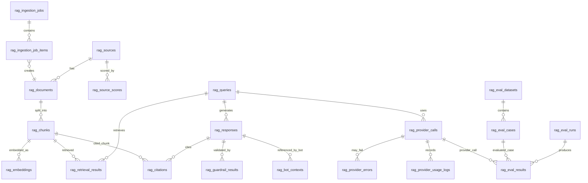
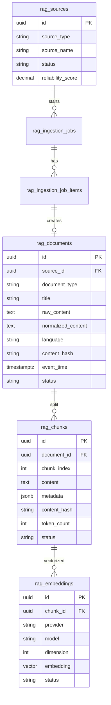
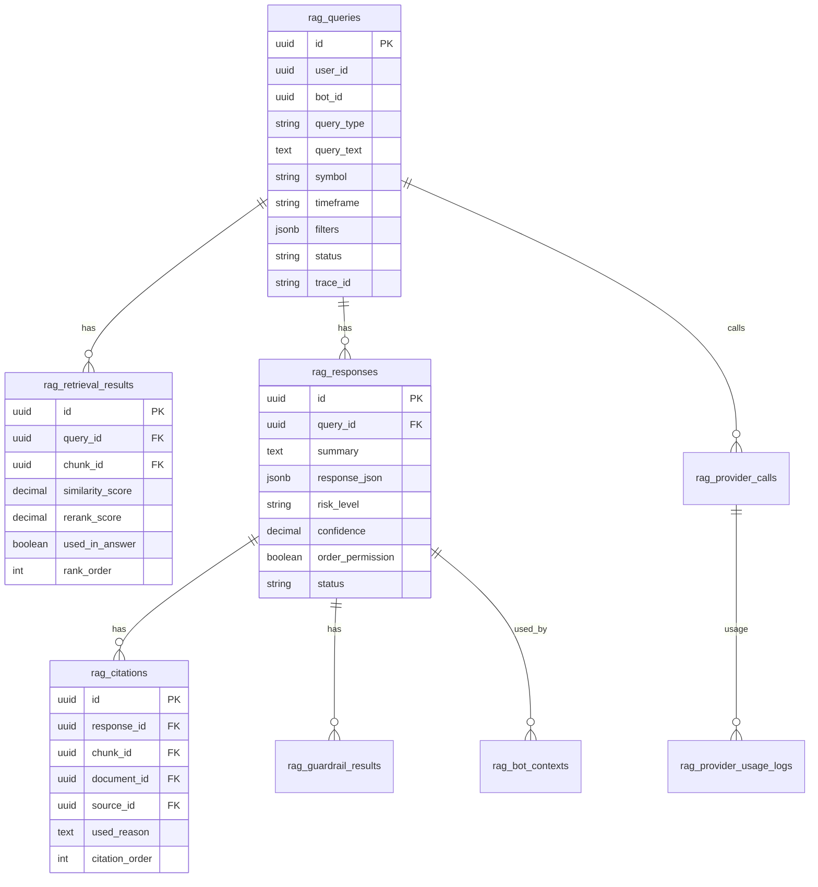

# Personal Multi Trading Platform

# Training Bot RAG Hub DB・ER設計書 v1.0

---

# 1. 文書情報

| 項目 | 内容 |
|---|---|
| 文書名 | Training Bot RAG Hub DB・ER設計書 |
| 対象システム | Personal Multi Trading Platform（PMTP） |
| 対象機能 | Training Bot参照用RAG基盤 |
| 文書種別 | DB・ER設計書 |
| 版数 | v1.1（正本化 2026-06-10: 統合スキーマ正本仕様 v1.0 適用 / B1〜B7 ブロッカー解消。本書が DB 正本。27_Chunking設計書 §9 DDL は概念参考に降格） |
| 作成日 | 2026-06-09 |
| 改訂日 | 2026-06-10 |
| 対象フェーズ | Phase 1 MVP / Phase 2 Provider比較 / Phase 3 外部情報RAG |
| DB | PostgreSQL |
| Vector Store | pgvector |
| ORM | Prisma |
| Cache / Queue | Redis |

---

# 2. 設計方針

## 2.1 基本方針

Training Bot RAG HubのDBは、以下を目的として設計する。

1. RAG検索対象データを安全に保存する
2. 文書・ログ・市場データをチャンク化して検索可能にする
3. Embeddingをpgvectorで保存する
4. RAG問い合わせ、検索結果、回答、引用、ガードレール結果を監査可能にする
5. Training Botが参照したRAG文脈を追跡可能にする
6. LLM Provider利用量、コスト、Latency、Fallbackを保存する
7. 将来のニュース、SNS、予測市場データ追加に耐える

## 2.2 最重要制約

```text
RAGは注文しない。
RAGはBotに判断材料を渡すだけ。
注文可否はTrading Engine / Risk Filter / Human Confirm側で判断する。
```

そのため、本DB設計では注文実行系テーブルを持たない。既存PMTP側の注文履歴・約定履歴・ポジション履歴は、RAG側では参照またはスナップショット化された文書として扱う。

## 2.3 採用DB

| 項目 | 採用 |
|---|---|
| RDBMS | PostgreSQL |
| Vector拡張 | pgvector |
| ORM | Prisma |
| 主キー | UUID |
| JSON保持 | JSONB |
| 日時 | timestamptz |
| 論理削除 | `deleted_at` または `status = DISABLED` |
| 監査追跡 | `trace_id` / `request_id` / `created_at` / `created_by` |

<!-- 正本化 2026-06-10: B1/B3/B4/B7 対応（統合スキーマ正本仕様 v1.0） -->
## 2.4 横断規約（正本化 2026-06-10 追加）

### 2.4.1 DB 正本宣言（B7）

テーブル名・カラム名・Enum・インデックスの **正本は本書（05）** とする。`27_Chunking設計書.md` §9 の DDL は概念参考に降格済み（27 側に注記あり）。矛盾時は本書が優先。Chunking 戦略そのもの（27 §4〜§8, §10〜§17）は引き続き 27 が正本。

### 2.4.2 トレーサビリティ 3 識別子（B4）

| 識別子 | 採番者 | 寿命 | 用途 |
|---|---|---|---|
| `trace_id` | **RAG サーバ発行**（受信時に未付与なら生成。PTP からの W3C traceparent 連携があれば継承） | 1 業務トランザクション（**リトライ跨ぎで不変**） | PMTP↔RAG 横断追跡 |
| `request_id` | RAG サーバ発行 | **1 実行（リトライごとに変わる）** | 個別 HTTP 実行・ログ突合 |
| `idempotency_key` | **ボット（クライアント）採番** | クライアント定義 | 二重課金・監査重複防止（B1） |

冪等性キー衝突時のサーバ挙動: 既存行を 200 で返却（再課金しない）。

### 2.4.3 order_permission の防御構造（B3）

一次防御は **DB ロール物理遮断**（§12.1 参照）: RAG 用 DB ユーザー（`rag_app_user` / `rag_worker_user` / `rag_readonly_user`）には PMTP 側 Order / Execution / Position / Credential 系テーブルへの GRANT を一切付与しない。`check (order_permission = false)`（§5.10 / §5.13）はその上の **二次防御** として維持する。

### 2.4.4 マルチテナント方針（全ボット共有プール）

本 DB は **全ボット共有プール（単一ユーザー前提）** で運用する。ボット間の交差汚染は仕様として許容。将来マルチオーナー化する場合は `rag_sources` / `rag_documents` / `rag_queries` に `owner_id uuid` を追加し、検索 WHERE へ伝播させるパスのみ予約する（現時点では実装しない）。

### 2.4.5 金融数値の保持方針

drawdown / runup / funding_rate / price / qty 等の金融数値を本 DB に保持する場合は **TEXT（string）または JSONB 内 string**（例: `"price": "65000.50"`）で保持し、float / double 精度のカラム・JSON number を作らない（PTP `engineering-prisma-decimal-policy` 同型）。`reliability_score` / `similarity_score` 等の **検索スコアは金融数値ではない** ため `numeric` のままで可。

---

# 3. ER図

## 3.1 MVP全体ER図



## 3.2 データ取込・Indexing ER図



## 3.3 Query・回答・監査 ER図



---

# 4. テーブル一覧

## 4.1 コアテーブル

| テーブル名 | 用途 | MVP |
|---|---|---|
| rag_sources | データソース管理 | 必須 |
| rag_source_scores | ソース信頼度スコア履歴 | 必須 |
| rag_documents | 原文・正規化済み文書 | 必須 |
| rag_chunks | 検索単位チャンク | 必須 |
| rag_embeddings | Embedding保存 | 必須 |
| rag_ingestion_jobs | 取込ジョブ | 必須 |
| rag_ingestion_job_items | 取込ジョブ明細 | 必須 |

## 4.2 RAG実行・監査テーブル

| テーブル名 | 用途 | MVP |
|---|---|---|
| rag_queries | RAG問い合わせ履歴 | 必須 |
| rag_retrieval_results | 検索結果履歴 | 必須 |
| rag_responses | RAG回答履歴 | 必須 |
| rag_citations | 回答に使った引用 | 必須 |
| rag_guardrail_results | ガードレール検証結果 | 必須 |
| rag_bot_contexts | Bot参照文脈 | 必須 |

## 4.3 Provider管理テーブル

| テーブル名 | 用途 | MVP |
|---|---|---|
| rag_provider_policies | Provider選択Policy | 必須 |
| rag_provider_calls | Provider呼び出し履歴 | 必須 |
| rag_provider_usage_logs | token / cost / latency記録 | 必須 |
| rag_provider_errors | Providerエラー / Fallback履歴 | 必須 |

## 4.4 評価系テーブル

| テーブル名 | 用途 | MVP |
|---|---|---|
| rag_eval_datasets | 評価Dataset | Phase 2 |
| rag_eval_cases | 評価ケース | Phase 2 |
| rag_eval_runs | 評価実行単位 | Phase 2 |
| rag_eval_results | Provider評価結果 | Phase 2 |
| rag_retrieval_evaluations | Retrieval品質評価（28_Retrieval評価設計書 §14 由来 / 名前予約のみ・DDL は Phase 2 着工時に設計） | Phase 2 |

<!-- 正本化 2026-06-10: 方針4 対応 — RAG 品質評価基盤（Precision@10 / Citation整合率 / Hallucination率）は Phase 2。MVP リリース判定（§15 受入基準）には品質指標を含めない -->
> **注記（正本化 2026-06-10）**: 評価系テーブルはすべて Phase 2。MVP 受入基準（§15）は機能要件のみで構成し、Precision@10 / Citation整合率 / Hallucination率 等の品質指標は MVP リリース判定から外す。

---

# 5. テーブル定義

## 5.1 rag_sources

### 目的

RAGに投入するデータソースを管理する。内部データ、ニュース、SNS、予測市場、戦略ドキュメントなどを区別する。

### カラム定義

| カラム | 型 | 必須 | 説明 |
|---|---|---:|---|
| id | uuid | Y | ソースID |
| source_type | varchar(50) | Y | enum 値の正本は §6.1（全 12 値）。MVP 主投入: `market_data` / `bot_log` / `strategy_doc` / `order_history`（他 8 値は Phase2+ 投入）（★正本化 2026-06-10 改訂: §6.1 へ一本化 / B7 enum SSoT） |
| source_name | varchar(100) | Y | `internal` / `binance` / `polymarket` / `news_api` 等 |
| display_name | varchar(200) | Y | 表示名 |
| description | text | N | 説明 |
| base_url | text | N | 外部ソースURL |
| reliability_score | numeric(5,4) | Y | 0〜1の信頼度 |
| default_language | varchar(10) | N | `ja` / `en` / `zh` |
| fetch_policy | jsonb | N | 取得設定 |
| status | varchar(30) | Y | `ACTIVE` / `DISABLED` / `BLOCKED` |
| created_at | timestamptz | Y | 作成日時 |
| updated_at | timestamptz | Y | 更新日時 |
| deleted_at | timestamptz | N | 論理削除日時 |

### 制約

```sql
unique(source_type, source_name)
check (reliability_score >= 0 and reliability_score <= 1)
```

---

## 5.2 rag_source_scores

### 目的

ソース信頼度、鮮度、ノイズ率などの評価履歴を保存する。

| カラム | 型 | 必須 | 説明 |
|---|---|---:|---|
| id | uuid | Y | スコアID |
| source_id | uuid | Y | rag_sources.id |
| reliability_score | numeric(5,4) | Y | 信頼度 |
| recency_score | numeric(5,4) | Y | 鮮度 |
| noise_score | numeric(5,4) | N | ノイズ度 |
| bias_score | numeric(5,4) | N | 偏り度 |
| evaluation_reason | text | N | 評価理由 |
| evaluated_at | timestamptz | Y | 評価日時 |
| created_at | timestamptz | Y | 作成日時 |

---

## 5.3 rag_documents

### 目的

原文、正規化本文、メタデータを文書単位で保存する。

| カラム | 型 | 必須 | 説明 |
|---|---|---:|---|
| id | uuid | Y | 文書ID |
| source_id | uuid | Y | rag_sources.id |
| external_id | varchar(255) | N | 外部側ID |
| document_type | varchar(50) | Y | `article` / `log` / `market_snapshot` / `strategy_rule` / `prediction_event` |
| title | text | N | タイトル |
| raw_content | text | Y | 原文 |
| normalized_content | text | Y | 正規化済み本文 |
| summary | text | N | 事前要約 |
| language | varchar(10) | Y | `ja` / `en` / `zh` |
| source_url | text | N | 参照URL |
| content_hash | varchar(64) | Y | 重複排除用SHA-256 |
| metadata | jsonb | Y | symbol, market, timeframe等 |
| event_time | timestamptz | N | 情報発生日時 |
| ingested_at | timestamptz | Y | 取込日時 |
| status | varchar(30) | Y | `PENDING` / `NORMALIZED` / `INDEXED` / `FAILED` / `BLOCKED` / `DISABLED` |
| created_at | timestamptz | Y | 作成日時 |
| updated_at | timestamptz | Y | 更新日時 |
| deleted_at | timestamptz | N | 論理削除日時 |

### 制約

```sql
unique(source_id, content_hash)
```

---

## 5.4 rag_chunks

### 目的

文書を検索しやすい単位に分割したチャンクを保存する。

| カラム | 型 | 必須 | 説明 |
|---|---|---:|---|
| id | uuid | Y | チャンクID |
| document_id | uuid | Y | rag_documents.id |
| source_id | uuid | Y | rag_sources.id（★正本化 2026-06-10 追加: 27 から採用。検索 SQL の join 段数削減・reliability join 用の非正規化 / B5・B7） |
| chunk_index | int | Y | 文書内順序 |
| content | text | Y | チャンク本文 |
| content_hash | varchar(64) | Y | チャンク重複排除用 |
| token_count | int | N | token数 |
| metadata | jsonb | Y | 検索フィルタ用メタデータ |
| source_type | varchar(50) | Y | 検索高速化用冗長カラム |
| symbol | varchar(30) | N | BTCUSDT等 |
| market | varchar(30) | N | crypto / stock / fx |
| timeframe | varchar(20) | N | 1m / 5m / 1h / 1d |
| event_time | timestamptz | N | イベント時刻 |
| ingested_at | timestamptz | Y | 取込日時（★正本化 2026-06-10 追加: 27 から採用。recency 動的計算の基準時刻 / event_time NULL 時 fallback / B5） |
| language | varchar(10) | Y | ja / en / zh |
| risk_tags | text[] | N | volatility等 |
| status | varchar(30) | Y | `ACTIVE` / `QUARANTINED` / `DISABLED`（★正本化 2026-06-10 改訂: 旧 `BLOCKED` → `QUARANTINED` にリネーム / B5・B7） |
| created_at | timestamptz | Y | 作成日時 |
| updated_at | timestamptz | Y | 更新日時 |
| deleted_at | timestamptz | N | 論理削除日時（★正本化 2026-06-10 追加: document 論理削除連動の直接述語 / B5） |

### 制約

```sql
unique(document_id, chunk_index)
unique(document_id, content_hash)
```

<!-- 正本化 2026-06-10: B5/B7 対応 — 隔離列一本化と recency_score の裁定 -->
### 設計裁定（正本化 2026-06-10）

1. **隔離列の一本化（B7）**: 27_Chunking設計書 旧 DDL の `is_active` / `is_quarantined` 2 軸ブールは **不採用**。2 軸ブールは `is_active=true AND is_quarantined=true` のような矛盾状態を表現できてしまい、検索 WHERE の書き漏れ面が 2 倍になるため、`status` 単一ステートマシンに一本化し `QUARANTINED` を語彙追加した。検索条件は `status = 'ACTIVE'` の 1 述語で済む（公開条件 SSoT 化）。マッピング: 旧 `is_quarantined=true` → `status='QUARANTINED'` / 旧 `is_active=false` → `status='DISABLED'`。
2. **recency_score はカラムとして保持しない（B5）**: 物理保持すると経年再計算バッチ（全行 UPDATE）が必須になり、再計算漏れ＝鮮度誤評価という新しい盲点を作る。`event_time` / `ingested_at` から `exp(-Δt/τ)` を検索 SQL 内で動的計算する（§8.1）。検索実行時点の計算値は `rag_retrieval_results.recency_score` にスナップショット保存し監査再現性を担保する。
3. **reliability_score も chunk へ非正規化しない**: `rag_sources` join で取得する（ソース信頼度更新が即時反映される SSoT 維持のため）。

---

## 5.5 rag_embeddings

### 目的

チャンク本文のEmbeddingをpgvectorで保存する。

| カラム | 型 | 必須 | 説明 |
|---|---|---:|---|
| id | uuid | Y | Embedding ID |
| chunk_id | uuid | Y | rag_chunks.id |
| provider | varchar(50) | Y | openai / gemini / voyage / mistral / local |
| model | varchar(100) | Y | text-embedding-3-small等 |
| dimension | int | Y | 1024 / 1536 / 3072 等（★正本化 2026-06-10 改訂: マルチProvider次元混在を許容 / B6） |
| embedding | vector | Y | pgvector。**型なし `vector`**（次元は dimension カラム + CHECK で担保 / ★正本化 2026-06-10 / B6） |
| content_hash | varchar(64) | Y | Embedding生成元hash |
| status | varchar(30) | Y | `ACTIVE` / `STALE` / `FAILED` |
| error_message | text | N | FAILED 時の原因保持（★正本化 2026-06-10 追加: 27 から採用） |
| embedded_at | timestamptz | Y | 生成日時 |
| created_at | timestamptz | Y | 作成日時 |

### 制約

<!-- 正本化 2026-06-10: B6 対応 — 宣言次元と実体の不一致を物理拒否 -->
```sql
unique(chunk_id, provider, model)
check (vector_dims(embedding) = dimension)  -- ★正本化 2026-06-10 追加（B6）
```

### 注意

Prismaはpgvector型を直接扱いにくい場合がある。その場合は以下のどちらかで対応する。

1. Prisma上では `Unsupported("vector")` として定義する
2. Vector検索SQLは `$queryRaw` で実行する

<!-- 正本化 2026-06-10: B6/B7 対応 — マルチProvider次元混在の方式裁定 -->
### マルチ Provider 次元混在の方式（正本化 2026-06-10 / B6）

**単一テーブル + 型なし `vector` カラム + 次元別・provider/model 別の部分式インデックス** を採用する。次元別テーブル分割は不採用。

- 理由①: `unique(chunk_id, provider, model)` と FK 構造を単一テーブルのまま維持できる
- 理由②: pgvector は型なし `vector` 列に直接インデックスを張れないが、**式インデックス `(embedding::vector(N))` + `WHERE dimension = N` の部分インデックス**で provider 別 ANN が成立する（pgvector 公式の mixed-dimension パターン / §7.3 参照）
- 理由③: テーブル分割は Prisma model 増殖と ingest 分岐を生む

カラム名は本書の `provider` / `model` / `dimension` に統一（27 旧 DDL の `embedding_provider` / `embedding_model` / `embedding_dimension` は破棄済み / B7）。

---

## 5.6 rag_ingestion_jobs

### 目的

外部・内部データ取込処理の実行単位を保存する。

| カラム | 型 | 必須 | 説明 |
|---|---|---:|---|
| id | uuid | Y | Job ID |
| source_id | uuid | Y | rag_sources.id |
| job_type | varchar(50) | Y | `manual_upload` / `scheduled_fetch` / `internal_sync` / `reindex` |
| status | varchar(30) | Y | `PENDING` / `FETCHING` / `NORMALIZED` / `INDEXING` / `INDEXED` / `FAILED` / `BLOCKED` |
| started_at | timestamptz | N | 開始日時 |
| finished_at | timestamptz | N | 終了日時 |
| total_count | int | Y | 対象件数 |
| success_count | int | Y | 成功件数 |
| failed_count | int | Y | 失敗件数 |
| error_message | text | N | エラー概要 |
| idempotency_key | text | N | 呼び出し元採番。手動 UI 起動時は NULL 可（★正本化 2026-06-10 追加 / B1） |
| payload_hash | varchar(64) | N | 同一 idempotency_key で異なる payload の再送を 409 判定するための sha256（NULL = 冪等性キーなし）（★正本化 2026-06-10 追加 / B1） |
| trace_id | varchar(100) | Y | 追跡ID（サーバ発行 / リトライ間で不変。§2.4.2 参照） |
| request_id | varchar(100) | Y | サーバ発行。1 実行ごと（リトライで変わる）（★正本化 2026-06-10 追加 / B4） |
| created_at | timestamptz | Y | 作成日時 |
| updated_at | timestamptz | Y | 更新日時 |

### 制約

<!-- 正本化 2026-06-10: B1 対応 — ingest 二重実行の物理遮断（部分 unique） -->
```sql
create unique index uq_rag_ingestion_jobs_idempotency
  on rag_ingestion_jobs (source_id, idempotency_key)
  where idempotency_key is not null;  -- ★正本化 2026-06-10 追加（B1）
```

---

## 5.7 rag_ingestion_job_items

### 目的

取込ジョブ内の個別データ処理結果を保存する。

| カラム | 型 | 必須 | 説明 |
|---|---|---:|---|
| id | uuid | Y | 明細ID |
| job_id | uuid | Y | rag_ingestion_jobs.id |
| document_id | uuid | N | 作成されたrag_documents.id |
| external_id | varchar(255) | N | 外部データID |
| status | varchar(30) | Y | `PENDING` / `SUCCESS` / `FAILED` / `SKIPPED` / `BLOCKED` |
| error_message | text | N | エラー内容 |
| raw_payload | jsonb | N | 取得元payload |
| trace_id | varchar(100) | Y | 追跡ID（★正本化 2026-06-10 追加: ingest 系 trace 欠落の解消 / B4。`rag_documents` / `rag_chunks` には trace 列を持たせない — job_items → document の FK で辿れるため） |
| created_at | timestamptz | Y | 作成日時 |
| updated_at | timestamptz | Y | 更新日時 |

---

## 5.8 rag_queries

### 目的

RAG問い合わせ入力を保存する。

| カラム | 型 | 必須 | 説明 |
|---|---|---:|---|
| id | uuid | Y | Query ID |
| requester_id | uuid | Y | 呼び出し主体 ID（bot または UI ユーザーを吸収する汎用 ID / `bot_id` とは別カラム）。冪等性スコープ（★正本化 2026-06-10 追加 / B1） |
| user_id | uuid | N | ユーザーID |
| bot_id | uuid | N | Bot ID |
| strategy_id | uuid | N | Strategy ID |
| idempotency_key | text | N | ボット採番。NULL = 冪等性保証なし呼び出し（UI 等）（★正本化 2026-06-10 追加 / B1） |
| payload_hash | varchar(64) | N | 同一 idempotency_key で異なる payload の再送を 409 判定するための sha256（★正本化 2026-06-10 追加 / B1） |
| query_type | varchar(50) | Y | enum 値の正本は §6.2（全 8 値: `market_context` / `bot_signal_explanation` / `similar_case` / `external_sentiment` / `risk_review` / `backtest_report` / `history_review` / `provider_eval`）（★正本化 2026-06-10 改訂: §6.2 へ一本化 / B7） |
| query_text | text | Y | ユーザーまたはBotの問い合わせ |
| symbol | varchar(30) | N | BTCUSDT等 |
| market | varchar(30) | N | crypto / stock / fx |
| timeframe | varchar(20) | N | 1h等 |
| source_types | text[] | N | 検索対象ソース種別 |
| filters | jsonb | Y | from/to, risk_tags等 |
| features | jsonb | N | RSI, MACD等 |
| provider_policy | varchar(100) | Y | default / risk_aware等 |
| status | varchar(30) | Y | `RECEIVED` / `VALIDATED` / `RETRIEVED` / `GENERATED` / `VALIDATED_OUTPUT` / `SAVED` / `RETURNED` / `FAILED` / `BLOCKED` |
| trace_id | varchar(100) | Y | **サーバ発行**。PMTP横断追跡ID（リトライ間で不変）（★正本化 2026-06-10 説明改訂 / B4。§2.4.2 参照） |
| request_id | varchar(100) | Y | サーバ発行。1 実行ごと（リトライで変わる）（★正本化 2026-06-10 追加 / B4） |
| created_at | timestamptz | Y | 作成日時 |
| updated_at | timestamptz | Y | 更新日時 |

### 制約

<!-- 正本化 2026-06-10: B1 対応 — 二重課金・監査重複の物理遮断（部分 unique） -->
```sql
create unique index uq_rag_queries_idempotency
  on rag_queries (requester_id, idempotency_key)
  where idempotency_key is not null;  -- ★正本化 2026-06-10 追加（B1）
```

冪等性キー衝突時のサーバ挙動（★正本化 2026-06-10 改訂 / B1）: 同一 `(requester_id, idempotency_key)` の再送で **`payload_hash` が一致**すれば既存行を 200 で返却（再課金しない / replay）。**`payload_hash` が不一致**なら `409 RAG_IDEMPOTENCY_CONFLICT`（同一キーで別 payload = クライアントのキー使い回しバグ）。idempotency_key は対象行の保持期間中ずっと有効で、再送は常にこの判定に従う（時間窓で新規実行にしたい場合は合成キーに `time_window_start` を含める）。部分 unique（`WHERE idempotency_key IS NOT NULL`）は Prisma schema で表現できないため raw migration で管理する（§9.4 参照）。

---

## 5.9 rag_retrieval_results

### 目的

RAG Queryで検索されたチャンクとスコアを保存する。

| カラム | 型 | 必須 | 説明 |
|---|---|---:|---|
| id | uuid | Y | Retrieval Result ID |
| query_id | uuid | Y | rag_queries.id |
| chunk_id | uuid | Y | rag_chunks.id |
| document_id | uuid | Y | rag_documents.id |
| source_id | uuid | Y | rag_sources.id |
| rank_order | int | Y | 検索順位 |
| similarity_score | numeric(8,6) | N | vector similarity |
| keyword_score | numeric(8,6) | N | keyword score |
| rerank_score | numeric(8,6) | N | reranking後score |
| recency_score | numeric(8,6) | N | 検索時に動的計算した鮮度スコアのスナップショット（監査再現用）（★正本化 2026-06-10 追加 / B5） |
| final_score | numeric(8,6) | N | §8.1 合成スコアのスナップショット（★正本化 2026-06-10 追加 / B5） |
| used_in_answer | boolean | Y | 回答生成に使ったか |
| retrieval_reason | text | N | 採用理由 |
| created_at | timestamptz | Y | 作成日時 |

### 制約

<!-- 正本化 2026-06-10: B2 対応 — rag_citations 複合 FK の参照先（whitelist 物理強制の基盤） -->
```sql
unique(query_id, chunk_id)  -- ★正本化 2026-06-10 追加: 同一クエリ内の同一チャンク重複登録防止
unique(id, chunk_id)        -- ★正本化 2026-06-10 追加: rag_citations 複合 FK の参照先（B2 whitelist）
```

> **注記**: chunk 上に recency_score を持たない代わり、**検索実行時点の計算値を本テーブルにスナップショット** する。これで監査再現性と「経年再計算ジョブ不要」を両立する（§5.4 設計裁定 2 参照）。

---

## 5.10 rag_responses

### 目的

LLMまたは検索結果のみで生成されたRAG回答を保存する。

| カラム | 型 | 必須 | 説明 |
|---|---|---:|---|
| id | uuid | Y | Response ID |
| query_id | uuid | Y | rag_queries.id |
| summary | text | Y | 要約 |
| response_json | jsonb | Y | 構造化回答全文 |
| supporting_factors | jsonb | N | 支持材料 |
| opposing_factors | jsonb | N | 反対材料 |
| similar_cases | jsonb | N | 類似ケース |
| risk_level | varchar(20) | Y | `LOW` / `MEDIUM` / `HIGH` / `CRITICAL` |
| confidence | numeric(5,4) | Y | 0〜1 |
| order_permission | boolean | Y | 常にfalse |
| warning_message | text | N | 注意文 |
| status | varchar(30) | Y | `GENERATED` / `VALIDATED` / `BLOCKED` / `RETURNED` |
| created_at | timestamptz | Y | 作成日時 |
| updated_at | timestamptz | Y | 更新日時 |

### 制約

```sql
check (confidence >= 0 and confidence <= 1)
check (order_permission = false)  -- 二次防御（一次防御は §2.4.3 / §12.1 の DB ロール物理遮断）
```

<!-- 正本化 2026-06-10: B3 / 金融数値方針の注記 -->
> **金融数値注記（正本化 2026-06-10）**: `response_json` / `similar_cases` 内の最大逆行幅・最大順行幅・price 等は **JSON string**（例: `"price": "65000.50"`）で保持する。JSON number 禁止（§2.4.5 参照）。

---

## 5.11 rag_citations

### 目的

回答に使った根拠ソースを保存する。

| カラム | 型 | 必須 | 説明 |
|---|---|---:|---|
| id | uuid | Y | Citation ID |
| response_id | uuid | Y | rag_responses.id |
| retrieval_result_id | uuid | Y | rag_retrieval_results.id（★正本化 2026-06-10 改訂: 旧 N → **NOT NULL 化**。複合 FK で whitelist を物理強制 / B2） |
| source_id | uuid | Y | rag_sources.id |
| document_id | uuid | Y | rag_documents.id |
| chunk_id | uuid | Y | rag_chunks.id |
| citation_order | int | Y | 表示順 |
| title | text | N | 引用表示タイトル |
| source_url | text | N | URL |
| used_reason | text | Y | 根拠として使った理由 |
| excerpt | text | Y | 引用箇所の本文スナップショット（後日の chunk 変更・削除に耐える）（★正本化 2026-06-10 追加 / B2） |
| similarity_score | numeric(8,6) | N | retrieval 時スコアの非正規化（検証高速化）（★正本化 2026-06-10 追加 / B2） |
| rerank_score | numeric(8,6) | N | 同上（★正本化 2026-06-10 追加 / B2） |
| event_time | timestamptz | N | 引用時点の chunk.event_time スナップショット（★正本化 2026-06-10 追加 / B2） |
| ingested_at | timestamptz | N | 引用時点の chunk.ingested_at スナップショット（★正本化 2026-06-10 追加 / B2） |
| quality_status | varchar(30) | Y | citation 品質の合成ステータス（enum 正本 / 10 §6.1 と一致）: `ACTIVE` / `QUARANTINED` / `DISABLED` / `STALE` / `LOW_RELIABILITY`。導出 = chunk.status（ACTIVE/QUARANTINED/DISABLED）∪ embedding STALE（§5.5 status）∪ source.reliability_score < 足切り → LOW_RELIABILITY。`ACTIVE` 以外の引用は guardrail BLOCK 対象（★正本化 2026-06-10 追加・改訂 / B2） |
| created_at | timestamptz | Y | 作成日時 |

### 制約

<!-- 正本化 2026-06-10: B2 対応 — chunk_id whitelist 検証の物理強制 -->
```sql
unique(response_id, citation_order)
foreign key (retrieval_result_id, chunk_id)
  references rag_retrieval_results (id, chunk_id)  -- ★正本化 2026-06-10 追加（B2 whitelist の物理強制）
```

### 設計裁定（正本化 2026-06-10 / B2）

- **whitelist 検証の物理強制**: `retrieval_result_id` を NOT NULL 化した上で、複合 FK `(retrieval_result_id, chunk_id) → rag_retrieval_results(id, chunk_id)` を張る。これにより「LLM が返した chunk_id が当該クエリの retrieval 集合に実在すること」を **DB 制約レベルで物理強制** できる（アプリ検証が漏れても捏造 citation は INSERT 不能）。参照先の `unique(id, chunk_id)` は §5.9 で定義済み。
- **非正規化カラムは引用時点のスナップショット**: excerpt / scores / times / quality_status は引用時点で固定し、chunk 側の後日変更で更新しない（監査固定）。
- 複合 FK は Prisma schema で表現できないため raw migration で管理する（§9.4 参照）。

---

## 5.12 rag_guardrail_results

### 目的

Prompt Injection検知、禁止表現、Schema Validation、Secret Maskingなどの結果を保存する。

| カラム | 型 | 必須 | 説明 |
|---|---|---:|---|
| id | uuid | Y | Guardrail Result ID |
| query_id | uuid | Y | rag_queries.id |
| response_id | uuid | N | rag_responses.id |
| guardrail_type | varchar(50) | Y | `prompt_injection` / `schema_validation` / `prohibited_expression` / `secret_masking` / `order_permission` |
| status | varchar(30) | Y | `PASS` / `WARNING` / `BLOCKED` |
| severity | varchar(20) | Y | `LOW` / `MEDIUM` / `HIGH` / `CRITICAL` |
| detected_items | jsonb | N | 検出項目 |
| reason | text | N | 判定理由 |
| blocked | boolean | Y | ブロックしたか |
| created_at | timestamptz | Y | 作成日時 |

---

## 5.13 rag_bot_contexts

### 目的

Training Botが参照したRAG回答をBot・Strategy・Signalと紐づける。

| カラム | 型 | 必須 | 説明 |
|---|---|---:|---|
| id | uuid | Y | Context ID |
| requester_id | uuid | Y | 呼び出し主体 ID（冪等性スコープ。§5.8 と同設計）（★正本化 2026-06-10 追加 / B1） |
| bot_id | uuid | Y | Bot ID |
| strategy_id | uuid | N | Strategy ID |
| idempotency_key | text | N | ボット採番。NULL = 冪等性保証なし呼び出し（★正本化 2026-06-10 追加 / B1） |
| payload_hash | varchar(64) | N | 同一 idempotency_key で異なる payload の再送を 409 判定するための sha256（★正本化 2026-06-10 追加 / B1） |
| query_id | uuid | Y | rag_queries.id |
| response_id | uuid | Y | rag_responses.id |
| symbol | varchar(30) | N | BTCUSDT等 |
| timeframe | varchar(20) | N | 1h等 |
| bot_signal | varchar(20) | N | `BUY` / `SELL` / `HOLD` / `NONE`（enum 正本は 10 §3.4.3 BotSignal 4 値 / ★正本化 2026-06-10 改訂: NONE 追加 / B7） |
| features | jsonb | N | RSI等 |
| context_json | jsonb | Y | Botへ返却した文脈 |
| order_permission | boolean | Y | 常にfalse |
| created_at | timestamptz | Y | 作成日時 |

### 制約

```sql
check (order_permission = false)  -- 二次防御（一次防御は §2.4.3 / §12.1 の DB ロール物理遮断）

-- ★正本化 2026-06-10 追加（B1）: 二重登録の物理遮断（部分 unique）
create unique index uq_rag_bot_contexts_idempotency
  on rag_bot_contexts (requester_id, idempotency_key)
  where idempotency_key is not null;
```

---

## 5.14 rag_provider_policies

### 目的

Query種別ごとのPrimary / Fallback Provider方針を保存する。

| カラム | 型 | 必須 | 説明 |
|---|---|---:|---|
| id | uuid | Y | Policy ID |
| policy_name | varchar(100) | Y | default / risk_aware等 |
| task_type | varchar(50) | Y | normal_summary / risk_review等 |
| primary_provider | varchar(50) | Y | openai等 |
| primary_model | varchar(100) | Y | model名 |
| fallback_provider | varchar(50) | N | fallback provider |
| fallback_model | varchar(100) | N | fallback model |
| max_input_tokens | int | N | 上限 |
| max_output_tokens | int | N | 上限 |
| max_estimated_cost | numeric(12,6) | N | 1回あたり上限 |
| enabled | boolean | Y | 有効フラグ |
| created_at | timestamptz | Y | 作成日時 |
| updated_at | timestamptz | Y | 更新日時 |

---

## 5.15 rag_provider_calls

### 目的

LLM / Embedding Provider呼び出しの実行履歴を保存する。

| カラム | 型 | 必須 | 説明 |
|---|---|---:|---|
| id | uuid | Y | Provider Call ID |
| query_id | uuid | N | rag_queries.id |
| response_id | uuid | N | rag_responses.id |
| provider_policy_id | uuid | N | rag_provider_policies.id |
| provider | varchar(50) | Y | openai / claude / gemini / mistral / local |
| model | varchar(100) | Y | model名 |
| call_type | varchar(50) | Y | `chat` / `embedding` / `rerank` / `eval` |
| status | varchar(30) | Y | `PENDING` / `CALLING` / `SUCCESS` / `FAILED` / `FALLBACK_USED` / `BLOCKED` |
| fallback_used | boolean | Y | fallback有無 |
| fallback_from_call_id | uuid | N | 元Call ID |
| request_hash | varchar(64) | N | リクエストhash |
| response_hash | varchar(64) | N | レスポンスhash |
| started_at | timestamptz | N | 開始日時 |
| finished_at | timestamptz | N | 終了日時 |
| trace_id | varchar(100) | Y | 追跡ID（サーバ発行 / リトライ間で不変。§2.4.2 参照） |
| request_id | varchar(100) | Y | サーバ発行。どの実行リトライの課金かを一意化（★正本化 2026-06-10 追加 / B4） |
| created_at | timestamptz | Y | 作成日時 |

---

## 5.16 rag_provider_usage_logs

### 目的

Provider利用量、token、コスト、Latencyを保存する。

| カラム | 型 | 必須 | 説明 |
|---|---|---:|---|
| id | uuid | Y | Usage Log ID |
| provider_call_id | uuid | Y | rag_provider_calls.id |
| provider | varchar(50) | Y | provider名 |
| model | varchar(100) | Y | model名 |
| input_tokens | int | Y | 入力token |
| output_tokens | int | Y | 出力token |
| total_tokens | int | Y | 合計token |
| estimated_cost_usd | numeric(12,6) | Y | 推定費用 |
| latency_ms | int | Y | 応答時間 |
| query_type | varchar(50) | N | query種別 |
| bot_id | uuid | N | Bot ID |
| trace_id | varchar(100) | Y | 追跡ID |
| created_at | timestamptz | Y | 作成日時 |

---

## 5.17 rag_provider_errors

### 目的

Provider APIエラー、Schema不一致、Rate Limit、Fallback発生理由を保存する。

| カラム | 型 | 必須 | 説明 |
|---|---|---:|---|
| id | uuid | Y | Error ID |
| provider_call_id | uuid | Y | rag_provider_calls.id |
| provider | varchar(50) | Y | provider名 |
| model | varchar(100) | N | model名 |
| error_type | varchar(50) | Y | `api_error` / `timeout` / `rate_limit` / `schema_invalid` / `safety_block` |
| error_code | varchar(100) | N | Provider側コード |
| error_message | text | Y | エラー内容 |
| retryable | boolean | Y | リトライ可否 |
| fallback_triggered | boolean | Y | fallback実行有無 |
| created_at | timestamptz | Y | 作成日時 |

---

## 5.18 rag_eval_datasets

### 目的

Provider比較用の評価Datasetを管理する。

| カラム | 型 | 必須 | 説明 |
|---|---|---:|---|
| id | uuid | Y | Dataset ID |
| dataset_code | varchar(100) | Y | RAG-EVAL-001等 |
| name | varchar(200) | Y | 評価Dataset名 |
| description | text | N | 説明 |
| task_type | varchar(50) | Y | 市場要約等 |
| language | varchar(10) | N | ja / en / zh |
| status | varchar(30) | Y | ACTIVE / DISABLED |
| created_at | timestamptz | Y | 作成日時 |
| updated_at | timestamptz | Y | 更新日時 |

---

## 5.19 rag_eval_cases

### 目的

評価Dataset内の個別ケースを保存する。

| カラム | 型 | 必須 | 説明 |
|---|---|---:|---|
| id | uuid | Y | Case ID |
| dataset_id | uuid | Y | rag_eval_datasets.id |
| case_no | int | Y | ケース番号 |
| input_json | jsonb | Y | 入力 |
| expected_json | jsonb | N | 期待出力 |
| evaluation_criteria | jsonb | Y | 評価基準 |
| risk_tags | text[] | N | リスクタグ |
| status | varchar(30) | Y | ACTIVE / DISABLED |
| created_at | timestamptz | Y | 作成日時 |
| updated_at | timestamptz | Y | 更新日時 |

---

## 5.20 rag_eval_runs

### 目的

Provider評価の実行単位を保存する。

| カラム | 型 | 必須 | 説明 |
|---|---|---:|---|
| id | uuid | Y | Run ID |
| dataset_id | uuid | Y | rag_eval_datasets.id |
| run_name | varchar(200) | Y | 実行名 |
| providers | jsonb | Y | 評価対象Provider一覧 |
| status | varchar(30) | Y | PENDING / RUNNING / COMPLETED / FAILED |
| started_at | timestamptz | N | 開始日時 |
| finished_at | timestamptz | N | 終了日時 |
| created_at | timestamptz | Y | 作成日時 |

---

## 5.21 rag_eval_results

### 目的

Provider別・評価ケース別の評価結果を保存する。

| カラム | 型 | 必須 | 説明 |
|---|---|---:|---|
| id | uuid | Y | Result ID |
| eval_run_id | uuid | Y | rag_eval_runs.id |
| eval_case_id | uuid | Y | rag_eval_cases.id |
| provider_call_id | uuid | N | rag_provider_calls.id |
| provider | varchar(50) | Y | provider名 |
| model | varchar(100) | Y | model名 |
| schema_valid | boolean | Y | Schema一致 |
| citation_accuracy | numeric(5,4) | N | 引用正確性 |
| hallucination_score | numeric(5,4) | N | ハルシネーション度 |
| risk_coverage_score | numeric(5,4) | N | リスク抽出力 |
| safety_violation | boolean | Y | 安全違反有無 |
| latency_ms | int | N | 応答時間 |
| estimated_cost_usd | numeric(12,6) | N | 推定費用 |
| total_score | numeric(6,4) | N | 総合スコア |
| evaluation_detail | jsonb | N | 詳細評価 |
| created_at | timestamptz | Y | 作成日時 |

---

# 6. 主要Enum定義

## 6.1 source_type

> ★正本化 2026-06-10（B7 / enum SSoT）: source_type の唯一の値正本は本節（全 12 値）。10 §3.4.3・本書 §5.1・27 §4 はこれを参照し、値リテラルを再宣言・部分列挙しない。MVP で実データを投入するのは ◎ の 4 値。△ 8 値は enum として定義済みだが投入は Phase2 以降。

```text
market_data         # ◎ MVP
bot_log             # ◎ MVP
order_history       # ◎ MVP
strategy_doc        # ◎ MVP
execution_history   # △ Phase2+
position_history    # △ Phase2+
audit_log           # △ Phase2+
news                # △ Phase2+
sns                 # △ Phase2+
prediction_market   # △ Phase2+
macro_event         # △ Phase2+
manual_note         # △ Phase2+
```

## 6.2 query_type

```text
market_context
bot_signal_explanation
similar_case
external_sentiment
risk_review
backtest_report
history_review
provider_eval
```

## 6.3 risk_level

```text
LOW
MEDIUM
HIGH
CRITICAL
```

## 6.4 guardrail_status

```text
PASS
WARNING
BLOCKED
```

## 6.5 ingestion_status

```text
PENDING
FETCHING
NORMALIZED
INDEXING
INDEXED
FAILED
BLOCKED
```

## 6.6 provider_call_status

```text
PENDING
CALLING
SUCCESS
FAILED
FALLBACK_USED
BLOCKED
```

---

# 7. インデックス設計

## 7.1 通常Index

```sql
create index idx_rag_sources_type_status
  on rag_sources(source_type, status);

create index idx_rag_documents_source_status
  on rag_documents(source_id, status);

create index idx_rag_documents_event_time
  on rag_documents(event_time);

create index idx_rag_documents_content_hash
  on rag_documents(content_hash);

create index idx_rag_chunks_document
  on rag_chunks(document_id, chunk_index);

create index idx_rag_chunks_symbol_timeframe
  on rag_chunks(symbol, timeframe);

create index idx_rag_chunks_event_time
  on rag_chunks(event_time);

create index idx_rag_chunks_source_type
  on rag_chunks(source_type);

create index idx_rag_queries_trace_id
  on rag_queries(trace_id);

create index idx_rag_queries_bot_created
  on rag_queries(bot_id, created_at desc);

create index idx_rag_responses_query
  on rag_responses(query_id);

create index idx_rag_provider_usage_created
  on rag_provider_usage_logs(created_at desc);

create index idx_rag_provider_usage_provider_model
  on rag_provider_usage_logs(provider, model, created_at desc);
```

## 7.2 JSONB Index

```sql
create index idx_rag_documents_metadata_gin
  on rag_documents using gin(metadata);

create index idx_rag_chunks_metadata_gin
  on rag_chunks using gin(metadata);

create index idx_rag_queries_filters_gin
  on rag_queries using gin(filters);

create index idx_rag_responses_response_json_gin
  on rag_responses using gin(response_json);
```

## 7.3 pgvector Index

<!-- 正本化 2026-06-10: B6/B7 対応 — HNSW 採用を確定し、次元別・provider/model 別の部分式インデックス方式に置換 -->

MVPではcosine similarityを基本とする。**インデックス方式は HNSW に確定**（27_Chunking設計書 旧 §9.3 の ivfflat は破棄: ivfflat は事前学習に十分な行数が必須で、MVP 初期の少データ期に精度が出ず、lists=100 にも根拠がない。HNSW は逐次 INSERT に強く運用パラメータが安定 / B7）。

`rag_embeddings.embedding` は型なし `vector`（§5.5）のため、**provider + model + dimension 別の部分式インデックス**（pgvector 公式の mixed-dimension パターン）を採用する（B6）。

### 旧定義（採用不可・参考）

```sql
-- （旧・参考）型固定の単一 ANN インデックス。マルチProvider次元混在（1024/1536/3072）に非対応のため正本化 2026-06-10 で破棄
create index idx_rag_embeddings_embedding_hnsw
  on rag_embeddings
  using hnsw (embedding vector_cosine_ops);
```

### 正本定義

```sql
create extension if not exists vector;

-- provider/model を採用するたびに 1 本ずつ追加する（命名規約: idx_emb_hnsw_{provider}_{dim}）
create index idx_emb_hnsw_openai_small_1536
  on rag_embeddings
  using hnsw ((embedding::vector(1536)) vector_cosine_ops)
  with (m = 16, ef_construction = 64)
  where provider = 'openai' and model = 'text-embedding-3-small'
    and dimension = 1536 and status = 'ACTIVE';

create index idx_emb_hnsw_voyage_1024
  on rag_embeddings
  using hnsw ((embedding::vector(1024)) vector_cosine_ops)
  with (m = 16, ef_construction = 64)
  where provider = 'voyage' and model = 'voyage-3'
    and dimension = 1024 and status = 'ACTIVE';
```

### 運用規約

1. 検索 SQL は必ず `embedding::vector(N)` の **同一キャスト式 + 同一 WHERE 述語** を書くこと（式・述語が一致しないと planner がインデックスを使わない）
2. 新 embedding model 採用時は本節にインデックス 1 行追加が必須（チェックリスト化）
3. 検索時 `SET hnsw.ef_search = 100;`（recall 重視）
4. データ量が小さい初期段階（1 万チャンク未満）では、Index なし seq scan でも動作確認は可能。1 万チャンクを超える段階で HNSW Index を作成する

---

# 8. Vector検索SQL例

## 8.1 Metadata Filter付きSemantic Search（合成スコア正本版）

<!-- 正本化 2026-06-10: B5 対応 — similarity 単独 ORDER BY を廃止し、合成スコア + 鮮度/信頼度/隔離/論理削除フィルタ + dedup 2 段の正本 SQL に置換 -->

旧版（similarity 単独 ORDER BY / 信頼度・鮮度・隔離・論理削除を無視）は **採用不可** として置換した。置換理由: 旧 SQL は `QUARANTINED` チャンク・論理削除済み document/source・低信頼ソース・古すぎる情報をすべて検索結果に混入させ、金銭判断に影響する出力の品質を担保できないため（B5）。

```sql
-- パラメータ:
--   $1 query embedding / $2 provider / $3 model / $4 dimension(int, キャスト式と一致させる)
--   $5 symbol / $6 timeframe / $7 source_types text[] / $8 event_time_from / $9 event_time_to
--   $10 reliability_floor (default 0.4) / $11 max_staleness (interval, default '90 days')
--   $12 top_k (default 20)
--   重み: w_sim=0.55, w_rel=0.20, w_rec=0.25（MVP 初期値 / rag_provider_policies 側で上書き可）
--   τ (recency 半減期): source_type 別 — news/sns/prediction_market: 7日, market_data: 30日,
--                        bot_log/order_history: 90日, strategy_doc: 365日

with ann_candidates as (
  -- 段1: ANN で oversample（dedup・足切りで減る分を見込み top_k の 5 倍）
  select
    e.chunk_id,
    1 - (e.embedding::vector(1536) <=> $1::vector(1536)) as similarity_score
  from rag_embeddings e
  where e.provider = $2 and e.model = $3 and e.dimension = $4
    and e.status = 'ACTIVE'
  order by e.embedding::vector(1536) <=> $1::vector(1536)
  limit $12 * 5
),
scored as (
  select
    c.id as chunk_id,
    c.document_id,
    c.source_id,
    c.content,
    c.content_hash,
    c.metadata,
    a.similarity_score,
    s.reliability_score,
    -- recency: 検索時動的計算（カラム保持しない / 経年再計算ジョブ不要 / §5.4 設計裁定 2）
    exp( - extract(epoch from (now() - coalesce(c.event_time, c.ingested_at)))
         / extract(epoch from (
             case c.source_type
               when 'news' then interval '7 days'
               when 'sns' then interval '7 days'
               when 'prediction_market' then interval '7 days'
               when 'market_data' then interval '30 days'
               when 'strategy_doc' then interval '365 days'
               else interval '90 days'
             end)) ) as recency_score
  from ann_candidates a
  join rag_chunks    c on c.id = a.chunk_id
  join rag_documents d on d.id = c.document_id
  join rag_sources   s on s.id = c.source_id
  where c.status = 'ACTIVE'                        -- 隔離除外（QUARANTINED/DISABLED を一括遮断）
    and c.deleted_at is null                       -- 論理削除除外
    and d.status = 'INDEXED'
    and d.deleted_at is null
    and s.status = 'ACTIVE'
    and s.deleted_at is null
    and s.reliability_score >= $10                 -- 信頼度足切り
    and coalesce(c.event_time, c.ingested_at) >= now() - $11::interval  -- 鮮度上限（staleness hard cap）
    and ($5::text  is null or c.symbol = $5)
    and ($6::text  is null or c.timeframe = $6)
    and ($7::text[] is null or c.source_type = any($7))
    and ($8::timestamptz is null or c.event_time >= $8)
    and ($9::timestamptz is null or c.event_time <= $9)
),
deduped as (
  -- near-duplicate dedup 段A: 同一 content_hash は最良スコア 1 件のみ
  select distinct on (content_hash) *
  from (
    select *,
      (similarity_score * 0.55
       + reliability_score * 0.20
       + recency_score * 0.25) as final_score
    from scored
  ) x
  order by content_hash, final_score desc
),
capped as (
  -- near-duplicate dedup 段B: 1 document あたり最大 2 chunk（単一文書による文脈占有を防止）
  select *, row_number() over (partition by document_id order by final_score desc) as doc_rank
  from deduped
)
select chunk_id, document_id, source_id, content, metadata,
       similarity_score, reliability_score, recency_score, final_score
from capped
where doc_rank <= 2
order by final_score desc
limit $12;
```

### 設計注記（正本化 2026-06-10 / B5）

- **staleness は「減点項」ではなく hard cap（WHERE）+ recency 重みの二重構造**。`final_score = sim*0.55 + rel*0.20 + rec*0.25` から別途 staleness を引かない（recency_score が指数減衰で同じ役割を果たすため二重減点を避ける）。staleness 要求は WHERE 句 hard cap として実装する。
- `strategy_doc` は鮮度概念が薄いため τ=365 日 + hard cap 適用除外を許容（`source_type='strategy_doc'` のとき $11 を `interval '10 years'` で呼ぶ運用とし、SQL は共通のまま）。
- 計算した `similarity_score / recency_score / final_score` は `rag_retrieval_results` にスナップショット保存する（§5.9）。これが監査再現の正本。
- semantic near-dup（hash 不一致だが内容類似）の除去は rerank フェーズの責務。MVP DB 層では content_hash + document cap の 2 段で十分（Phase 2 で MinHash/SimHash 列追加を検討）。
- 重みの正本は `rag_provider_policies` の設定（jsonb）に置き、SQL リテラルはデフォルト値。
- `embedding::vector(1536)` のキャスト式は §7.3 の部分式インデックスと **完全一致** させること（不一致だと planner がインデックスを使わない）。次元の異なる provider を検索する場合はキャスト次元 N を当該 provider の dimension に合わせる。

## 8.2 類似ケース検索の考え方

類似ケース検索は、最初から完全にEmbeddingだけで実装しない。MVPでは以下のハイブリッド方針とする。

1. symbol / timeframe / event_timeで候補を絞る
2. RSI / MACD / ATR / Volume Spike等のfeaturesをJSONBで絞る
3. Embedding similarityで類似文脈を検索する
4. rerank_scoreで最終順位を決める

---

# 9. Prisma Schema方針

## 9.1 pgvector型

Prismaでは以下のように扱う。

```prisma
model RagEmbedding {
  id          String   @id @default(uuid()) @db.Uuid
  chunkId     String   @map("chunk_id") @db.Uuid
  provider    String   @db.VarChar(50)
  model       String   @db.VarChar(100)
  dimension   Int
  embedding   Unsupported("vector")
  contentHash String   @map("content_hash") @db.VarChar(64)
  status      String   @db.VarChar(30)
  embeddedAt  DateTime @map("embedded_at") @db.Timestamptz(6)
  createdAt   DateTime @default(now()) @map("created_at") @db.Timestamptz(6)

  chunk RagChunk @relation(fields: [chunkId], references: [id])

  @@unique([chunkId, provider, model])
  @@map("rag_embeddings")
}
```

## 9.2 JSONB方針

Prismaでは `Json` 型を使う。

```prisma
metadata Json
filters  Json
features Json?
responseJson Json @map("response_json")
```

## 9.3 配列型方針

PostgreSQLの `text[]` はPrismaでは `String[]` で扱う。

```prisma
riskTags String[] @map("risk_tags")
```

<!-- 正本化 2026-06-10: B1/B2/B5 対応 — Prisma で表現できない制約の管理方針 -->
## 9.4 raw migration 管理と可視性 helper SSoT（正本化 2026-06-10 追加）

1. **部分 unique**（`WHERE idempotency_key IS NOT NULL` / §5.6・§5.8・§5.13）は Prisma schema で表現できないため **raw migration で管理** し、schema.prisma に存在をコメントで明記する（B1）。
2. **複合 FK**（`rag_citations(retrieval_result_id, chunk_id) → rag_retrieval_results(id, chunk_id)` / §5.11）も同様に raw migration で管理する（B2）。
3. **ANN 検索は `$queryRaw` 固定**とし、§8.1 の SQL を 1 ファイルに集約する。**検索可視性条件（`status='ACTIVE'` / `deleted_at IS NULL` / reliability 足切り / staleness hard cap）の WHERE 直書きを禁止** し、helper 関数（案: `buildChunkVisibilityWhere()`）を唯一の組み立て口とする（B5 / 公開条件 SSoT）。

---

# 10. データライフサイクル

## 10.1 Ingestion

```text
rag_sources
  ↓
rag_ingestion_jobs
  ↓
rag_ingestion_job_items
  ↓
rag_documents
  ↓
rag_chunks
  ↓
rag_embeddings
```

## 10.2 RAG Query

```text
rag_queries
  ↓
rag_retrieval_results
  ↓
rag_provider_calls
  ↓
rag_provider_usage_logs / rag_provider_errors
  ↓
rag_responses
  ↓
rag_citations
  ↓
rag_guardrail_results
  ↓
rag_bot_contexts
```

## 10.3 Provider評価

```text
rag_eval_datasets
  ↓
rag_eval_cases
  ↓
rag_eval_runs
  ↓
rag_provider_calls
  ↓
rag_eval_results
```

---

# 11. 保持期間・削除方針

| データ | MVP保持期間 | 将来方針 |
|---|---:|---|
| rag_sources | 無期限 | 論理削除 |
| rag_documents | 1年以上 | ソース種別別に調整 |
| rag_chunks | 1年以上 | document削除に連動 |
| rag_embeddings | 1年以上 | model変更時はSTALE化 |
| rag_queries | 1年以上 | 3年以上を検討 |
| rag_responses | 1年以上 | 3年以上を検討 |
| rag_citations | 1年以上 | responseに連動 |
| rag_guardrail_results | 1年以上 | 3年以上を検討 |
| rag_provider_usage_logs | 1年以上 | 月次集計後も明細保持 |
| rag_eval_results | 1年以上 | Provider選定根拠として保持 |

---

# 12. セキュリティ設計

## 12.1 DB権限

| DB Role | 権限 | 用途 |
|---|---|---|
| rag_app_user | select / insert / update | RAG API |
| rag_worker_user | select / insert / update | Ingestion / Embedding Worker |
| rag_readonly_user | select only | 分析・運用調査（**Bot の DB 直接接続は禁止** / 30 §2.1 準拠。Bot は HTTP API 経由のみ） |
| rag_admin_user | maintenance | 管理・再Index |

<!-- 正本化 2026-06-10: B3 対応 — order_permission 一次防御の DDL 化（DB ロール物理遮断） -->
### DB ロール物理遮断 DDL（正本化 2026-06-10 追加 / B3 一次防御）

RAG 専用ロールは `rag` スキーマのみにアクセスできる。**PMTP 側 orders / executions / positions / credentials への GRANT を一切持たない**。これが `order_permission` の一次防御であり、`check (order_permission = false)`（§5.10 / §5.13）はその上の二次防御。

```sql
-- RAG 専用ロール（PMTP 側 Order/取引系テーブルへの GRANT を付与しない）
create role rag_app_user      login;
create role rag_worker_user   login;
create role rag_readonly_user login;

grant usage on schema rag to rag_app_user, rag_worker_user, rag_readonly_user;
grant select, insert, update on all tables in schema rag to rag_app_user, rag_worker_user;
grant select on all tables in schema rag to rag_readonly_user;
-- DELETE は誰にも付与しない（論理削除のみ / rag_admin_user の maintenance を除く）

-- ★ 検証クエリ（CI で恒常実行）: PMTP 側テーブルへの権限が 0 件であること
--   select * from information_schema.role_table_grants
--   where grantee like 'rag_%' and table_schema <> 'rag';  -- 期待: 0 rows
```

> **消費側（Bot）契約の注記（B3 の残り半分）**: `order_permission` は常に false で返り、Bot 側は値を読まずに破棄してよい契約とする。Bot 側契約の正本は API 設計書（10）のスコープ。

## 12.2 禁止データ

以下はRAG DBに原則保存しない。

- API Key
- Secret
- JWT
- Password
- 出金認証情報
- 個人識別情報の生値
- 注文実行用Credential

## 12.3 Masking方針

注文履歴・約定履歴をRAGに投入する場合は、以下をマスクする。

| 対象 | 方針 |
|---|---|
| user_id | 必要時のみ内部UUID |
| account_id | hash化 |
| broker_account | 保存しない |
| api_key | 保存禁止 |
| order_id | 内部参照IDまたはhash |

---

# 13. 正規化・非正規化方針

## 13.1 正規化するもの

| 対象 | 理由 |
|---|---|
| source | 信頼度管理、ソース別集計のため |
| document | 原文管理と重複排除のため |
| chunk | 検索単位として独立管理するため |
| embedding | provider/model別に再生成できるようにするため |
| query/response/citation | 監査可能性のため |

## 13.2 あえて非正規化するもの

| 対象 | 理由 |
|---|---|
| rag_chunks.source_type | 検索高速化 |
| rag_chunks.symbol | Metadata Filter高速化 |
| rag_chunks.timeframe | Metadata Filter高速化 |
| rag_retrieval_results.document_id/source_id | 監査クエリ高速化 |
| rag_provider_usage_logs.provider/model | コスト集計高速化 |

---

# 14. MVP実装優先順位

```text
1. rag_sources
2. rag_documents
3. rag_chunks
4. rag_embeddings
5. rag_queries
6. rag_retrieval_results
7. rag_responses
8. rag_citations
9. rag_guardrail_results
10. rag_provider_calls
11. rag_provider_usage_logs
12. rag_provider_errors
13. rag_bot_contexts
14. rag_ingestion_jobs
15. rag_ingestion_job_items
16. rag_provider_policies
```

Phase 2以降で以下を追加する。

```text
17. rag_eval_datasets
18. rag_eval_cases
19. rag_eval_runs
20. rag_eval_results
```

---

# 15. MVP受入基準

| ID | 受入基準 |
|---|---|
| DB-AC-001 | `rag_sources` / `rag_documents` / `rag_chunks` / `rag_embeddings` によりRAG対象データを保存できる |
| DB-AC-002 | pgvectorでSemantic Searchが実行できる |
| DB-AC-003 | symbol / timeframe / source_type / event_timeでMetadata Filterできる |
| DB-AC-004 | RAG問い合わせを `rag_queries` に保存できる |
| DB-AC-005 | 検索結果を `rag_retrieval_results` に保存できる |
| DB-AC-006 | 回答を `rag_responses` に保存できる |
| DB-AC-007 | 回答根拠を `rag_citations` に保存できる |
| DB-AC-008 | ガードレール結果を `rag_guardrail_results` に保存できる |
| DB-AC-009 | Provider利用量、token、cost、latencyを保存できる |
| DB-AC-010 | Bot参照履歴を `rag_bot_contexts` に保存できる |
| DB-AC-011 | `order_permission = false` 制約をDBレベルでも担保できる（二次防御）。RAG 用 DB ロールが PMTP 側 Order/取引系テーブルへの GRANT を持たないこと（一次防御 / §12.1 検証クエリで 0 rows） |
| DB-AC-012 | Prompt Injection疑い・禁止表現検知結果を監査できる |
| DB-AC-013 | 同一 `(requester_id, idempotency_key)` の二重 INSERT が unique 制約で拒否される（B1） |
| DB-AC-014 | retrieval 集合に存在しない chunk_id の citation INSERT が複合 FK で拒否される（B2） |

<!-- 正本化 2026-06-10: 方針4 対応 -->
> **注記（正本化 2026-06-10）**: Precision@10 / Citation整合率 / Hallucination率 等の **品質指標は MVP 受入基準に含めない**（Phase 2 で評価基盤とともに導入 / §4.4 注記参照）。MVP 受入は上記の機能・制約要件のみで判定する。

---

# 16. 最終設計判断

Training Bot RAG HubのDBは、PostgreSQL + pgvectorを中心に設計する。

MVPでは専用Vector DBを導入せず、以下の構成を優先する。

```text
PostgreSQL
+ pgvector
+ JSONB metadata
+ Prisma
+ Raw SQL for vector search
+ Redis for async queue/cache
```

この設計により、以下を満たす。

- RAG Source / Document / Chunk / Embeddingを一貫管理できる
- RAG Query / Retrieval / Response / Citationを監査できる
- Training Botが参照した根拠を後から追跡できる
- Provider利用量とコストを管理できる
- OpenAI以外のProviderへ拡張できる
- 外部情報RAG、Provider比較、Local LLM化に拡張できる
- RAGから注文実行に接続しない安全境界を維持できる

結論：

```text
Phase 1 MVPでは、本設計のうちコアテーブル + RAG実行監査テーブル + Provider利用ログまでを実装する。
Provider評価系テーブルはPhase 2で追加する。
外部ニュース・SNS・予測市場の高度な個別SchemaはPhase 3で追加する。
```
