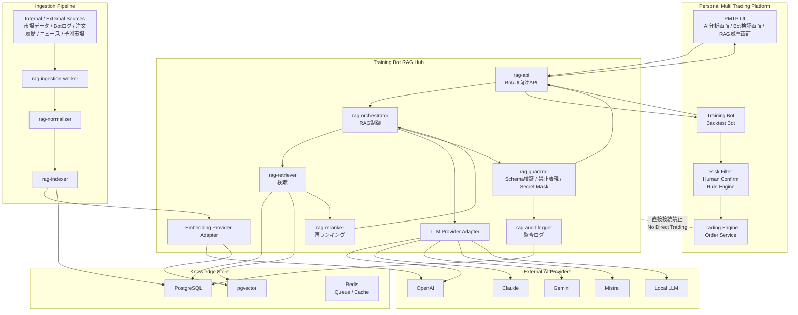
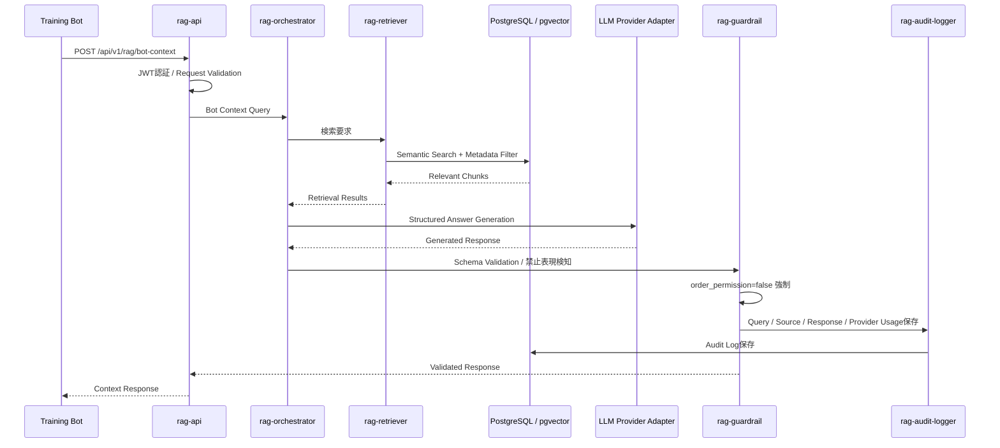
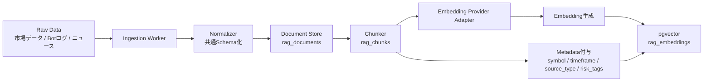
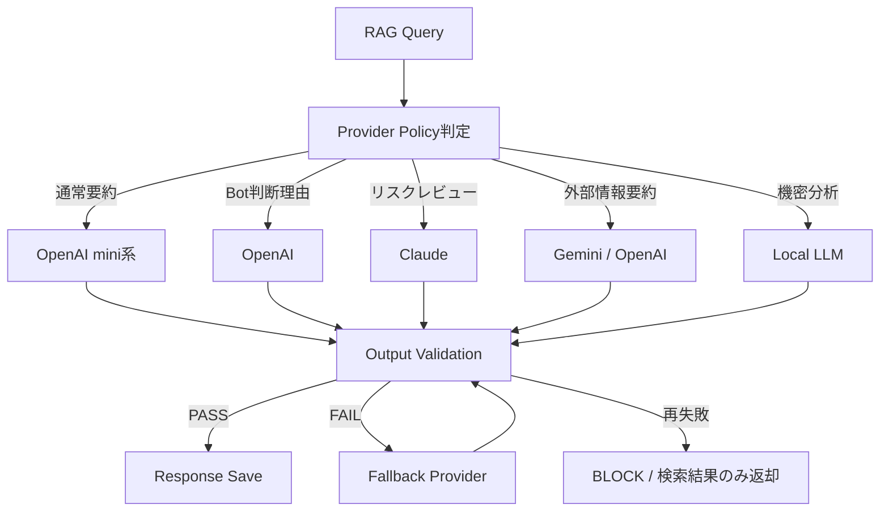
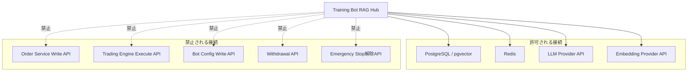

## 全体構成

```mermaid
flowchart TB
  subgraph PMTP["Personal Multi Trading Platform"]
    UI["PMTP UI<br/>AI分析画面 / Bot検証画面 / RAG履歴画面"]
    TBOT["Training Bot<br/>Backtest Bot"]
    RISK["Risk Filter<br/>Human Confirm<br/>Rule Engine"]
    TE["Trading Engine<br/>Order Service"]
  end

  subgraph RAG["Training Bot RAG Hub"]
    API["rag-api<br/>Bot/UI向けAPI"]
    ORCH["rag-orchestrator<br/>RAG制御"]
    RET["rag-retriever<br/>検索"]
    RERANK["rag-reranker<br/>再ランキング"]
    GUARD["rag-guardrail<br/>Schema検証 / 禁止表現 / Secret Mask"]
    AUDIT["rag-audit-logger<br/>監査ログ"]
    LLMAD["LLM Provider Adapter"]
    EMBAD["Embedding Provider Adapter"]
  end

  subgraph DATA["Knowledge Store"]
    PG["PostgreSQL"]
    VECTOR["pgvector"]
    REDIS["Redis<br/>Queue / Cache"]
  end

  subgraph INGEST["Ingestion Pipeline"]
    SRC["Internal / External Sources<br/>市場データ / Botログ / 注文履歴 / ニュース / 予測市場"]
    WORKER["rag-ingestion-worker"]
    NORMAL["rag-normalizer"]
    INDEXER["rag-indexer"]
  end

  subgraph PROVIDERS["External AI Providers"]
    OPENAI["OpenAI"]
    CLAUDE["Claude"]
    GEMINI["Gemini"]
    MISTRAL["Mistral"]
    LOCAL["Local LLM"]
  end

  SRC --> WORKER --> NORMAL --> INDEXER
  INDEXER --> EMBAD
  EMBAD --> OPENAI
  EMBAD --> VECTOR
  INDEXER --> PG

  UI --> API
  TBOT --> API
  API --> ORCH
  ORCH --> RET
  RET --> PG
  RET --> VECTOR
  RET --> RERANK
  RERANK --> ORCH
  ORCH --> LLMAD
  LLMAD --> OPENAI
  LLMAD --> CLAUDE
  LLMAD --> GEMINI
  LLMAD --> MISTRAL
  LLMAD --> LOCAL
  ORCH --> GUARD
  GUARD --> AUDIT
  AUDIT --> PG
  GUARD --> API
  API --> UI
  API --> TBOT

  TBOT --> RISK
  RISK --> TE

  RAG -. "直接接続禁止<br/>No Direct Trading" .- TE

```

## Query シーケンス

```mermaid
sequenceDiagram
  participant Bot as Training Bot
  participant API as rag-api
  participant Orch as rag-orchestrator
  participant Ret as rag-retriever
  participant DB as PostgreSQL / pgvector
  participant LLM as LLM Provider Adapter
  participant Guard as rag-guardrail
  participant Audit as rag-audit-logger

  Bot->>API: POST /api/v1/rag/bot-context
  API->>API: JWT認証 / Request Validation
  API->>Orch: Bot Context Query
  Orch->>Ret: 検索要求
  Ret->>DB: Semantic Search + Metadata Filter
  DB-->>Ret: Relevant Chunks
  Ret-->>Orch: Retrieval Results
  Orch->>LLM: Structured Answer Generation
  LLM-->>Orch: Generated Response
  Orch->>Guard: Schema Validation / 禁止表現検知
  Guard->>Guard: order_permission=false 強制
  Guard->>Audit: Query / Source / Response / Provider Usage保存
  Audit->>DB: Audit Log保存
  Guard-->>API: Validated Response
  API-->>Bot: Context Response
```
## Ingestion

```mermaid
flowchart LR
  A["Raw Data<br/>市場データ / Botログ / ニュース"] --> B["Ingestion Worker"]
  B --> C["Normalizer<br/>共通Schema化"]
  C --> D["Document Store<br/>rag_documents"]
  D --> E["Chunker<br/>rag_chunks"]
  E --> F["Embedding Provider Adapter"]
  F --> G["Embedding生成"]
  G --> H["pgvector<br/>rag_embeddings"]
  E --> I["Metadata付与<br/>symbol / timeframe / source_type / risk_tags"]
  I --> H

```
## Provider選択

```mermaid
flowchart TD
  Q["RAG Query"] --> P["Provider Policy判定"]

  P -->|通常要約| OAI_MINI["OpenAI mini系"]
  P -->|Bot判断理由| OAI["OpenAI"]
  P -->|リスクレビュー| CLAUDE["Claude"]
  P -->|外部情報要約| GEMINI["Gemini / OpenAI"]
  P -->|機密分析| LOCAL["Local LLM"]

  OAI_MINI --> V["Output Validation"]
  OAI --> V
  CLAUDE --> V
  GEMINI --> V
  LOCAL --> V

  V -->|PASS| R["Response Save"]
  V -->|FAIL| F["Fallback Provider"]
  F --> V
  V -->|再失敗| BLOCK["BLOCK / 検索結果のみ返却"]

```

## セキュリティ境界

```mermaid
flowchart TB
  RAG["Training Bot RAG Hub"]

  subgraph ALLOW["許可される接続"]
    DB["PostgreSQL / pgvector"]
    CACHE["Redis"]
    LLM["LLM Provider API"]
    EMB["Embedding Provider API"]
  end

  subgraph DENY["禁止される接続"]
    ORDER["Order Service Write API"]
    EXEC["Trading Engine Execute API"]
    BOTCFG["Bot Config Write API"]
    WITHDRAW["Withdrawal API"]
    ESTOP["Emergency Stop解除API"]
  end

  RAG --> DB
  RAG --> CACHE
  RAG --> LLM
  RAG --> EMB

  RAG -. "禁止" .-> ORDER
  RAG -. "禁止" .-> EXEC
  RAG -. "禁止" .-> BOTCFG
  RAG -. "禁止" .-> WITHDRAW
  RAG -. "禁止" .-> ESTOP
```
