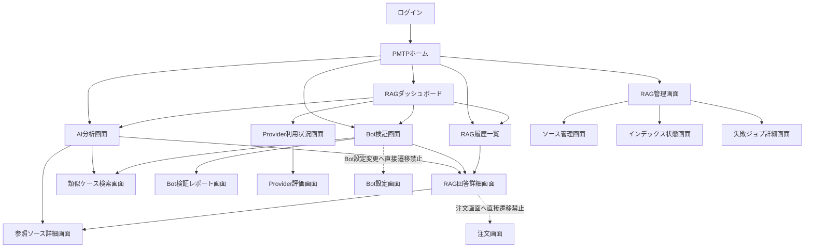
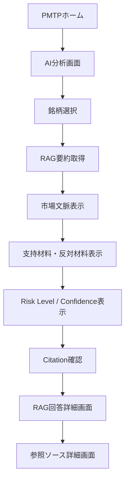
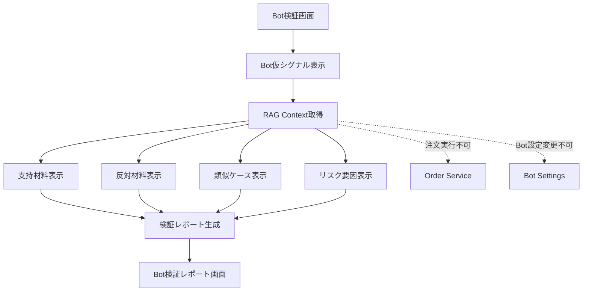
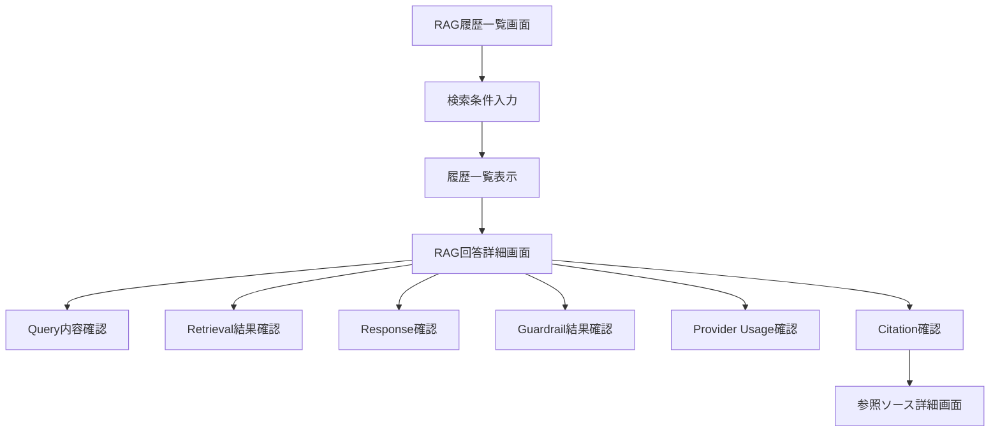
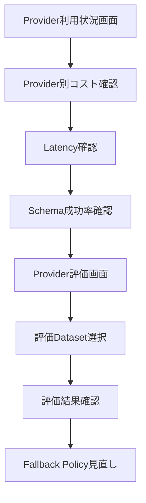
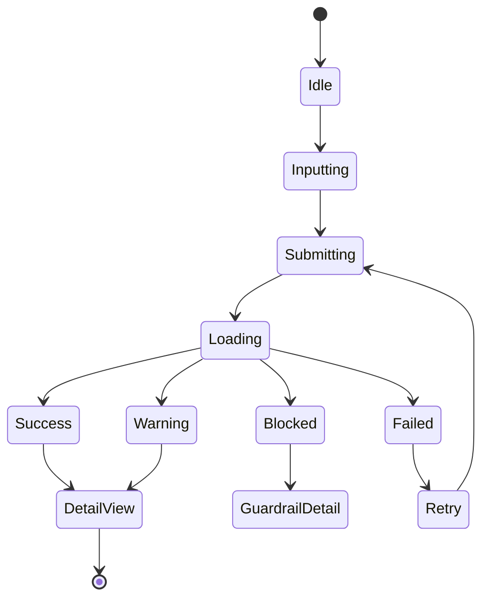
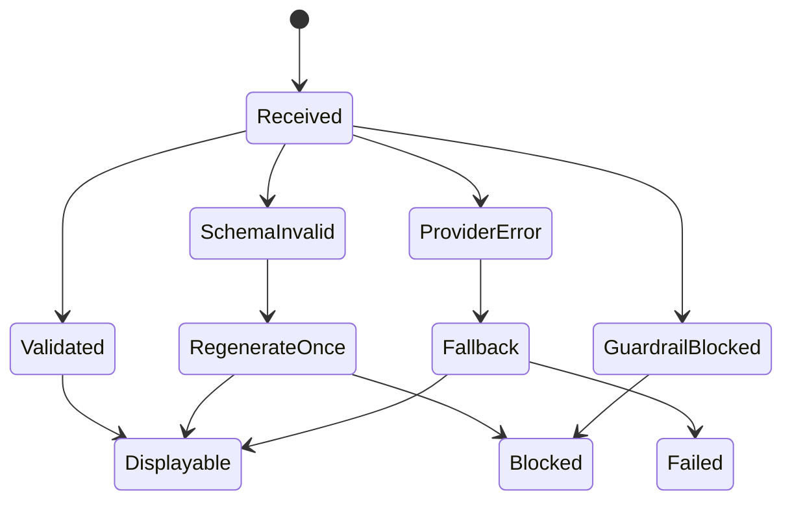

# **Personal Multi Trading Platform**

# **Training Bot RAG Hub UI画面一覧・画面遷移設計書 v1.0**

---

## **1. 文書情報**

|**項目**|**内容**|
|---|---|
|文書名|Training Bot RAG Hub UI画面一覧・画面遷移設計書|
|対象システム|Personal Multi Trading Platform（PMTP）|
|対象機能|Training Bot参照用RAG基盤|
|文書種別|UI画面一覧・画面遷移設計書|
|版数|v1.0|
|作成日|2026-06-09|
|対象フェーズ|Phase 1 MVP / Phase 2 Provider比較 / Phase 3 外部情報RAG|
|前提|RAGは注文実行しない。RAGはBot設定変更しない。RAGは判断材料のみ提示する。|

---

## **2. UI設計方針**

## **2.1 基本方針**

Training Bot RAG HubのUIは、以下を目的とする。

```text
1. RAG回答を人間が確認できる
2. Training Botの判断理由を可視化できる
3. 参照ソース・信頼度・リスクを確認できる
4. RAG履歴を監査できる
5. Provider利用状況・コスト・品質を確認できる
6. RAG回答から直接注文へ進ませない
```

---

## **2.2 UI上の禁止事項**

|**禁止事項**|**理由**|
|---|---|
|RAG回答画面に「注文する」ボタンを置かない|RAG出力から誤発注を誘発しないため|
|RAG回答をBUY / SELL確定指示として表示しない|投資助言・断定表現を避けるため|
|RAG画面からBot設定を直接変更しない|Bot暴走・設定ミス防止|
|RAG画面からBot起動・停止しない|RAGとBot制御の責務分離|
|RAG履歴から注文画面へ直接遷移しない|判断材料と注文行為を分離するため|
|Provider raw responseをそのまま表示しない|未検証出力をユーザーに見せないため|

---

## **3. 画面一覧**

## **3.1 MVP対象画面**

|**画面ID**|**画面名**|**概要**|**優先度**|
|---|---|---|---|
|RAG-UI-001|RAGダッシュボード|RAG全体の状態、直近Query、リスク件数、コスト概要を表示|高|
|RAG-UI-002|AI分析画面拡張|銘柄ごとのRAG要約、理由、リスク、Citationを表示|高|
|RAG-UI-003|Bot検証画面|Bot仮シグナルに対するRAG説明、支持材料、反対材料、類似ケースを表示|高|
|RAG-UI-004|RAG問い合わせ画面|ユーザーが任意のRAG Queryを実行する画面|中|
|RAG-UI-005|RAG回答詳細画面|1件のRAG回答、参照ソース、Guardrail結果を詳細表示|高|
|RAG-UI-006|RAG履歴一覧画面|過去のQuery、回答、risk_level、confidenceを一覧表示|高|
|RAG-UI-007|参照ソース詳細画面|RAG回答に使われたDocument / Chunk / Sourceを確認|中|
|RAG-UI-008|類似ケース検索画面|現在条件に近い過去ケースを検索・比較|中|
|RAG-UI-009|Bot検証レポート画面|バックテスト結果とRAG分析を統合表示|中|
|RAG-UI-010|RAG管理画面|ソース、インデックス状態、失敗ジョブを管理|中|
|RAG-UI-011|Provider利用状況画面|Provider別token、cost、latencyを確認|中|
|RAG-UI-012|Provider評価画面|Provider比較結果、Schema成功率、コスト、品質を確認|低|

---

## **3.2 Phase別対象画面**

|**Phase**|**対象画面**|
|---|---|
|Phase 1 MVP|RAGダッシュボード、AI分析画面拡張、Bot検証画面、RAG回答詳細、RAG履歴|
|Phase 2 Provider比較|Provider利用状況画面、Provider評価画面|
|Phase 3 外部情報RAG|参照ソース詳細、外部情報ソース管理、類似ケース検索|
|Phase 4 高度化|評価Dataset管理、Local LLM管理、Vector Store管理|

---

## **4. 全体画面遷移図**



---

## **5. 主要ユーザー導線**

## **5.1 AI分析確認導線**



---

## **5.2 Bot検証導線**



---

## **5.3 RAG履歴監査導線**



---

## **5.4 Provider評価導線**



---

# **6. 画面詳細設計**

---

## **6.1 RAG-UI-001 RAGダッシュボード**

## **6.1.1 目的**

RAG全体の状態を俯瞰する画面。

## **6.1.2 表示項目**

|**項目**|**内容**|
|---|---|
|本日Query数|当日のRAG問い合わせ件数|
|直近Query一覧|最新10件|
|高リスク回答件数|risk_level = HIGH / CRITICAL の件数|
|Guardrail Block件数|出力検証・禁止表現でBLOCKされた件数|
|平均Confidence|直近Queryの平均信頼度|
|平均Latency|RAG API応答時間|
|月間推定コスト|LLM / Embedding費用|
|Provider別利用比率|OpenAI / Claude / Gemini等|
|インデックス状態|indexed / failed / pending|
|失敗ジョブ件数|Ingestion / Embedding失敗|

## **6.1.3 操作**

|**操作**|**内容**|
|---|---|
|AI分析画面へ遷移|銘柄別分析へ移動|
|Bot検証画面へ遷移|Bot別検証へ移動|
|RAG履歴へ遷移|過去問い合わせを確認|
|Provider利用状況へ遷移|コスト・token・latency確認|
|失敗ジョブへ遷移|Worker失敗内容を確認|

## **6.1.4 注意表示**

```text
RAGは投資助言ではありません。
RAGは注文実行権限を持ちません。
表示内容はBot検証・市場理解の参考情報です。
```

---

## **6.2 RAG-UI-002 AI分析画面拡張**

## **6.2.1 目的**

既存AI分析画面に、RAG由来の根拠・リスク・参照ソースを追加表示する。

## **6.2.2 表示項目**

|**項目**|**内容**|
|---|---|
|symbol|対象銘柄|
|timeframe|時間足|
|RAG要約|市場文脈の要約|
|supporting_factors|強気・支持材料|
|opposing_factors|弱気・反対材料|
|risk_level|LOW / MEDIUM / HIGH / CRITICAL|
|confidence|0〜1の信頼度|
|similar_cases|類似過去ケース|
|citations|参照ソース|
|provider|使用Provider|
|model|使用Model|
|warning|投資助言ではない旨|

## **6.2.3 操作**

|**操作**|**内容**|
|---|---|
|RAG再取得|現在条件でRAG Queryを再実行|
|回答詳細を見る|RAG回答詳細画面へ遷移|
|参照ソースを見る|参照ソース詳細画面へ遷移|
|類似ケースを見る|類似ケース検索画面へ遷移|

## **6.2.4 非表示にする操作**

|**操作**|**理由**|
|---|---|
|この分析で注文する|RAGから注文誘導しない|
|BUY確定|断定的投資助言を避ける|
|SELL確定|断定的投資助言を避ける|
|Bot設定へ自動反映|Bot設定変更は禁止|

---

## **6.3 RAG-UI-003 Bot検証画面**

## **6.3.1 目的**

Training Botの仮シグナルに対して、RAGが生成した理由・反対材料・リスクを確認する。

## **6.3.2 表示項目**

|**項目**|**内容**|
|---|---|
|bot_id|Bot識別子|
|strategy_id|戦略識別子|
|symbol|対象銘柄|
|bot_signal|BUY / SELL / HOLD の仮シグナル|
|features|RSI、MACD、ATR、Volume等|
|RAG explanation|Bot判断理由|
|supporting_factors|支持材料|
|opposing_factors|反対材料|
|similar_cases|類似ケース|
|risk_level|リスク水準|
|confidence|信頼度|
|guardrail.order_permission|常にfalse|
|provider|使用Provider|
|citations|参照ソース|

## **6.3.3 操作**

|**操作**|**内容**|
|---|---|
|RAG説明を再取得|Bot Context APIを再実行|
|類似ケースを見る|類似ケース検索画面へ遷移|
|レポート生成|Bot検証レポート画面へ遷移|
|回答履歴を見る|RAG履歴画面へ遷移|
|Citationを見る|参照ソース詳細へ遷移|

## **6.3.4 明示的な制約**

```text
Bot検証画面では、RAG回答から注文実行できない。
Bot検証画面では、RAG回答からBot設定を直接変更できない。
Bot検証画面では、RAG回答を投資助言として表示しない。
```

---

## **6.4 RAG-UI-004 RAG問い合わせ画面**

## **6.4.1 目的**

ユーザーが任意の質問をRAGへ投げ、内部データ・外部データ・過去ケースを検索できる画面。

## **6.4.2 入力項目**

|**項目**|**内容**|
|---|---|
|query|自然文問い合わせ|
|symbol|BTCUSDT等|
|market|crypto / stock / fx|
|timeframe|1m / 5m / 1h / 1d|
|source_types|market_data / bot_log / news等|
|from / to|対象期間|
|provider_policy|default / risk_aware / low_cost|
|language|ja / en / zh|

## **6.4.3 出力項目**

|**項目**|**内容**|
|---|---|
|summary|要約|
|supporting_factors|支持材料|
|opposing_factors|反対材料|
|risk_level|リスク|
|confidence|信頼度|
|citations|参照ソース|
|guardrail_result|PASS / WARNING / BLOCK|
|provider_usage|token / cost / latency|

---

## **6.5 RAG-UI-005 RAG回答詳細画面**

## **6.5.1 目的**

RAG回答1件の詳細を監査・検証する。

## **6.5.2 表示項目**

|**項目**|**内容**|
|---|---|
|query_id|Query ID|
|trace_id|トレースID|
|user_id / bot_id|実行主体|
|query|入力問い合わせ|
|normalized_query|正規化後Query|
|retrieval_results|検索されたChunk一覧|
|response|生成回答|
|risk_level|リスク|
|confidence|信頼度|
|citations|回答に使ったソース|
|guardrail_result|PASS / WARNING / BLOCK|
|blocked_reason|BLOCK理由|
|provider|Provider|
|model|Model|
|input_tokens|入力token|
|output_tokens|出力token|
|estimated_cost|推定費用|
|latency_ms|応答時間|
|created_at|作成日時|

## **6.5.3 操作**

|**操作**|**内容**|
|---|---|
|Citation詳細|参照ソース詳細画面へ遷移|
|同条件で再実行|同一条件でRAG Query再実行|
|JSON表示|Response JSONを確認|
|Guardrail詳細|BLOCK / WARNING理由を確認|

---

## **6.6 RAG-UI-006 RAG履歴一覧画面**

## **6.6.1 目的**

RAG問い合わせ履歴を検索・監査する。

## **6.6.2 検索条件**

|**条件**|**内容**|
|---|---|
|期間|created_at|
|symbol|銘柄|
|bot_id|Bot|
|user_id|ユーザー|
|risk_level|LOW / MEDIUM / HIGH / CRITICAL|
|confidence範囲|0〜1|
|provider|OpenAI / Claude / Gemini等|
|guardrail_status|PASS / WARNING / BLOCK|
|source_type|market_data / news / bot_log等|

## **6.6.3 一覧項目**

|**項目**|**内容**|
|---|---|
|created_at|実行日時|
|query|問い合わせ概要|
|symbol|銘柄|
|bot_id|Bot|
|risk_level|リスク|
|confidence|信頼度|
|provider|Provider|
|cost|推定費用|
|guardrail|PASS / WARNING / BLOCK|

---

## **6.7 RAG-UI-007 参照ソース詳細画面**

## **6.7.1 目的**

RAG回答の根拠となったSource / Document / Chunkを確認する。

## **6.7.2 表示項目**

|**項目**|**内容**|
|---|---|
|source_id|Source ID|
|source_type|news / bot_log / market_data等|
|source_name|internal / polymarket / news_api等|
|title|タイトル|
|original_text|原文|
|processed_text|正規化済み本文|
|chunk_text|使用Chunk|
|reliability_score|信頼度|
|recency_score|鮮度|
|risk_tags|volatility / sentiment等|
|event_time|イベント時刻|
|ingested_at|取込日時|
|used_reason|回答に使われた理由|

## **6.7.3 注意表示**

```text
外部ソースは事実を保証するものではありません。
予測市場データは市場参加者の見方として扱います。
SNS情報は低信頼ソースとして扱います。
```

---

## **6.8 RAG-UI-008 類似ケース検索画面**

## **6.8.1 目的**

現在の市場特徴量に近い過去ケースを検索する。

## **6.8.2 入力項目**

|**項目**|**内容**|
|---|---|
|symbol|銘柄|
|timeframe|時間足|
|lookback_period|検索対象期間|
|RSI|任意|
|MACD|任意|
|ATR|任意|
|volume_spike|任意|
|funding_rate|任意|
|open_interest|任意|
|news_event|任意|
|bot_signal|任意|

## **6.8.3 表示項目**

|**項目**|**内容**|
|---|---|
|case_id|類似ケースID|
|period|期間|
|similarity|類似度|
|condition|当時の条件|
|after_move|その後の値動き|
|max_drawdown|最大逆行幅|
|max_favorable_move|最大順行幅|
|risk_comment|リスクコメント|
|citations|根拠ソース|

---

## **6.9 RAG-UI-009 Bot検証レポート画面**

## **6.9.1 目的**

バックテスト結果とRAG分析を統合し、Bot改善に使えるレポートを表示する。

## **6.9.2 表示項目**

|**項目**|**内容**|
|---|---|
|strategy_id|戦略|
|backtest_period|検証期間|
|total_trades|取引数|
|win_rate|勝率|
|profit_factor|Profit Factor|
|max_drawdown|最大DD|
|winning_patterns|勝ちパターン|
|losing_patterns|負けパターン|
|rag_insights|RAG分析|
|risk_factors|リスク要因|
|improvement_candidates|改善候補|
|citations|根拠|

## **6.9.3 禁止事項**

|**禁止事項**|**理由**|
|---|---|
|改善候補をBot設定へ自動反映|RAGによるBot設定変更禁止|
|勝率保証表示|不適切|
|利益保証表示|不適切|

---

## **6.10 RAG-UI-010 RAG管理画面**

## **6.10.1 目的**

RAGソース、インデックス状態、失敗ジョブを管理する。

## **6.10.2 管理対象**

|**対象**|**内容**|
|---|---|
|rag_sources|ソース一覧|
|rag_documents|ドキュメント状態|
|rag_chunks|チャンク状態|
|rag_embeddings|Embedding生成状態|
|ingestion_jobs|取込ジョブ|
|indexing_jobs|インデックスジョブ|
|failed_jobs|失敗ジョブ|
|blocked_documents|危険文書|

## **6.10.3 操作**

|**操作**|**内容**|
|---|---|
|ソース有効化 / 無効化|source単位で制御|
|再インデックス|対象データを再処理|
|失敗ジョブ再実行|FAILEDジョブを再実行|
|危険データ隔離|Prompt Injection疑いをBLOCK|
|ソース信頼度変更|reliability_score更新|

---

## **6.11 RAG-UI-011 Provider利用状況画面**

## **6.11.1 目的**

LLM Providerごとの利用量、コスト、Latencyを確認する。

## **6.11.2 表示項目**

|**項目**|**内容**|
|---|---|
|provider|OpenAI / Claude / Gemini / Mistral|
|model|使用Model|
|query_count|Query数|
|input_tokens|入力token|
|output_tokens|出力token|
|estimated_cost|推定費用|
|avg_latency_ms|平均Latency|
|error_rate|エラー率|
|fallback_count|Fallback回数|
|schema_valid_rate|Schema成功率|

## **6.11.3 アラート**

|**条件**|**表示**|
|---|---|
|月額上限80%到達|WARNING|
|月額上限100%到達|BLOCKまたはmini限定|
|Schema成功率低下|Provider見直し|
|Error Rate増加|Fallback確認|

---

## **6.12 RAG-UI-012 Provider評価画面**

## **6.12.1 目的**

Provider比較評価結果を確認する。

## **6.12.2 表示項目**

|**項目**|**内容**|
|---|---|
|eval_dataset|評価Dataset|
|provider|Provider|
|model|Model|
|task_type|通常要約 / リスクレビュー等|
|schema_valid_rate|Schema成功率|
|citation_accuracy|Citation正確性|
|hallucination_rate|ハルシネーション率|
|risk_coverage|リスク抽出率|
|latency|応答時間|
|cost_per_query|1Queryあたり費用|
|safety_violation_rate|禁止表現発生率|

---

# **7. 画面遷移ルール**

## **7.1 許可される遷移**

|**From**|**To**|**条件**|
|---|---|---|
|RAGダッシュボード|AI分析画面|USER / ADMIN|
|RAGダッシュボード|Bot検証画面|USER / ADMIN|
|RAGダッシュボード|RAG履歴一覧|USER / ADMIN|
|AI分析画面|RAG回答詳細|USER / ADMIN|
|AI分析画面|参照ソース詳細|USER / ADMIN|
|Bot検証画面|類似ケース検索|USER / ADMIN|
|Bot検証画面|Bot検証レポート|USER / ADMIN|
|RAG履歴一覧|RAG回答詳細|USER / ADMIN|
|RAG回答詳細|参照ソース詳細|USER / ADMIN|
|RAG管理画面|失敗ジョブ詳細|ADMIN|
|Provider利用状況|Provider評価画面|ADMIN / RAG_EVALUATOR|

---

## **7.2 禁止される遷移**

|**From**|**To**|**理由**|
|---|---|---|
|RAG回答詳細|注文確認画面|RAGから注文誘導しない|
|AI分析画面|注文確認画面|RAG回答を直接注文に接続しない|
|Bot検証画面|Bot設定編集画面|RAGからBot設定変更しない|
|Bot検証レポート|Bot設定自動反映画面|自動反映禁止|
|RAG履歴一覧|注文実行画面|監査画面から注文させない|
|Provider評価画面|Provider自動切替確定|自動切替は別途管理判断|

---

# **8. 権限別表示制御**

|**画面**|**USER**|**TRAINING_BOT**|**ADMIN**|**RAG_EVALUATOR**|
|---|---|---|---|---|
|RAGダッシュボード|○|×|○|○|
|AI分析画面|○|×|○|×|
|Bot検証画面|○|×|○|×|
|RAG問い合わせ画面|○|×|○|×|
|RAG回答詳細画面|○|×|○|○|
|RAG履歴一覧画面|○|×|○|○|
|参照ソース詳細画面|○|×|○|○|
|類似ケース検索画面|○|×|○|×|
|Bot検証レポート画面|○|×|○|×|
|RAG管理画面|×|×|○|×|
|Provider利用状況画面|×|×|○|○|
|Provider評価画面|×|×|○|○|

---

# **9. UIコンポーネント設計**

## **9.1 共通コンポーネント**

|**コンポーネント**|**用途**|
|---|---|
|RagRiskBadge|risk_level表示|
|ConfidenceMeter|confidence表示|
|CitationList|参照ソース一覧|
|ProviderUsageBadge|provider / model / cost表示|
|GuardrailStatusBadge|PASS / WARNING / BLOCK表示|
|SimilarCaseTable|類似ケース一覧|
|RagResponsePanel|RAG回答本文表示|
|RagWarningBanner|投資助言ではない警告|
|SourceReliabilityBadge|reliability_score表示|
|RecencyBadge|recency_score表示|
|TokenCostSummary|token / cost表示|
|TraceIdLink|trace_id追跡|

---

## **9.2 Risk Level表示仕様**

|**risk_level**|**表示**|**UI方針**|
|---|---|---|
|LOW|低リスク|通常表示|
|MEDIUM|中リスク|注意表示|
|HIGH|高リスク|警告強調|
|CRITICAL|重大リスク|回答上部に強制警告|

---

## **9.3 Guardrail表示仕様**

|**guardrail_status**|**表示**|**ユーザー操作**|
|---|---|---|
|PASS|検証済み|詳細確認可能|
|WARNING|注意あり|Warning理由を表示|
|BLOCK|ブロック済み|回答本文は非表示または制限表示|

---

# **10. 主要画面ワイヤーフレーム**

## **10.1 AI分析画面拡張**

```text
+--------------------------------------------------+
| AI分析: BTCUSDT / 1h                              |
+--------------------------------------------------+
| Market Summary                                   |
| - RAG要約本文                                     |
|                                                  |
| Confidence: 0.68     Risk: MEDIUM                |
| Provider: OpenAI / gpt-xxx                       |
+--------------------------------------------------+
| Supporting Factors                               |
| 1. RSIが売られすぎ圏                              |
| 2. 出来高増加                                     |
+--------------------------------------------------+
| Opposing Factors                                 |
| 1. 上位足は下落傾向                               |
| 2. 急騰後の反落リスク                             |
+--------------------------------------------------+
| Similar Cases                                    |
| [Case Table]                                     |
+--------------------------------------------------+
| Citations                                        |
| [Source 1] [Source 2] [Source 3]                 |
+--------------------------------------------------+
| Warning                                          |
| この出力は投資助言ではありません。                 |
+--------------------------------------------------+
| [RAG再取得] [回答詳細] [参照ソース]                |
+--------------------------------------------------+
```

---

## **10.2 Bot検証画面**

```text
+--------------------------------------------------+
| Bot検証: Mean Reversion Bot                       |
+--------------------------------------------------+
| Bot Signal Candidate                              |
| Symbol: BTCUSDT                                   |
| Signal: BUY candidate                             |
| RSI: 29 / MACD: Golden Cross / Volume Spike: true |
+--------------------------------------------------+
| RAG Explanation                                  |
| - Bot仮シグナルの説明                             |
+--------------------------------------------------+
| Supporting Factors                               |
| - 支持材料一覧                                    |
+--------------------------------------------------+
| Opposing Factors                                 |
| - 反対材料一覧                                    |
+--------------------------------------------------+
| Risk Notes                                       |
| Risk Level: HIGH                                  |
| order_permission: false                           |
+--------------------------------------------------+
| Similar Cases                                    |
| [Case Table]                                     |
+--------------------------------------------------+
| [RAG再取得] [類似ケース] [検証レポート]             |
+--------------------------------------------------+
```

---

## **10.3 RAG履歴一覧画面**

```text
+--------------------------------------------------+
| RAG履歴                                           |
+--------------------------------------------------+
| Filters                                          |
| Period / Symbol / Bot / Risk / Provider / Status |
+--------------------------------------------------+
| Date       Query         Symbol Risk Confidence  |
| 06/09      BTC急騰要因    BTC    HIGH 0.62       |
| 06/09      Bot理由生成    ETH    MED  0.71       |
+--------------------------------------------------+
| [詳細] [Citation] [JSON]                          |
+--------------------------------------------------+
```

---

# **11. UI状態管理**

## **11.1 RAG Query UI状態**



---

## **11.2 RAG回答表示状態**



---

# **12. API連携マッピング**

|**画面**|**利用API**|
|---|---|
|RAGダッシュボード|GET /api/v1/rag/dashboard|
|AI分析画面拡張|POST /api/v1/rag/query|
|Bot検証画面|POST /api/v1/rag/bot-context|
|RAG問い合わせ画面|POST /api/v1/rag/query|
|RAG回答詳細画面|GET /api/v1/rag/history/{query_id}|
|RAG履歴一覧画面|GET /api/v1/rag/history|
|参照ソース詳細画面|GET /api/v1/rag/sources/{source_id}|
|類似ケース検索画面|POST /api/v1/rag/similar-cases|
|Bot検証レポート画面|POST /api/v1/rag/backtest-report|
|RAG管理画面|GET /api/v1/rag/admin/sources|
|Provider利用状況画面|GET /api/v1/rag/provider-usage|
|Provider評価画面|GET /api/v1/rag/provider-evaluations|

---

# **13. 受け入れ基準**

|**ID**|**受け入れ基準**|
|---|---|
|UI-AC-001|AI分析画面にRAG要約、risk_level、confidence、citationが表示される|
|UI-AC-002|Bot検証画面に支持材料、反対材料、類似ケース、order_permission=falseが表示される|
|UI-AC-003|RAG回答詳細画面でQuery、Response、Citation、Guardrail、Provider Usageを確認できる|
|UI-AC-004|RAG履歴一覧で期間、symbol、risk_level、providerで検索できる|
|UI-AC-005|RAG画面から注文確認・注文実行画面へ直接遷移できない|
|UI-AC-006|RAG画面からBot設定を直接変更できない|
|UI-AC-007|Guardrail BLOCK時は回答本文を通常表示しない|
|UI-AC-008|Provider利用状況画面でtoken、cost、latencyを確認できる|
|UI-AC-009|Citationから参照ソース詳細へ遷移できる|
|UI-AC-010|すべてのRAG回答画面に「投資助言ではない」警告が表示される|

---

# **14. MVP実装優先順位**

```text
1. RAG回答表示コンポーネント
2. AI分析画面へのRAG要約表示
3. Bot検証画面へのRAG説明表示
4. RAG回答詳細画面
5. RAG履歴一覧画面
6. Citation詳細画面
7. 類似ケース検索画面
8. Provider利用状況画面
9. RAG管理画面
10. Provider評価画面
```

---

# **15. 最終方針**

Training Bot RAG HubのUIは、RAG回答を「売買判断」ではなく「検証・説明・監査のための参考情報」として表示する。

特に重要なのは以下である。

```text
1. RAG回答から直接注文へ遷移させない
2. RAG回答からBot設定を直接変更させない
3. RAG回答には必ずRisk、Confidence、Citationを表示する
4. Guardrail結果を隠さず表示する
5. Provider利用量・コスト・Latencyを確認可能にする
6. RAG履歴を監査可能にする
```

このUI設計により、Training Bot RAG HubはPMTP内で安全にAI分析・Bot検証・外部情報活用を支援しつつ、金融システムとして重要な誤発注防止、監査性、説明可能性を維持する。