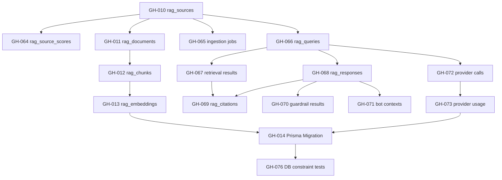
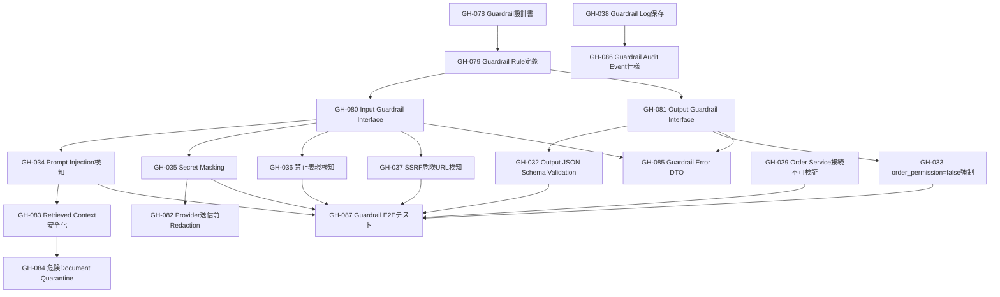

# **Training Bot RAG Hub**

# **WBS・GitHub Issue管理設計書 v2.0**

## **1. 文書目的**

本書は、Training Bot RAG Hub のMVP開発を、WBSだけでなく GitHub Issue / Pull Request / Milestone / Label によって管理できる形へ再設計する。

対象は以下。

- WBS計画
- GitHub Issue設計
- Milestone設計
- Label設計
- Branch運用
- Pull Request運用
- Issue粒度ルール
- 完了条件
- 品質ゲート

---

## **2. 管理方針**

### **2.1 基本方針**

```text
WBS = プロジェクト全体の作業分解
GitHub Issue = 実装・検証単位の作業チケット
Pull Request = 成果物レビュー単位
Milestone = フェーズ完了判定単位
Label = 優先度・種別・領域管理
```

### **2.2 Issue管理の目的**

- 作業漏れを防ぐ
- MVP範囲を固定する
- 実装・テスト・レビューを追跡する
- Claude Code / 開発者 / PM が同じ粒度で作業できるようにする
- PR単位で品質ゲートを通す

---

## **3. GitHub運用ルール**

## **3.1 Branch戦略**

|**用途**|**Branch**|
|---|---|
|本番安定版|main|
|開発統合|develop|
|機能開発|feature/{issue-id}-{short-name}|
|修正|fix/{issue-id}-{short-name}|
|ドキュメント|docs/{issue-id}-{short-name}|
|テスト|test/{issue-id}-{short-name}|
|リリース準備|release/mvp-v1|

例：

```bash
feature/gh-012-rag-query-api
fix/gh-034-guardrail-schema-validation
docs/gh-003-wbs-update
test/gh-051-provider-fallback-test
```

---

## **3.2 Pull Requestルール**

PRは必ずIssueに紐づける。

PRタイトル形式：

```text
[GH-012] RAG Query APIを実装
```

PR本文テンプレート：

```md
## 対応Issue
Closes #12

## 実装内容
- 
- 
- 

## 確認内容
- [ ] typecheck
- [ ] lint
- [ ] unit test
- [ ] integration test
- [ ] manual test

## 影響範囲
- API
- DB
- RAG
- Guardrail
- UI

## リスク
- 

## スクリーンショット / ログ
必要に応じて添付
```

---

# **4. GitHub Label設計**

## **4.1 種別Label**

|**Label**|**用途**|
|---|---|
|type: feature|新機能|
|type: bug|不具合|
|type: docs|ドキュメント|
|type: test|テスト|
|type: refactor|リファクタ|
|type: chore|雑務|
|type: security|セキュリティ|
|type: infra|インフラ|

---

## **4.2 領域Label**

|**Label**|**対象**|
|---|---|
|area: rag-core|RAG中核|
|area: ingestion|データ取込|
|area: indexing|Chunk / Embedding|
|area: retrieval|検索|
|area: llm-provider|LLM Provider|
|area: guardrail|安全制御|
|area: api|API|
|area: ui|画面|
|area: db|DB|
|area: audit|監査ログ|
|area: test|テスト|
|area: docs|設計書|

---

## **4.3 優先度Label**

|**Label**|**意味**|
|---|---|
|priority: critical|MVP必須・安全性直結|
|priority: high|MVP必須|
|priority: medium|MVP内で可能なら対応|
|priority: low|後続Phase|

---

## **4.4 状態Label**

|**Label**|**意味**|
|---|---|
|status: ready|着手可能|
|status: in-progress|作業中|
|status: review|レビュー中|
|status: blocked|ブロック中|
|status: done|完了|
|status: deferred|後回し|

---

# **5. Milestone設計**

|**Milestone**|**目的**|**完了条件**|
|---|---|---|
|M0: Project Setup|開発基盤準備|Repository / CI / Docker起動|
|M1: Design Freeze|設計確定|要件・API・DB・WBS確定|
|M2: Data Foundation|DB・取込・Index完成|Document / Chunk / Embedding保存可能|
|M3: RAG Core MVP|RAG検索・回答生成完成|Query APIが動作|
|M4: Guardrail MVP|安全制御完成|order_permission=false / Injection防御|
|M5: UI MVP|画面表示完成|AI分析 / Bot検証 / 履歴表示|
|M6: Test Complete|総合テスト完了|Critical / High Bug 0|
|M7: MVP Release|MVPリリース|リリース判定完了|

---

# **6. Issue粒度ルール**

## **6.1 1 Issue の適正サイズ**

1 Issue は以下を満たす。

```text
1〜2日で完了できる
PR 1本で閉じられる
成果物が明確
テスト観点が書ける
```

## **6.2 NGなIssue**

```text
RAGを全部作る
DBを全部作る
UIを全部作る
テストする
セキュリティ対応する
```

## **6.3 良いIssue**

```text
rag_documents / rag_chunks のPrisma Schemaを作成する
POST /api/v1/rag/query のRequest Validationを実装する
order_permission=false を全レスポンスで強制する
Prompt Injection検知の最小ルールを実装する
```

---

# **7. WBS × GitHub Issue対応表**

## **7.1 M0: Project Setup**

|**Issue ID**|**Issue名**|**Label**|**優先度**|
|---|---|---|---|
|GH-001|Repository初期構成を作成する|type: chore / area: infra|critical|
|GH-002|Docker Compose環境を作成する|type: infra / area: infra|critical|
|GH-003|PostgreSQL / Redis / pgvector を起動する|type: infra / area: db|critical|
|GH-004|CIでtypecheck / lint / testを実行する|type: chore / area: infra|high|
|GH-005|環境変数テンプレートを作成する|type: chore / area: infra|high|

---

## **7.2 M1: Design Freeze**

|**Issue ID**|**Issue名**|**Label**|**優先度**|
|---|---|---|---|
|GH-006|WBS・Issue管理設計書を確定する|type: docs / area: docs|critical|
|GH-007|API設計をIssue単位へ分解する|type: docs / area: api|high|
|GH-008|DB設計をIssue単位へ分解する|type: docs / area: db|high|
|GH-009|Guardrail要件をIssue単位へ分解する|type: docs / area: guardrail|critical|

### 7.2.1 GH-008 DB設計Issue分解結果

GH-008では、DB・ER設計書で定義されたMVP必須テーブルを、GitHub Issue単位へ分解する。

#### 分解方針

| 方針 | 内容 |
|---|---|
| 1 Issueの粒度 | 1〜2日で完了できる単位 |
| PR単位 | 1 Issue = 1 PR |
| 対象 | Prisma Schema / Migration / DB制約 / Index / 検証SQL |
| 対象外 | RAG Query API実装、LLM Provider実装、UI実装 |
| 安全制約 | RAG側に注文実行系テーブルを作らない |
| 監査制約 | Query、Retrieval、Response、Citation、Guardrail、Provider Usageを追跡可能にする |

#### 既存Issueで追跡するDB実装範囲

| Issue ID | 対象 | 主なテーブル・成果物 | 判定 |
|---|---|---|---|
| GH-010 | Source Schema | rag_sources | 既存Issueで対応 |
| GH-011 | Document Schema | rag_documents | 既存Issueで対応 |
| GH-012 | Chunk Schema | rag_chunks | 既存Issueで対応 |
| GH-013 | Embedding Schema | rag_embeddings | 既存Issueで対応 |
| GH-014 | Prisma Migration | 初期Migration、pgvector拡張、index | 既存Issueで対応 |
| GH-015 | Document登録Service | rag_documents 登録処理 | 既存Issueで対応 |
| GH-016 | Chunk分割Service | rag_chunks 生成処理 | 既存Issueで対応 |
| GH-017 | Metadata付与処理 | metadata、symbol、timeframe、risk_tags | 既存Issueで対応 |
| GH-018 | Embedding Adapter Interface | EmbeddingProvider interface | 既存Issueで対応 |
| GH-019 | OpenAI Embedding実装 | text-embedding-3-small 呼び出し | 既存Issueで対応 |
| GH-020 | pgvector保存処理 | rag_embeddings 保存・検索準備 | 既存Issueで対応 |

#### 現行WBSで専用Issueが不足しているDB範囲

以下はDB・ER設計書ではMVP必須だが、現行のGH-010〜GH-020だけでは専用Issueとして追跡しにくい。

| 追加Issue ID | Issue名 | 対象テーブル | Label | 優先度 | Milestone |
|---|---|---|---|---|---|
| GH-064 | rag_source_scores Schemaを作成する | rag_source_scores | type: feature / area: db | high | M2 |
| GH-065 | rag_ingestion_jobs Schemaを作成する | rag_ingestion_jobs / rag_ingestion_job_items | type: feature / area: db | high | M2 |
| GH-066 | rag_queries Schemaを作成する | rag_queries | type: feature / area: db | critical | M3 |
| GH-067 | rag_retrieval_results Schemaを作成する | rag_retrieval_results | type: feature / area: db | critical | M3 |
| GH-068 | rag_responses Schemaを作成する | rag_responses | type: feature / area: db | critical | M3 |
| GH-069 | rag_citations Schemaを作成する | rag_citations | type: feature / area: db | critical | M3 |
| GH-070 | rag_guardrail_results Schemaを作成する | rag_guardrail_results | type: security / area: guardrail | critical | M4 |
| GH-071 | rag_bot_contexts Schemaを作成する | rag_bot_contexts | type: feature / area: db | high | M3 |
| GH-072 | rag_provider_calls Schemaを作成する | rag_provider_policies / rag_provider_calls | type: feature / area: llm-provider | high | M3 |
| GH-073 | rag_provider_usage_logs Schemaを作成する | rag_provider_usage_logs / rag_provider_errors | type: feature / area: audit | high | M3 |
| GH-074 | rag_eval_dataset Schemaを作成する | rag_eval_datasets / rag_eval_cases | type: feature / area: db | medium | Phase 2 |
| GH-075 | rag_eval_results Schemaを作成する | rag_eval_runs / rag_eval_results | type: feature / area: db | medium | Phase 2 |
| GH-076 | DB制約テストを作成する | confidence / order_permission / FK / unique制約 | type: test / area: db | critical | M6 |
| GH-077 | pgvector Index性能確認を実施する | rag_embeddings index | type: test / area: db | high | M6 |

#### DB Issue依存関係



---

## **7.3 M2: Data Foundation**

|**Issue ID**|**Issue名**|**Label**|**優先度**|
|---|---|---|---|
|GH-010|rag_sources Schemaを作成する|type: feature / area: db|critical|
|GH-011|rag_documents Schemaを作成する|type: feature / area: db|critical|
|GH-012|rag_chunks Schemaを作成する|type: feature / area: db|critical|
|GH-013|rag_embeddings Schemaを作成する|type: feature / area: db|critical|
|GH-014|Prisma Migrationを作成する|type: feature / area: db|critical|
|GH-015|Document登録Serviceを実装する|type: feature / area: ingestion|high|
|GH-016|Chunk分割Serviceを実装する|type: feature / area: indexing|critical|
|GH-017|Metadata付与処理を実装する|type: feature / area: indexing|critical|
|GH-018|Embedding Adapter Interfaceを定義する|type: feature / area: llm-provider|critical|
|GH-019|OpenAI Embedding実装を追加する|type: feature / area: llm-provider|critical|
|GH-020|pgvector保存処理を実装する|type: feature / area: indexing|critical|

---

## **7.4 M3: RAG Core MVP**

|**Issue ID**|**Issue名**|**Label**|**優先度**|
|---|---|---|---|
|GH-021|Semantic Searchを実装する|type: feature / area: retrieval|critical|
|GH-022|Metadata Filterを実装する|type: feature / area: retrieval|critical|
|GH-023|Reranking処理を実装する|type: feature / area: retrieval|high|
|GH-024|LLM Provider Interfaceを定義する|type: feature / area: llm-provider|critical|
|GH-025|OpenAI LLM Adapterを実装する|type: feature / area: llm-provider|critical|
|GH-026|Provider Usage Logを実装する|type: feature / area: audit|high|
|GH-027|RAG Orchestratorを実装する|type: feature / area: rag-core|critical|
|GH-028|POST /api/v1/rag/query を実装する|type: feature / area: api|critical|
|GH-029|POST /api/v1/rag/bot-context を実装する|type: feature / area: api|critical|
|GH-030|POST /api/v1/rag/similar-cases を実装する|type: feature / area: api|high|
|GH-031|GET /api/v1/rag/history を実装する|type: feature / area: api|high|

---

## **7.5 M4: Guardrail MVP**

|**Issue ID**|**Issue名**|**Label**|**優先度**|
|---|---|---|---|
|GH-032|Output JSON Schema Validationを実装する|type: security / area: guardrail|critical|
|GH-033|order_permission=false強制処理を実装する|type: security / area: guardrail|critical|
|GH-034|Prompt Injection検知を実装する|type: security / area: guardrail|critical|
|GH-035|Secret Maskingを実装する|type: security / area: guardrail|critical|
|GH-036|禁止表現検知を実装する|type: security / area: guardrail|critical|
|GH-037|SSRF危険URL検知を実装する|type: security / area: guardrail|high|
|GH-038|Guardrail Log保存を実装する|type: security / area: audit|high|
|GH-039|RAGからOrder Serviceへ接続できないことを検証する|type: test / area: security|critical|

### 7.2.2 GH-009 Guardrail要件Issue分解結果

GH-009では、Training Bot RAG Hub の Guardrail 要件を、実装・検証・監査できる GitHub Issue 単位へ分解する。

#### 分解方針

| 方針 | 内容 |
|---|---|
| 1 Issueの粒度 | 1〜2日で完了できる単位 |
| PR単位 | 1 Issue = 1 PR |
| 対象 | 入力Guardrail / 出力Guardrail / Provider送信前保護 / 監査ログ / テスト |
| 対象外 | 注文実行、Bot設定変更、緊急停止解除、自動売買判断 |
| 安全制約 | RAGは注文権限を持たず、order_permission / orderPermission は常に false |
| 監査制約 | Guardrail判定、BLOCK理由、Provider送信前Masking結果を追跡可能にする |

#### Guardrail分類

| 分類 | 内容 | 主な検知・制御対象 |
|---|---|---|
| Input Guardrail | ユーザー入力・Bot入力を検査する | 注文要求、利益保証要求、Secret要求、SSRF疑いURL |
| Retrieved Context Guardrail | 取得文書を命令として扱わない | Prompt Injection、Tool Injection、System Prompt Override |
| Provider Payload Guardrail | 外部LLM送信前に危険情報を除外する | API Key、JWT、Secret、個人情報、内部制御情報 |
| Output Guardrail | LLM出力を検証する | Schema不一致、order_permission=true、断定的投資助言、Citation欠落 |
| Audit Guardrail | 判定結果を保存する | PASS / WARNING / BLOCKED、理由、trace_id、query_id |

#### 既存Issueで追跡するGuardrail実装範囲

| Issue ID | 対象 | 主な成果物 | 判定 |
|---|---|---|---|
| GH-032 | Output JSON Schema Validation | RAG回答Schema検証、Parse失敗時BLOCK | 既存Issueで対応 |
| GH-033 | order_permission=false強制処理 | アプリケーション側で false 固定 | 既存Issueで対応 |
| GH-034 | Prompt Injection検知 | Ignore previous instructions 等の検知 | 既存Issueで対応 |
| GH-035 | Secret Masking | API Key / JWT / Secret のマスク | 既存Issueで対応 |
| GH-036 | 禁止表現検知 | 利益保証、勝率保証、断定的投資助言の検知 | 既存Issueで対応 |
| GH-037 | SSRF危険URL検知 | localhost / 169.254.169.254 等の遮断 | 既存Issueで対応 |
| GH-038 | Guardrail Log保存 | guardrail_logs / audit_logs 保存 | 既存Issueで対応 |
| GH-039 | Order Service接続不可検証 | RAGからOrder Serviceへ書込不可を検証 | 既存Issueで対応 |

#### 現行WBSで専用Issueが不足しているGuardrail範囲

以下はGuardrail要件として重要だが、現行のGH-032〜GH-039だけでは専用Issueとして追跡しにくい。

| 追加Issue ID | Issue名 | 対象 | Label | 優先度 | Milestone |
|---|---|---|---|---|---|
| GH-078 | Guardrail設計書を作成する | Guardrail全体方針、分類、BLOCK条件 | type: docs / area: guardrail | critical | M1 |
| GH-079 | Guardrail Rule定義を作成する | 禁止語、危険URL、Secret Pattern、投資助言表現 | type: security / area: guardrail | critical | M4 |
| GH-080 | Input Guardrail共通Interfaceを定義する | user query / bot context 入力検証 | type: security / area: guardrail | critical | M4 |
| GH-081 | Output Guardrail共通Interfaceを定義する | LLM出力検証、Schema検証、orderPermission固定 | type: security / area: guardrail | critical | M4 |
| GH-082 | Provider送信前Redactionを実装する | 外部LLMへ送る前のSecret / PII除外 | type: security / area: llm-provider | critical | M4 |
| GH-083 | Retrieved Context安全化を実装する | 外部文書内の命令文を命令として扱わない処理 | type: security / area: guardrail | critical | M4 |
| GH-084 | 危険Document Quarantineを実装する | Prompt Injection疑い文書の隔離 | type: security / area: ingestion | high | M4 |
| GH-085 | Guardrail Error DTOを統一する | BLOCK / WARNING / PASS のHTTP応答形式 | type: feature / area: api | high | M4 |
| GH-086 | Guardrail Audit Event仕様を確定する | GUARDRAIL_PASSED / BLOCKED / WARNING の保存仕様 | type: docs / area: audit | high | M4 |
| GH-087 | Guardrail E2Eテストを作成する | Query API / Bot Context / Similar Cases横断検証 | type: test / area: guardrail | critical | M6 |

#### Guardrail Issue依存関係


## Guardrail受入条件

| 項目                      | 基準 |
| ----------------------- | -- |
| order_permission=true   | 0件 |
| orderPermission=true    | 0件 |
| RAGからOrder API呼び出し      | 0件 |
| RAGからTrading Engine直接命令 | 0件 |
| RAGからBot設定変更            | 0件 |
| RAGから緊急停止解除             | 0件 |
| Prompt Injection突破      | 0件 |
| Secret漏洩                | 0件 |
| ProviderへのSecret送信      | 0件 |
| Guardrail Log欠損         | 0件 |
| Trading Engineへの影響      | 0件 |


---

## **7.6 M5: UI MVP**

|**Issue ID**|**Issue名**|**Label**|**優先度**|
|---|---|---|---|
|GH-040|AI分析画面にRAG Summaryを表示する|type: feature / area: ui|high|
|GH-041|AI分析画面にRisk Levelを表示する|type: feature / area: ui|high|
|GH-042|AI分析画面にCitationを表示する|type: feature / area: ui|high|
|GH-043|Bot検証画面に支持材料・反対材料を表示する|type: feature / area: ui|high|
|GH-044|Bot検証画面に類似ケースを表示する|type: feature / area: ui|high|
|GH-045|RAG履歴一覧画面を作成する|type: feature / area: ui|medium|
|GH-046|RAG履歴詳細画面を作成する|type: feature / area: ui|medium|
|GH-047|RAG出力は投資助言ではない警告を表示する|type: security / area: ui|critical|
|GH-048|RAG結果から注文ボタンを表示しないことを確認する|type: test / area: ui|critical|

---

## **7.7 M6: Test Complete**

|**Issue ID**|**Issue名**|**Label**|**優先度**|
|---|---|---|---|
|GH-049|単体テストを作成する|type: test / area: test|critical|
|GH-050|RAG Query API結合テストを作成する|type: test / area: api|critical|
|GH-051|Bot Context API結合テストを作成する|type: test / area: api|critical|
|GH-052|Provider Fallbackテストを作成する|type: test / area: llm-provider|high|
|GH-053|Prompt Injectionテストを作成する|type: test / area: guardrail|critical|
|GH-054|Secret漏洩テストを作成する|type: test / area: guardrail|critical|
|GH-055|order_permission=falseテストを作成する|type: test / area: guardrail|critical|
|GH-056|性能テストを実施する|type: test / area: test|high|
|GH-057|障害試験を実施する|type: test / area: test|high|
|GH-058|受入試験を実施する|type: test / area: test|critical|

---

## **7.8 M7: MVP Release**

|**Issue ID**|**Issue名**|**Label**|**優先度**|
|---|---|---|---|
|GH-059|READMEを更新する|type: docs / area: docs|high|
|GH-060|運用手順書を作成する|type: docs / area: docs|high|
|GH-061|リリース手順書を作成する|type: docs / area: docs|high|
|GH-062|MVP品質判定を実施する|type: test / area: test|critical|
|GH-063|MVP v1.0 Release Tagを作成する|type: chore / area: infra|critical|

---

# **8. Issueテンプレート**

## **8.1 Feature Issue**

```md
## 概要

## 背景

## 対応内容
- [ ] 
- [ ] 
- [ ] 

## 完了条件
- [ ] 実装完了
- [ ] テスト追加
- [ ] typecheck成功
- [ ] lint成功
- [ ] PRレビュー完了

## 関連WBS
WBS: 

## 関連要件
RAG-Fxxx / AC-xxx

## 備考
```

---

## **8.2 Bug Issue**

```md
## 不具合内容

## 再現手順
1. 
2. 
3. 

## 期待結果

## 実際の結果

## 影響範囲

## 重大度
- [ ] Critical
- [ ] High
- [ ] Medium
- [ ] Low

## 修正方針

## 完了条件
- [ ] 修正完了
- [ ] 再現テスト追加
- [ ] 回帰テスト完了
```

---

## **8.3 Security Issue**

```md
## セキュリティ観点

## 攻撃シナリオ

## 対応内容
- [ ] 

## 完了条件
- [ ] 防御処理実装
- [ ] セキュリティテスト追加
- [ ] 監査ログ保存確認
- [ ] Critical / Highなし

## 関連要件
RAG-F048〜F054
```

---

# **9. Issue完了条件**

## **9.1 通常Issue**

```text
実装済み
テスト済み
レビュー済み
main または develop へマージ済み
関連PRがIssueに紐づいている
```

## **9.2 API Issue**

```text
Request Validationあり
Response Schemaあり
正常系テストあり
異常系テストあり
認証・認可確認済み
Audit Log確認済み
```

## **9.3 Guardrail Issue**

```text
BLOCK / WARNING / PASS の状態が明確
監査ログ保存あり
テストケースあり
order_permission=false を破らない
Secretを出力しない
```

## **9.4 UI Issue**

```text
表示項目が要件通り
危険な注文導線なし
投資助言ではない警告表示あり
レスポンシブ確認済み
```

---

# **10. GitHub Project Board設計**

## **10.1 カラム**

```text
Backlog
Ready
In Progress
Review
Testing
Blocked
Done
```

## **10.2 運用ルール**

|**カラム**|**条件**|
|---|---|
|Backlog|未整理|
|Ready|要件・完了条件が明確|
|In Progress|担当者が作業中|
|Review|PRレビュー中|
|Testing|テスト・動作確認中|
|Blocked|依存関係・仕様未確定|
|Done|PRマージ済み|

---

# **11. 品質ゲート**

## **Gate 1: Design Freeze**

条件：

```text
M1 Milestone完了
Issue分解完了
MVP対象外が明確
```

## **Gate 2: RAG Core Complete**

条件：

```text
Query API成功
Bot Context API成功
Embedding / pgvector検索成功
```

## **Gate 3: Guardrail Complete**

条件：

```text
order_permission=true 0件
Secret漏洩 0件
Prompt Injection突破 0件
注文API接続なし
```

## **Gate 4: Test Complete**

条件：

```text
Critical Bug 0件
High Bug 0件
Schema成功率 99%以上
Citation整合率 95%以上
Query API 3秒以内
類似検索 5秒以内
```

## **Gate 5: MVP Release**

条件：

```text
全critical Issue完了
全high Issue完了
受入試験完了
Release Tag作成
```

---

# **12. 開発スケジュール**

|**週**|**Milestone**|**主な作業**|
|---|---|---|
|Week 1|M0 / M1|環境構築・Issue分解・設計確定|
|Week 2|M2|DB / Prisma / pgvector|
|Week 3|M2|Ingestion / Chunk / Embedding|
|Week 4|M3|Retrieval / RAG Orchestrator|
|Week 5|M3|Provider Adapter / Query API|
|Week 6|M4|Guardrail / Audit Log|
|Week 7|M5|AI分析画面 / Bot検証画面|
|Week 8|M5|履歴画面 / UI調整|
|Week 9|M6|単体・結合・システムテスト|
|Week 10|M6|性能・セキュリティ・障害試験|
|Week 11|M7|受入試験・品質判定|
|Week 12|M7|MVP Release|

---

# **13. 初期Issue投入順序**

最初に作るべきIssueは以下。

```text
GH-001 Repository初期構成
GH-002 Docker Compose環境
GH-003 PostgreSQL / Redis / pgvector
GH-006 WBS・Issue管理設計書確定
GH-010 rag_sources Schema
GH-011 rag_documents Schema
GH-012 rag_chunks Schema
GH-013 rag_embeddings Schema
GH-018 Embedding Adapter Interface
GH-024 LLM Provider Interface
GH-028 RAG Query API
GH-032 Output JSON Schema Validation
GH-033 order_permission=false強制
GH-034 Prompt Injection検知
```

この順番で進める。

---

# **14. MVP対象外Issue**

以下はMVPでは作成しても `status: deferred` とする。

|**Issue候補**|**理由**|
|---|---|
|Claude Adapter本実装|Phase2で対応|
|Gemini Adapter本実装|Phase2で対応|
|Mistral Adapter本実装|Phase2で対応|
|SNS本格取込|Phase3で対応|
|Polymarket自動取込|Phase3で対応|
|Local LLM実装|Phase4で対応|
|Qdrant移行|Phase4で対応|
|Provider自動最適化|Phase4で対応|

---

# **15. 最終方針**

Training Bot RAG Hub の開発管理は、以下で統一する。

```text
WBSで全体管理
GitHub Issueで作業管理
Milestoneでフェーズ管理
Labelで領域・優先度管理
PRでレビュー管理
品質ゲートでリリース判定
```

特にMVPでは、以下のIssueを最優先で完了させる。

```text
RAG Query API
Bot Context API
Embedding / pgvector
Provider Adapter Interface
Output Validation
order_permission=false
Prompt Injection防御
Secret Masking
Audit Log
Trading Engine非干渉確認
```

この運用により、RAG基盤の開発を安全性・監査性・実装進捗の3軸で管理できる。