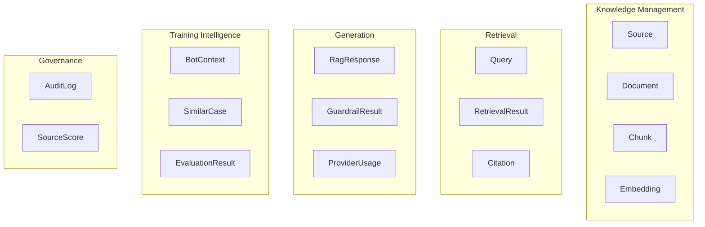
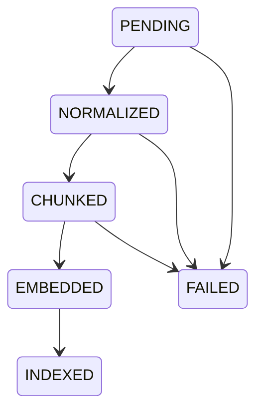
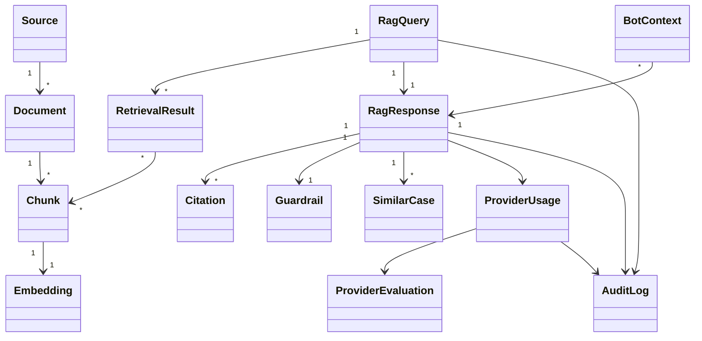

# **Training Bot RAG Hub ドメインモデル設計書 v1.0**

本設計書は企画書・要件定義書・DB設計・アーキテクチャ設計を踏まえ、Training Bot RAG Hub の業務ドメインを整理したものです。特に「RAGは注文しない」「参照専用」「監査可能」「Provider差し替え可能」という原則を中心にモデル化しています。  

---

# **1. ドメイン設計方針**

## **コア原則**

```text
RAGは知識基盤

RAGは注文しない

RAGは説明する

RAGは根拠を返す

RAGは監査可能

RAGはProvider非依存
```

---

# **2. ドメイン境界（Bounded Context）**



---

# **3. 集約（Aggregate）一覧**

|**Aggregate**|**役割**|
|---|---|
|Source Aggregate|知識ソース管理|
|Document Aggregate|文書管理|
|Query Aggregate|問い合わせ管理|
|Response Aggregate|回答管理|
|Bot Context Aggregate|Bot利用履歴|
|Provider Aggregate|LLM利用管理|
|Evaluation Aggregate|Provider評価|
|Audit Aggregate|監査管理|

---

# **4. Source Aggregate**

## **集約ルート**

```text
Source
```

## **エンティティ**

### **Source**

|**属性**|**型**|
|---|---|
|sourceId|UUID|
|sourceType|Enum|
|sourceName|String|
|reliabilityScore|Decimal|
|enabled|Boolean|
|createdAt|DateTime|

---

### **SourceType**

```text
MARKET_DATA
BOT_LOG
ORDER_HISTORY
TRADE_HISTORY
NEWS
SNS
PREDICTION_MARKET
STRATEGY_DOC
```

---

### **業務ルール**

```text
信頼度は0〜1

無効化されたSourceは検索対象外

危険Sourceは隔離可能
```

---

# **5. Document Aggregate**

## **集約ルート**

```text
Document
```

---

### **Document**

|**属性**|**型**|
|---|---|
|documentId|UUID|
|sourceId|UUID|
|title|String|
|language|Language|
|status|DocumentStatus|
|createdAt|DateTime|

---

### **Chunk**

|**属性**|**型**|
|---|---|
|chunkId|UUID|
|documentId|UUID|
|chunkIndex|Integer|
|content|Text|
|tokenCount|Integer|

---

### **Metadata**

|**属性**|**型**|
|---|---|
|symbol|String|
|market|String|
|timeframe|String|
|eventTime|DateTime|
|riskTags|List|
|recencyScore|Decimal|

---

### **Embedding**

|**属性**|**型**|
|---|---|
|embeddingId|UUID|
|chunkId|UUID|
|provider|String|
|model|String|
|dimension|Integer|

---

### **状態遷移**



---

# **6. Query Aggregate**

## **集約ルート**

```text
RagQuery
```

---

### **RagQuery**

|**属性**|**型**|
|---|---|
|queryId|UUID|
|queryText|Text|
|queryType|QueryType|
|symbol|String|
|timeframe|String|
|requesterId|UUID|
|createdAt|DateTime|

---

### **QueryType**

```text
MARKET_CONTEXT
BOT_EXPLANATION
SIMILAR_CASE
SENTIMENT
BACKTEST_REVIEW
PROVIDER_EVALUATION
```

---

### **業務ルール**

```text
query保存必須

trace_id必須

監査対象
```

---

# **7. Retrieval Aggregate**

## **集約ルート**

```text
RetrievalResult
```

---

### **RetrievalResult**

|**属性**|**型**|
|---|---|
|retrievalId|UUID|
|queryId|UUID|
|score|Decimal|
|rerankScore|Decimal|

---

### **RetrievedChunk**

|**属性**|**型**|
|---|---|
|chunkId|UUID|
|similarity|Decimal|
|usedForAnswer|Boolean|

---

### **業務ルール**

```text
回答に使ったChunkを追跡可能

再現性を保証する
```

---

# **8. Response Aggregate**

## **集約ルート**

```text
RagResponse
```

---

### **RagResponse**

|**属性**|**型**|
|---|---|
|responseId|UUID|
|queryId|UUID|
|summary|Text|
|confidence|Decimal|
|riskLevel|RiskLevel|
|createdAt|DateTime|

---

### **SupportingFactor**

```text
強気材料
```

---

### **OpposingFactor**

```text
反対材料
```

---

### **Citation**

|**属性**|**型**|
|---|---|
|citationId|UUID|
|sourceId|UUID|
|reason|Text|

---

### **RiskLevel**

```text
LOW
MEDIUM
HIGH
CRITICAL
```

---

### **Guardrail**

|**属性**|**型**|
|---|---|
|orderPermission|Boolean|
|validationStatus|Enum|
|blockedReason|String|

---

### **業務ルール**

```text
orderPermissionは必ずfalse

Citation必須

RiskLevel必須

Confidence必須
```

要件定義で `order_permission=false` が必須とされています。  

---

# **9. Bot Context Aggregate**

## **集約ルート**

```text
BotContext
```

---

### **BotContext**

|**属性**|**型**|
|---|---|
|contextId|UUID|
|botId|UUID|
|strategyId|UUID|
|responseId|UUID|
|createdAt|DateTime|

---

### **SimilarCase**

|**属性**|**型**|
|---|---|
|caseId|UUID|
|similarity|Decimal|
|outcome|String|
|maxDrawdown|Decimal|

---

### **業務ルール**

```text
Botが参照した根拠を追跡

再学習可能

バックテスト利用可能
```

---

# **10. Provider Aggregate**

## **集約ルート**

```text
ProviderUsage
```

---

### **ProviderUsage**

|**属性**|**型**|
|---|---|
|usageId|UUID|
|provider|ProviderType|
|model|String|
|inputTokens|Integer|
|outputTokens|Integer|
|estimatedCost|Decimal|
|latencyMs|Integer|

---

### **ProviderType**

```text
OPENAI
CLAUDE
GEMINI
MISTRAL
LOCAL
```

---

### **ProviderCall**

|**属性**|**型**|
|---|---|
|callId|UUID|
|status|ProviderStatus|
|fallbackUsed|Boolean|

---

### **ProviderStatus**

```text
PENDING
CALLING
SUCCESS
FAILED
FALLBACK_USED
BLOCKED
```

---

# **11. Evaluation Aggregate**

## **集約ルート**

```text
ProviderEvaluation
```

---

### **ProviderEvaluation**

|**属性**|**型**|
|---|---|
|evaluationId|UUID|
|provider|ProviderType|
|datasetId|String|
|score|Decimal|

---

### **EvaluationMetric**

|**属性**|**型**|
|---|---|
|schemaValidRate|Decimal|
|citationAccuracy|Decimal|
|hallucinationRate|Decimal|
|riskCoverage|Decimal|
|costPerQuery|Decimal|
|latency|Decimal|

---

### **業務ルール**

```text
月次評価可能

Provider比較可能

Fallback判断材料
```

Provider比較評価は要件で明示されています。  

---

# **12. Audit Aggregate**

## **集約ルート**

```text
AuditLog
```

---

### **AuditLog**

|**属性**|**型**|
|---|---|
|auditId|UUID|
|traceId|UUID|
|eventType|String|
|createdAt|DateTime|

---

### **AuditEvent**

```text
QUERY_CREATED

RETRIEVAL_EXECUTED

LLM_CALLED

RESPONSE_GENERATED

GUARDRAIL_BLOCKED

FALLBACK_USED

BOT_CONTEXT_CREATED
```

---

### **業務ルール**

```text
全Query保存

全Response保存

全Provider利用保存

全Guardrail保存
```

---

# **13. ドメインモデル全体図**



# **14. MVPで実装すべき集約**

優先順位は以下です。

```text
P1
├─ Source
├─ Document
├─ Chunk
├─ Embedding
├─ RagQuery
├─ RetrievalResult
├─ RagResponse
├─ Citation
├─ Guardrail
├─ BotContext
├─ ProviderUsage
└─ AuditLog

P2
├─ SimilarCase
└─ ProviderEvaluation

P3
├─ SourceScore
├─ SentimentModel
└─ PredictionMarketModel
```

このドメインモデルを基準にすると、次工程の「DDDベースのアプリケーション設計書（Aggregate・Repository・Domain Service・Application Service・UseCase設計）」へそのまま展開できます。企画書・要件定義・ER設計・API設計との整合性も取れています。