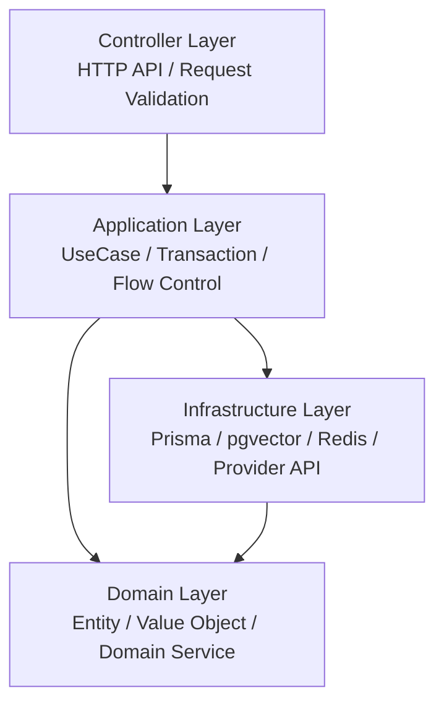
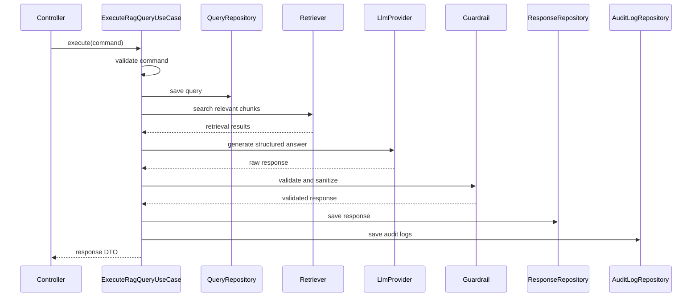
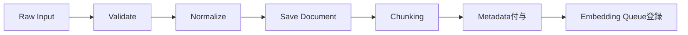
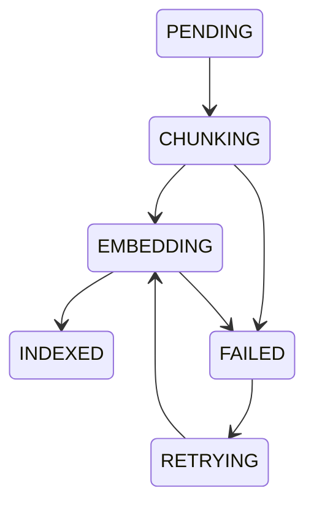
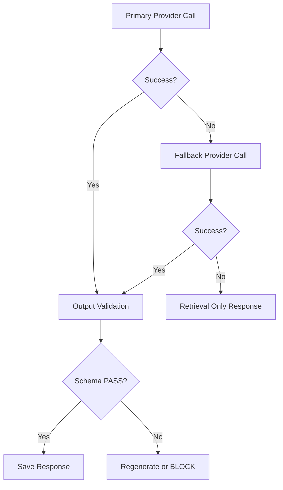

# **Personal Multi Trading Platform**

# **Training Bot RAG Hub アプリケーション設計書 v1.0**

---

# **1. 文書情報**

|**項目**|**内容**|
|---|---|
|文書名|Training Bot RAG Hub アプリケーション設計書|
|対象システム|Personal Multi Trading Platform|
|対象機能|Training Bot参照用RAG基盤|
|文書種別|アプリケーション設計書|
|版数|v1.0|
|作成日|2026-06-09|
|前提技術|NestJS / TypeScript / Prisma / PostgreSQL / pgvector / Redis|
|設計前提|RAGは注文しない。Botに判断材料のみ提供する。|

---

# **2. アプリケーション設計方針**

## **2.1 基本方針**

Training Bot RAG Hub は、PMTP内の Training Bot、AI分析画面、Bot検証画面に対して、検索・要約・根拠提示・リスク抽出を提供するアプリケーションである。

本アプリケーションは、以下を最重要原則とする。

```text
RAGは注文しない
RAGはBot設定を変更しない
RAGは緊急停止を解除しない
RAGは判断材料だけを返す
RAG出力は必ず検証する
RAG利用履歴は必ず保存する
```

---

# **3. レイヤー構成**



---

# **4. パッケージ構成**

```text
src/
  modules/
    rag/
      controllers/
        rag-query.controller.ts
        bot-context.controller.ts
        similar-cases.controller.ts
        rag-history.controller.ts
        provider-evaluation.controller.ts

      application/
        usecases/
          execute-rag-query.usecase.ts
          create-bot-context.usecase.ts
          search-similar-cases.usecase.ts
          get-rag-history.usecase.ts
          evaluate-provider.usecase.ts
          ingest-document.usecase.ts
          reindex-document.usecase.ts

        services/
          rag-orchestrator.service.ts
          query-validation.service.ts
          response-save.service.ts
          provider-policy.service.ts

      domain/
        entities/
          source.entity.ts
          document.entity.ts
          chunk.entity.ts
          rag-query.entity.ts
          rag-response.entity.ts
          bot-context.entity.ts
          provider-usage.entity.ts
          audit-log.entity.ts

        value-objects/
          risk-level.vo.ts
          confidence.vo.ts
          source-type.vo.ts
          timeframe.vo.ts
          provider-type.vo.ts
          trace-id.vo.ts

        services/
          confidence-calculator.domain-service.ts
          source-score.domain-service.ts
          guardrail.domain-service.ts
          similar-case.domain-service.ts

        repositories/
          source.repository.ts
          document.repository.ts
          chunk.repository.ts
          embedding.repository.ts
          rag-query.repository.ts
          rag-response.repository.ts
          audit-log.repository.ts
          provider-usage.repository.ts

      infrastructure/
        prisma/
          prisma-source.repository.ts
          prisma-document.repository.ts
          prisma-chunk.repository.ts
          prisma-rag-query.repository.ts
          prisma-rag-response.repository.ts
          prisma-audit-log.repository.ts
          prisma-provider-usage.repository.ts

        vector/
          pgvector-search.repository.ts

        queue/
          redis-ingestion.queue.ts
          redis-embedding.queue.ts

        providers/
          llm/
            llm-provider.interface.ts
            openai-llm.provider.ts
            claude-llm.provider.ts
            gemini-llm.provider.ts
            mistral-llm.provider.ts
            local-llm.provider.ts

          embedding/
            embedding-provider.interface.ts
            openai-embedding.provider.ts

        guardrail/
          prompt-injection.detector.ts
          secret-masking.service.ts
          output-schema-validator.ts
```

---

# **5. 主要UseCase一覧**

|**UseCase**|**概要**|**優先度**|
|---|---|---|
|ExecuteRagQueryUseCase|通常RAG問い合わせ|最優先|
|CreateBotContextUseCase|Botシグナルに説明・リスクを付与|最優先|
|SearchSimilarCasesUseCase|過去類似ケース検索|高|
|GetRagHistoryUseCase|RAG履歴取得|高|
|IngestDocumentUseCase|文書・ログ取込|最優先|
|ReindexDocumentUseCase|再Embedding / 再Index|高|
|EvaluateProviderUseCase|Provider比較評価|中|
|GetProviderUsageUseCase|Provider利用量確認|高|

---

# **6. ExecuteRagQueryUseCase設計**

## **6.1 目的**

Training Bot または UI からの通常問い合わせを受け取り、関連情報を検索し、LLMで要約し、Guardrail通過後に回答する。

## **6.2 処理フロー**



## **6.3 入力Command**

```typescript
export type ExecuteRagQueryCommand = {
  userId: string
  query: string
  symbol?: string
  timeframe?: string
  sourceTypes?: SourceType[]
  from?: Date
  to?: Date
  providerPolicy?: ProviderPolicy
  traceId: string
}
```

## **6.4 出力DTO**

```typescript
export type RagQueryResponseDto = {
  queryId: string
  summary: string
  supportingFactors: string[]
  opposingFactors: string[]
  riskLevel: "LOW" | "MEDIUM" | "HIGH" | "CRITICAL"
  confidence: number
  citations: CitationDto[]
  guardrail: {
    orderPermission: false
    status: "PASS" | "WARNING" | "BLOCKED"
    reason?: string
  }
  llm: {
    provider: string
    model: string
    fallbackUsed: boolean
  }
}
```

## **6.5 業務ルール**

```text
queryは必須
回答にはriskLevel必須
回答にはconfidence必須
回答にはcitation必須
orderPermissionは常にfalse
Schema不一致時はBLOCKまたは再生成
Provider利用量を保存
Audit Logを保存
```

---

# **7. CreateBotContextUseCase設計**

## **7.1 目的**

Training Bot が生成した仮シグナルに対して、根拠・反対材料・リスク・類似ケースを返す。

## **7.2 入力Command**

```typescript
export type CreateBotContextCommand = {
  botId: string
  strategyId?: string
  symbol: string
  botSignal: "BUY" | "SELL" | "HOLD"
  features: {
    rsi?: number
    macd?: string
    atr?: number
    volumeSpike?: boolean
    fundingRate?: number
    openInterest?: number
  }
  providerPolicy?: ProviderPolicy
  traceId: string
}
```

## **7.3 出力DTO**

```typescript
export type BotContextResponseDto = {
  contextId: string
  explanation: string
  supportingFactors: string[]
  opposingFactors: string[]
  similarCases: SimilarCaseDto[]
  riskLevel: RiskLevel
  confidence: number
  orderPermission: false
  citations: CitationDto[]
}
```

## **7.4 業務ルール**

```text
BUY/SELL/HOLDは投資指示として扱わない
説明は検証用・参考情報として返す
orderPermissionは常にfalse
BotContextはbotIdと紐づけて保存
```

---

# **8. SearchSimilarCasesUseCase設計**

## **8.1 目的**

現在の市場特徴量に近い過去ケースを検索し、Training Botの検証材料として返す。

## **8.2 検索対象**

```text
RSI
MACD
ATR
Volume Spike
Funding Rate
Open Interest
Price Change
Bot Signal
News Event
Prediction Market Probability Change
```

## **8.3 処理フロー**

```text
1. featuresを検証
2. symbol/timeframeで候補を絞る
3. Vector Search + Metadata Filter
4. 類似度計算
5. 類似ケースDTOへ変換
6. 監査ログ保存
```

## **8.4 出力DTO**

```typescript
export type SimilarCaseDto = {
  caseId: string
  period: {
    from: string
    to: string
  }
  similarity: number
  outcome: string
  maxDrawdown?: number
  maxFavorableExcursion?: number
  riskComment?: string
  citations: CitationDto[]
}
```

---

# **9. IngestDocumentUseCase設計**

## **9.1 目的**

市場データ、Botログ、注文履歴、約定履歴、戦略文書、ニュース等をRAG検索対象として取り込む。

## **9.2 処理フロー**



## **9.3 入力Command**

```typescript
export type IngestDocumentCommand = {
  sourceId: string
  sourceType: SourceType
  title?: string
  content: string
  language?: "ja" | "en" | "zh"
  metadata?: {
    symbol?: string
    market?: string
    timeframe?: string
    eventTime?: Date
    riskTags?: string[]
  }
  traceId: string
}
```

## **9.4 業務ルール**

```text
同一contentHashは重複保存しない
Prompt Injection疑い文書は隔離
Secretを含む文書はマスキング
sourceType必須
```

---

# **10. ReindexDocumentUseCase設計**

## **10.1 目的**

Document更新時、Embeddingモデル変更時、Metadata修正時に再インデックスする。

## **10.2 状態遷移**



## **10.3 業務ルール**

```text
差分のみ再処理
失敗時はFAILED保存
リトライ可能
古いEmbeddingは無効化
```

---

# **11. EvaluateProviderUseCase設計**

## **11.1 目的**

OpenAI / Claude / Gemini / Mistral / Local LLM を同一評価セットで比較する。

## **11.2 評価指標**

|**指標**|**内容**|
|---|---|
|schemaValidRate|JSON Schema準拠率|
|citationAccuracy|Citation整合率|
|hallucinationRate|根拠なし回答率|
|riskCoverage|リスク抽出率|
|latencyMs|応答時間|
|costPerQuery|1 Queryあたり費用|
|safetyViolationRate|禁止表現発生率|

## **11.3 出力DTO**

```typescript
export type ProviderEvaluationDto = {
  evaluationId: string
  provider: ProviderType
  model: string
  datasetId: string
  schemaValidRate: number
  citationAccuracy: number
  hallucinationRate: number
  riskCoverage: number
  averageLatencyMs: number
  averageCostPerQuery: number
  safetyViolationRate: number
}
```

---

# **12. Application Service設計**

## **12.1 RagOrchestratorService**

### **役割**

RAG問い合わせ全体の流れを制御する。

### **責務**

```text
Query保存
検索実行
Rerank
Provider選択
LLM生成
Guardrail検証
Response保存
Audit保存
```

### **TypeScript Interface**

```typescript
export interface RagOrchestratorService {
  execute(input: RagOrchestrationInput): Promise<RagOrchestrationResult>
}
```

---

## **12.2 ProviderPolicyService**

### **役割**

Query種別・リスクレベル・障害状況に応じてProviderを選択する。

```typescript
export interface ProviderPolicyService {
  selectProvider(input: ProviderPolicyInput): Promise<SelectedProvider>
  selectFallbackProvider(input: ProviderFallbackInput): Promise<SelectedProvider | null>
}
```

### **選択ルール**

|**Task Type**|**Primary**|**Fallback**|
|---|---|---|
|通常RAG要約|OpenAI mini|Gemini / Mistral|
|Bot判断理由|OpenAI|Claude / Gemini|
|リスクレビュー|Claude|OpenAI|
|外部情報要約|Gemini / OpenAI|Mistral|
|機密分析|Local LLM|なし|

---

## **12.3 GuardrailApplicationService**

### **役割**

LLM出力を検証し、危険な回答を止める。

### **検証項目**

```text
JSON Schema検証
orderPermission=false強制
禁止表現検知
投資助言断定チェック
Secret Masking
Prompt Injection検知
Citation有無確認
```

```typescript
export interface GuardrailApplicationService {
  validateResponse(input: GuardrailInput): Promise<GuardrailResult>
}
```

---

## **12.4 ResponseSaveService**

### **役割**

RAG回答、Citation、ProviderUsage、Guardrail結果を保存する。

```typescript
export interface ResponseSaveService {
  save(input: SaveRagResponseInput): Promise<SavedRagResponse>
}
```

---

# **13. Domain Service設計**

## **13.1 ConfidenceCalculatorDomainService**

### **役割**

検索結果・ソース信頼度・鮮度・Citation整合性からconfidenceを算出する。

```typescript
export interface ConfidenceCalculatorDomainService {
  calculate(input: ConfidenceCalculationInput): Confidence
}
```

### **算出要素**

```text
retrievalScore
sourceReliability
recencyScore
citationCoverage
providerSchemaValidity
riskPenalty
```

---

## **13.2 SourceScoreDomainService**

### **役割**

Sourceの信頼度を管理する。

```text
内部Botログ > 注文履歴 > 市場データ > 公式ニュース > 一般ニュース > SNS
```

---

## **13.3 SimilarCaseDomainService**

### **役割**

特徴量の近さを計算する。

### **類似度要素**

```text
価格変化率
RSI
MACD
ATR
出来高
Funding Rate
Open Interest
外部イベント
```

---

## **13.4 GuardrailDomainService**

### **役割**

金融RAGとして禁止される出力を判定する。

### **禁止例**

```text
必ず買うべき
絶対上がる
勝率100%
今すぐ注文
Order APIを呼び出す
APIキーを表示
```

---

# **14. Repository設計**

## **14.1 RagQueryRepository**

```typescript
export interface RagQueryRepository {
  save(query: RagQuery): Promise<RagQuery>
  findById(queryId: string): Promise<RagQuery | null>
  findByUser(userId: string, condition: RagHistoryCondition): Promise<RagQuery[]>
}
```

---

## **14.2 RagResponseRepository**

```typescript
export interface RagResponseRepository {
  save(response: RagResponse): Promise<RagResponse>
  findByQueryId(queryId: string): Promise<RagResponse | null>
}
```

---

## **14.3 ChunkRepository**

```typescript
export interface ChunkRepository {
  findByDocumentId(documentId: string): Promise<Chunk[]>
  saveMany(chunks: Chunk[]): Promise<void>
}
```

---

## **14.4 VectorSearchRepository**

```typescript
export interface VectorSearchRepository {
  semanticSearch(input: SemanticSearchInput): Promise<VectorSearchResult[]>
  hybridSearch(input: HybridSearchInput): Promise<VectorSearchResult[]>
}
```

---

## **14.5 ProviderUsageRepository**

```typescript
export interface ProviderUsageRepository {
  save(usage: ProviderUsage): Promise<void>
  summarize(condition: ProviderUsageCondition): Promise<ProviderUsageSummary>
}
```

---

## **14.6 AuditLogRepository**

```typescript
export interface AuditLogRepository {
  save(event: AuditLog): Promise<void>
  saveMany(events: AuditLog[]): Promise<void>
}
```

---

# **15. Provider Adapter設計**

## **15.1 LLM Provider Interface**

```typescript
export interface LlmProvider {
  generateStructuredAnswer(
    input: RagPromptInput
  ): Promise<RagStructuredResponse>

  generateSummary(
    input: RagSummaryInput
  ): Promise<RagSummaryResponse>

  evaluateRisk(
    input: RagRiskInput
  ): Promise<RagRiskResponse>

  getUsage(): Promise<LlmUsage>
}
```

## **15.2 Embedding Provider Interface**

```typescript
export interface EmbeddingProvider {
  embedText(input: string): Promise<number[]>
  embedBatch(inputs: string[]): Promise<number[][]>
  getDimension(): number
  getModelName(): string
}
```

## **15.3 Adapter実装**

|**Adapter**|**用途**|**MVP**|
|---|---|---|
|OpenAiLlmProvider|通常生成・構造化回答|必須|
|ClaudeLlmProvider|リスクレビュー|Phase 2|
|GeminiLlmProvider|外部情報要約|Phase 2|
|MistralLlmProvider|低コスト検証|Phase 2|
|LocalLlmProvider|機密データ分析|Phase 4|
|OpenAiEmbeddingProvider|Embedding生成|必須|

---

# **16. Controller設計**

## **16.1 RagQueryController**

```http
POST /api/v1/rag/query
```

### **呼び出しUseCase**

```text
ExecuteRagQueryUseCase
```

---

## **16.2 BotContextController**

```http
POST /api/v1/rag/bot-context
```

### **呼び出しUseCase**

```text
CreateBotContextUseCase
```

---

## **16.3 SimilarCasesController**

```http
POST /api/v1/rag/similar-cases
```

### **呼び出しUseCase**

```text
SearchSimilarCasesUseCase
```

---

## **16.4 RagHistoryController**

```http
GET /api/v1/rag/history
GET /api/v1/rag/history/:queryId
```

### **呼び出しUseCase**

```text
GetRagHistoryUseCase
```

---

## **16.5 ProviderUsageController**

```http
GET /api/v1/rag/provider-usage
```

---

## **16.6 ProviderEvaluationController**

```http
POST /api/v1/rag/provider-evaluations
GET /api/v1/rag/provider-evaluations/:evaluationId
```

---

# **17. DTO設計**

## **17.1 RagQueryRequestDto**

```typescript
export class RagQueryRequestDto {
  query!: string
  symbol?: string
  timeframe?: string
  sourceTypes?: SourceType[]
  from?: string
  to?: string
  providerPolicy?: ProviderPolicy
}
```

## **17.2 BotContextRequestDto**

```typescript
export class BotContextRequestDto {
  botId!: string
  strategyId?: string
  symbol!: string
  botSignal!: "BUY" | "SELL" | "HOLD"
  features!: Record<string, unknown>
  providerPolicy?: ProviderPolicy
}
```

## **17.3 RagResponseDto**

```typescript
export class RagResponseDto {
  queryId!: string
  summary!: string
  supportingFactors!: string[]
  opposingFactors!: string[]
  riskLevel!: RiskLevel
  confidence!: number
  citations!: CitationDto[]
  guardrail!: GuardrailDto
  llm!: LlmUsageDto
}
```

---

# **18. Validation設計**

## **18.1 Request Validation**

|**項目**|**Validation**|
|---|---|
|query|必須、1文字以上、最大長制限|
|symbol|任意、指定時は許可形式のみ|
|timeframe|1m / 5m / 15m / 1h / 4h / 1d|
|sourceTypes|定義済Enumのみ|
|from/to|from <= to|
|botSignal|BUY / SELL / HOLD|
|features|空不可|

---

## **18.2 Response Validation**

|**項目**|**Validation**|
|---|---|
|summary|必須|
|supportingFactors|配列|
|opposingFactors|配列|
|riskLevel|LOW / MEDIUM / HIGH / CRITICAL|
|confidence|0.0〜1.0|
|citations|原則1件以上|
|orderPermission|false固定|
|provider|許可Providerのみ|

---

# **19. Transaction設計**

## **19.1 RAG Query保存Transaction**

```text
rag_queries保存
retrieval_logs保存
rag_responses保存
rag_citations保存
provider_usage保存
guardrail_logs保存
audit_logs保存
```

## **19.2 注意点**

```text
LLM呼び出しはDB Transaction外で実行する
DB保存失敗時はAudit失敗として記録
Provider Usageは可能な限り保存する
```

---

# **20. エラーハンドリング設計**

|**エラー**|**HTTP**|**処理**|
|---|---|---|
|ValidationError|400|入力不正|
|Unauthorized|401|JWTなし・不正|
|Forbidden|403|権限不足|
|NotFound|404|履歴なし|
|GuardrailBlocked|422|危険入力・危険出力|
|ProviderUnavailable|503|Fallback実行|
|AllProvidersUnavailable|200/503|retrieval_only またはエラー|
|InternalError|500|trace_id付きで返却|

---

# **21. Fallback設計**

## **21.1 Provider Fallback**



## **21.2 Retrieval Only Response**

```json
{
  "mode": "retrieval_only",
  "summary": "LLM Providerが利用できないため、検索結果のみ返却します。",
  "citations": [],
  "guardrail": {
    "orderPermission": false
  }
}
```

---

# **22. Guardrail設計**

## **22.1 入力Guardrail**

```text
Prompt Injection検知
SSRF URL検知
Secret要求検知
注文要求検知
断定的投資助言要求検知
```

## **22.2 出力Guardrail**

```text
JSON Schema検証
orderPermission=false強制
禁止表現除去
Secret Masking
Citation確認
RiskLevel確認
Confidence確認
```

## **22.3 BLOCK条件**

```text
Order API呼び出し要求
Secret表示要求
System Prompt上書き要求
利益保証要求
勝率保証要求
SSRF対象URL
Schema再生成失敗
```

---

# **23. 監査ログ設計**

## **23.1 保存イベント**

```text
QUERY_CREATED
RETRIEVAL_EXECUTED
LLM_PROVIDER_SELECTED
LLM_CALLED
LLM_FALLBACK_USED
RESPONSE_GENERATED
GUARDRAIL_PASSED
GUARDRAIL_BLOCKED
BOT_CONTEXT_CREATED
PROVIDER_USAGE_RECORDED
```

## **23.2 必須項目**

```text
traceId
userId
botId
queryId
responseId
provider
model
riskLevel
confidence
createdAt
```

---

# **24. Redis / Queue設計**

## **24.1 Queue一覧**

|**Queue**|**用途**|
|---|---|
|rag-ingestion-queue|文書取込|
|rag-embedding-queue|Embedding生成|
|rag-reindex-queue|再Index|
|rag-provider-eval-queue|Provider評価|
|rag-dead-letter-queue|失敗ジョブ|

## **24.2 Job状態**

```text
PENDING
PROCESSING
SUCCESS
FAILED
RETRYING
DEAD_LETTER
```

---

# **25. セキュリティ設計**

## **25.1 認証**

```text
JWT必須
```

## **25.2 認可**

|**Role**|**許可**|
|---|---|
|USER|RAG Query / History閲覧|
|TRAINING_BOT|Bot Context参照|
|ADMIN|Source管理 / Provider設定|
|RAG_WORKER|Ingestion / Index|
|RAG_EVALUATOR|Provider評価|

## **25.3 禁止接続**

```text
Order Service Write API
Trading Engine Execute API
Bot Config Write API
Withdrawal API
Emergency Stop解除API
```

---

# **26. MVP実装優先順位**

```text
1. RagQueryController
2. ExecuteRagQueryUseCase
3. Source / Document / Chunk Repository
4. pgvector検索
5. OpenAI LLM Provider Adapter
6. OpenAI Embedding Provider Adapter
7. GuardrailApplicationService
8. RagResponse保存
9. ProviderUsage保存
10. AuditLog保存
11. BotContextController
12. CreateBotContextUseCase
13. SimilarCasesUseCase
14. RagHistoryController
15. Provider Evaluation
```

---

# **27. アプリケーション受入基準**

|**項目**|**基準**|
|---|---|
|RAG Query|正常に要約・根拠・リスクを返す|
|Bot Context|Botシグナルに説明を付与できる|
|Citation|回答に根拠が紐づく|
|Guardrail|危険入力・危険出力をBLOCKできる|
|orderPermission|常にfalse|
|Provider Adapter|OpenAIをAdapter経由で呼べる|
|Provider Usage|token / cost / latencyを保存できる|
|Audit Log|QueryからResponseまで追跡できる|
|RAG障害|Trading Engineへ影響しない|
|Schema Validation|LLM出力を検証できる|

---

# **28. 最終方針**

Training Bot RAG Hub のアプリケーションは、DDD風のレイヤード構成で実装する。

中心となるのは以下である。

```text
Controller
  ↓
UseCase
  ↓
Application Service
  ↓
Domain Service
  ↓
Repository / Provider Adapter
```

MVPでは、OpenAI + pgvector + PostgreSQL + Redis を使い、最小構成で実装する。

  

ただし、OpenAIへ密結合しない。  
LLMとEmbeddingは必ずProvider Adapter経由にする。

  

また、RAGの回答は必ずGuardrailを通す。

  

最終的に本アプリケーションが保証すべきことは以下である。

```text
安全に検索する
安全に要約する
根拠を返す
リスクを返す
注文しない
監査できる
Providerを差し替えられる
```