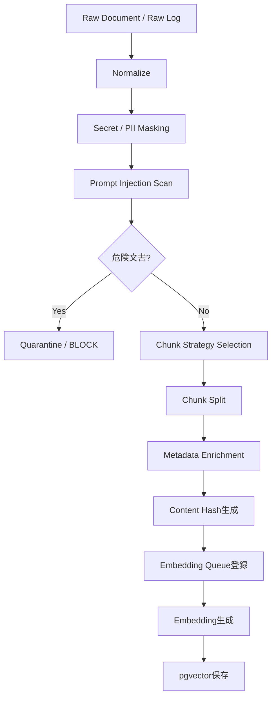

以下、**Chunking設計書 v1.0**です。既存のRAG要件で「チャンク分割・Embedding生成・メタデータ付与・pgvector保存」がMVP最優先要件として定義されている前提で作成しています。 

---

# **Training Bot RAG Hub Chunking設計書 v1.0**

## **1. 文書情報**

|**項目**|**内容**|
|---|---|
|文書名|Chunking設計書|
|対象システム|Personal Multi Trading Platform|
|対象機能|Training Bot RAG Hub|
|文書種別|詳細設計書|
|版数|v1.0|
|作成日|2026-06-09|
|対象フェーズ|MVP|

---

## **2. 目的**

本設計書は、Training Bot RAG Hubにおける文書・ログ・市場データ・外部情報を、RAG検索に適した単位へ分割するためのChunking方式を定義する。

Chunkingの目的は以下。

1. 検索精度を高める
2. Citation精度を高める
3. LLMへ渡すContext量を制御する
4. 不要なEmbedding再生成を防ぐ
5. 金融RAGとして監査可能な検索単位を作る

RAG Hubでは、検索・要約・類似ケース抽出・リスク抽出・根拠提示が主要機能であり、チャンク設計はその品質を左右する中核設計である。 

---

## **3. 基本方針**

|**方針**|**内容**|
|---|---|
|Source-grounded|各チャンクは必ず元ソースへ戻れる|
|Metadata-first|symbol、timeframe、source_type、event_timeを必須付与|
|Small Enough|LLM Contextに入れやすい粒度にする|
|Large Enough|意味が壊れない単位を維持する|
|Overlapあり|文脈断絶を防ぐ|
|差分更新前提|文書全体の再Embeddingを避ける|
|危険文書隔離|Prompt Injection疑い文書は検索対象から除外可能にする|

---

## **4. 対象データ**

|**source_type**|**対象**|**Chunking方針**|
|---|---|---|
|strategy_doc|Bot戦略ルール、リスク設定、設計書|見出し単位 + token分割|
|bot_log|Bot実行ログ、判断ログ|1イベントまたは1判断単位|
|order_history|注文履歴|1注文単位|
|execution_history|約定履歴|1約定単位|
|market_data|OHLCV、RSI、MACD、ATR|時系列Window単位|
|news|ニュース本文・要約|段落単位 + token分割|
|prediction_market|Polymarket等のイベント確率|1イベント + 時点単位|
|sns_summary|SNS要約|トピック + 時間Window単位|

---

## **5. Chunkサイズ設計**

## **5.1 標準サイズ**

|**データ種別**|**chunk_size**|**overlap**|**理由**|
|---|---|---|---|
|設計書・戦略文書|500〜800 tokens|80〜120 tokens|意味単位を保ちやすい|
|ニュース|400〜700 tokens|80 tokens|速報・背景情報を分離しやすい|
|Botログ|1イベント単位|なし〜50 tokens|判断単位で追跡しやすい|
|注文・約定履歴|1レコード単位|なし|監査性重視|
|市場データ|30〜120本の足単位|10〜20%|類似ケース検索向け|
|予測市場データ|1イベント + 時点単位|なし|確率変化を時系列管理|
|SNS要約|1トピック + 1時間〜1日単位|なし|ノイズ集約前提|

---

## **5.2 MVP標準値**

MVPでは以下を標準とする。

```text
default_chunk_size = 700 tokens
default_overlap = 100 tokens
max_chunk_size = 1,000 tokens
min_chunk_size = 80 tokens
```

ただし、注文履歴・約定履歴・Botログはtoken固定ではなく、イベント単位を優先する。

---

## **6. Chunking処理フロー**



既存アーキテクチャでも、Raw DataからNormalizer、Document Store、Chunker、Embedding生成、pgvector保存へ進む流れが定義されているため、この設計に合わせる。 

---

## **7. Chunk Strategy**

## **7.1 Strategy Document Chunking**

対象：

- Bot戦略ルール
- Risk Rule
- PMTP設計書
- 運用ルール
- テスト設計書

方式：

1. Markdown見出しで分割
2. 見出し配下が長い場合はtokenで再分割
3. 見出し階層をmetadataに保存
4. 前後文脈をoverlapで保持

メタデータ例：

```json
{
  "source_type": "strategy_doc",
  "document_title": "Training Bot RAG Hub 要件定義書",
  "heading_path": ["8. 機能要件", "8.2 インデックス機能"],
  "chunk_index": 12,
  "language": "ja"
}
```

---

## **7.2 Bot Log Chunking**

対象：

- Bot判断ログ
- Backtestログ
- Signal生成ログ
- AI分析ログ

方式：

```text
1 Bot decision = 1 Chunk
```

チャンク本文例：

```text
symbol=BTCUSDT
timeframe=1h
signal=BUY
rsi=29
macd=golden_cross
volume_spike=true
bot_reason=短期反発候補
risk=上位足下落継続
```

メタデータ：

```json
{
  "source_type": "bot_log",
  "bot_id": "uuid",
  "strategy_id": "uuid",
  "symbol": "BTCUSDT",
  "timeframe": "1h",
  "event_time": "2026-06-09T10:00:00Z",
  "signal": "BUY",
  "risk_tags": ["volatility", "trend_reversal"]
}
```

---

## **7.3 Market Data Chunking**

対象：

- OHLCV
- RSI
- MACD
- ATR
- VWAP
- Funding Rate
- Open Interest

方式：

```text
symbol + timeframe + fixed window
```

MVP標準：

|**timeframe**|**window_size**|**overlap**|
|---|---|---|
|1m|120本|20本|
|5m|96本|12本|
|15m|96本|12本|
|1h|72本|12本|
|4h|60本|8本|
|1d|90本|10本|

用途：

- 類似ケース検索
- 急騰急落パターン抽出
- Bot判断理由補強

---

## **7.4 News Chunking**

方式：

1. タイトル・本文・published_atを正規化
2. 記事本文を段落単位で分割
3. 長い段落はtoken分割
4. 速報・分析記事・規制ニュースをrisk_tagsへ反映

メタデータ：

```json
{
  "source_type": "news",
  "source_name": "news_api",
  "title": "BTC ETF related news",
  "published_at": "2026-06-09T00:00:00Z",
  "symbol": "BTCUSDT",
  "risk_tags": ["regulation", "macro", "sentiment"],
  "reliability_score": 0.75,
  "recency_score": 0.92
}
```

---

## **7.5 Prediction Market Chunking**

対象：

- Polymarket等のイベント
- 確率変化
- 出来高
- liquidity
- market status

方式：

```text
1 event snapshot = 1 chunk
```

注意：

予測市場データは事実ではなく、市場参加者の見方として扱う。これは既存要件でも明記されている。 

---

## **8. Metadata設計**

各Chunkには以下を必須付与する。

```json
{
  "chunk_id": "uuid",
  "document_id": "uuid",
  "source_id": "uuid",
  "source_type": "market_data | bot_log | order_history | news | sns | prediction_market | strategy_doc",
  "source_name": "internal | binance | polymarket | news_api",
  "symbol": "BTCUSDT",
  "market": "crypto",
  "timeframe": "1h",
  "event_time": "datetime",
  "ingested_at": "datetime",
  "language": "ja | en | zh",
  "chunk_index": 0,
  "token_count": 700,
  "content_hash": "sha256",
  "reliability_score": 0.0,
  "recency_score": 0.0,
  "risk_tags": ["volatility", "liquidity", "sentiment"],
  "is_active": true,
  "is_quarantined": false
}
```

---

## **9. DB設計**

## **9.1 rag_chunks**

```sql
CREATE TABLE rag_chunks (
  id UUID PRIMARY KEY,
  document_id UUID NOT NULL,
  source_id UUID NOT NULL,
  chunk_index INTEGER NOT NULL,
  content TEXT NOT NULL,
  content_hash TEXT NOT NULL,
  token_count INTEGER NOT NULL,
  language TEXT,
  source_type TEXT NOT NULL,
  symbol TEXT,
  market TEXT,
  timeframe TEXT,
  event_time TIMESTAMP,
  ingested_at TIMESTAMP NOT NULL,
  reliability_score NUMERIC(5,4),
  recency_score NUMERIC(5,4),
  risk_tags TEXT[],
  metadata JSONB,
  is_active BOOLEAN DEFAULT true,
  is_quarantined BOOLEAN DEFAULT false,
  created_at TIMESTAMP DEFAULT now(),
  updated_at TIMESTAMP DEFAULT now()
);
```

---

## **9.2 rag_embeddings**

```sql
CREATE TABLE rag_embeddings (
  id UUID PRIMARY KEY,
  chunk_id UUID NOT NULL REFERENCES rag_chunks(id),
  embedding_provider TEXT NOT NULL,
  embedding_model TEXT NOT NULL,
  embedding_dimension INTEGER NOT NULL,
  embedding vector(1536),
  content_hash TEXT NOT NULL,
  status TEXT NOT NULL,
  error_message TEXT,
  created_at TIMESTAMP DEFAULT now(),
  updated_at TIMESTAMP DEFAULT now()
);
```

---

## **9.3 Index**

```sql
CREATE INDEX idx_rag_chunks_source_type
ON rag_chunks(source_type);

CREATE INDEX idx_rag_chunks_symbol_timeframe
ON rag_chunks(symbol, timeframe);

CREATE INDEX idx_rag_chunks_event_time
ON rag_chunks(event_time);

CREATE INDEX idx_rag_chunks_active
ON rag_chunks(is_active, is_quarantined);

CREATE INDEX idx_rag_chunks_metadata
ON rag_chunks USING gin(metadata);
```

pgvector検索用：

```sql
CREATE INDEX idx_rag_embeddings_vector
ON rag_embeddings
USING ivfflat (embedding vector_cosine_ops)
WITH (lists = 100);
```

---

## **10. Chunk更新・再Index設計**

## **10.1 差分判定**

以下が一致する場合、再Embeddingしない。

```text
document_id
chunk_index
content_hash
embedding_model
embedding_dimension
```

## **10.2 再Embedding条件**

|**条件**|**再Embedding**|
|---|---|
|content_hash変更|必要|
|embedding_model変更|必要|
|metadataのみ変更|不要|
|reliability_score変更|不要|
|recency_score変更|不要|
|chunk分割ルール変更|必要|
|source無効化|不要、検索対象外にする|

Embedding費はMVPでは非常に小さいが、無駄な再生成は避けるべき。既存コスト見積もりでも、差分Indexingと再Embedding防止がコスト削減策として定義されている。 

---

## **11. 検索時のChunk利用方針**

## **11.1 Retrieval標準設定**

```json
{
  "top_k": 20,
  "rerank_top_k": 8,
  "max_context_chunks": 6,
  "max_context_tokens": 2500
}
```

## **11.2 Metadata Filter優先**

検索時は、Embedding類似度だけでなく以下を必ず併用する。

```text
symbol
timeframe
source_type
event_time
language
risk_tags
is_active=true
is_quarantined=false
```

## **11.3 Context投入優先度**

|**優先度**|**Chunk**|
|---|---|
|1|高類似度 + 高信頼度|
|2|高類似度 + 高鮮度|
|3|内部Botログ|
|4|市場データ|
|5|ニュース|
|6|SNS / 予測市場|

---

## **12. Guardrail連携**

Chunking前に以下を実施する。

|**チェック**|**内容**|
|---|---|
|Secret Masking|API Key、JWT、Secretを除外|
|PII Masking|個人情報を除外|
|Prompt Injection Scan|外部文書内の命令文を検知|
|URL Safety Check|SSRF疑いURLを検知|
|Source Trust Check|低信頼ソースに低スコア付与|

Prompt Injection、Secret Masking、注文権限遮断は既存要件上の最重要ガードレールである。 

---

## **13. Chunk品質指標**

|**指標**|**目標**|
|---|---|
|chunk生成成功率|99%以上|
|metadata付与率|99%以上|
|content_hash付与率|100%|
|embedding生成成功率|99%以上|
|quarantined判定漏れ|0件|
|Citation追跡可能率|100%|
|重複Chunk率|5%未満|
|Precision@10|80%以上|
|Citation整合率|95%以上|

RAG品質試験ではPrecision@10、Citation精度、Hallucination抑制が重要指標として定義されている。 

---

## **14. エラー処理**

|**エラー**|**処理**|
|---|---|
|token_count超過|再分割|
|metadata不足|LOW_QUALITYとして保存またはReject|
|Secret検出|Mask後に処理、不可ならBLOCK|
|Prompt Injection疑い|quarantine|
|Embedding失敗|FAILED → RETRY|
|重複検出|既存Chunkを再利用|
|source無効化|is_active=false|

---

## **15. MVP実装範囲**

MVPで実装する。

|**項目**|**対応**|
|---|---|
|Markdown見出しChunking|対応|
|Token-based Chunking|対応|
|Bot Logイベント単位Chunking|対応|
|Market Data Window Chunking|対応|
|Metadata付与|対応|
|content_hash|対応|
|差分Embedding|対応|
|Prompt Injection疑い隔離|対応|
|pgvector保存|対応|

MVPでは実装しない。

|**項目**|**理由**|
|---|---|
|動的Chunking最適化|評価データ蓄積後でよい|
|マルチモーダルChunking|初期対象外|
|専用Vector DB最適化|MVPはpgvectorで十分|
|自動Chunkサイズ学習|Phase 2以降|

---

## **16. 受入基準**

|**ID**|**基準**|
|---|---|
|AC-CHUNK-001|文書からchunkが生成される|
|AC-CHUNK-002|各chunkにmetadataが付与される|
|AC-CHUNK-003|Embeddingがpgvectorへ保存される|
|AC-CHUNK-004|content_hashにより差分判定できる|
|AC-CHUNK-005|symbol/timeframe/source_typeで絞り込める|
|AC-CHUNK-006|Prompt Injection疑い文書を隔離できる|
|AC-CHUNK-007|Citationから元文書へ戻れる|
|AC-CHUNK-008|類似検索でPrecision@10 80%以上|
|AC-CHUNK-009|Citation整合率95%以上|
|AC-CHUNK-010|RAGから注文APIへ影響しない|

---

## **17. 最終方針**

Training Bot RAG HubのChunkingは、単なる文字数分割ではなく、金融RAGの検索品質・監査性・安全性を支える基盤として設計する。

MVPでは以下を標準とする。

```text
1. 文書は見出し + token単位で分割
2. Botログは1判断単位で分割
3. 市場データはtimeframe別window単位で分割
4. 注文・約定履歴は1レコード単位で分割
5. 各chunkにmetadataとcontent_hashを必須付与
6. Prompt Injection疑い文書は隔離
7. Embeddingは差分生成
8. 検索時はEmbedding類似度 + Metadata Filterを併用
```

結論として、MVPでは **700 tokens / overlap 100 tokens** を標準値とし、データ種別ごとにイベント単位・時系列Window単位へ調整する。